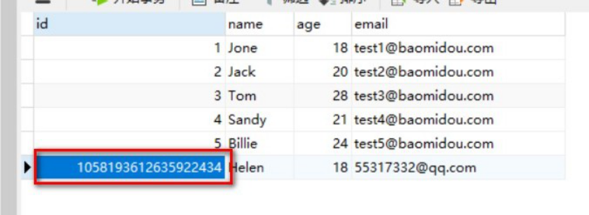

# 一、insert

## 1、插入操作

```java
public class CRUDTests {
 @Autowired
 private UserMapper userMapper;
 @Test
 public void testInsert(){
 User user = new User();
 user.setName("Helen");
 user.setAge(18);
 user.setEmail("55317332@qq.com");
 int result = userMapper.insert(user);
 System.out.println(result); //影响的行数
 System.out.println(user); //id自动回填
 }
}

注意：数据库插入id值默认为：全局唯一id



## 2、主键策略

### （1）ID_WORKER

MyBatis-Plus默认的主键策略是：ID_WORKER 全局唯一ID
参考资料：分布式系统唯一ID生成方案汇总：
[https://www.cnblogs.com/haoxinyue/p/5208136.html](https://www.cnblogs.com/haoxinyue/p/5208136.html)

### （2）自增策略

要想主键自增需要配置如下主键策略
需要在创建数据表的时候设置主键自增
实体字段中配置 @TableId(type = IdType.AUTO)

```java
@TableId(type = IdType.AUTO)
private Long id;
```

其它主键策略：分析 IdType 源码可知

```java
public enum IdType {
 /**
 * 数据库ID自增
 */
 AUTO(0),
 
 /**
 * 该类型为未设置主键类型
 */
 NONE(1),
 
 /**
 * 用户输入ID
 * 该类型可以通过自己注册自动填充插件进行填充
 */ 
 INPUT(2),
 
 /**
 * 全局唯一ID
 */ 
 ASSIGN_ID(3),
 
 /**
 * 全局唯一ID (UUID)
 */
 ASSIGN_UUID(4),
 
 /** @deprecated */
 @Deprecated
 ID_WORKER(3),
 /** @deprecated */
 @Deprecated
 ID_WORKER_STR(3),
 /** @deprecated */
 @Deprecated
 UUID(4);
 private final int key;
 private IdType(int key) {
 this.key = key;
 }
 public int getKey() {
 return this.key;
 }
}
```

# 二、update

## 1、根据Id更新操作

注意：update时生成的sql自动是动态sql：UPDATE user SET age=? WHERE id=?

```java
@Test
 public void testUpdateById(){
 	User user = new User();
 	user.setId(1L);
 	user.setAge(28);
 	int result = userMapper.updateById(user);
 	System.out.println(result);
 }
```

## 2、自动填充

项目中经常会遇到一些数据，每次都使用相同的方式填充，例如记录的创建时间，更新时间等。
我们可以使用MyBatis Plus的自动填充功能，完成这些字段的赋值工作：

### （1）数据库表中添加自动填充字段

在User表中添加datetime类型的新的字段 create_time、update_time

### （2）实体上添加注解

```java
@Data
public class User {
 ......
 
 @TableField(fill = FieldFill.INSERT)
 private Date createTime;
 //@TableField(fill = FieldFill.UPDATE)
 @TableField(fill = FieldFill.INSERT_UPDATE)
 private Date updateTime;
}
```

### （3）实现元对象处理器接口

注意：不要忘记添加 @Component 注解

```java
@Component
public class MyMetaObjectHandler implements MetaObjectHandler {
 @Override
 public void insertFill(MetaObject metaObject) {
 this.setFieldValByName("createTime", new Date(), metaObject);
 this.setFieldValByName("updateTime", new Date(), metaObject);
 }
 @Override
 public void updateFill(MetaObject metaObject) {
 this.setFieldValByName("updateTime", new Date(), metaObject);
 }
}
```

### （4）测试

## 3、乐观锁

**主要适用场景：** 当要更新一条记录的时候，希望这条记录没有被别人更新，也就是说实现线程安
全的数据更新
**乐观锁实现方式：**

* 取出记录时，获取当前version
* 更新时，带上这个version
* 执行更新时， set version = newVersion where version = oldVersion
* 如果version不对，就更新失败

### （1）数据库中添加version字段

```sql
ALTER TABLE `user` ADD COLUMN `version` INT
```


### （2）实体类添加version字段

并添加 @Version 注解

```java
@Version
@TableField(fill = FieldFill.INSERT)
private Integer version;

```

### （3）元对象处理器接口添加version的insert默认值

```java
@Override
public void insertFill(MetaObject metaObject) {
 ......
 this.setFieldValByName("version", 1, metaObject);
}
```

**特别说明:**

* 支持的数据类型只有 int,Integer,long,Long,Date,Timestamp,LocalDateTime
* 整数类型下 newVersion = oldVersion + 1
* newVersion 会回写到 entity 中
* 仅支持 updateById(id) 与 update(entity, wrapper) 方法
* 在 update(entity, wrapper) 方法下, wrapper 不能复用!!!

### （4）在 MybatisPlusConfig 中注册 Bean

创建配置类

```java
import com.baomidou.mybatisplus.extension.plugins.PaginationInterceptor;
import org.mybatis.spring.annotation.MapperScan;
import org.springframework.context.annotation.Bean;
import org.springframework.context.annotation.Configuration;
import org.springframework.transaction.annotation.EnableTransactionManagement;
@EnableTransactionManagement
@Configuration
@MapperScan("com.atguigu.mybatis_plus.mapper")
public class MybatisPlusConfig {
     /**
 * 乐观锁插件
 */
 @Bean
 public OptimisticLockerInterceptor optimisticLockerInterceptor() {
 return new OptimisticLockerInterceptor();
 }
}
```

### （5）测试乐观锁可以修改成功

测试后分析打印的sql语句，将version的数值进行了加1操作

```java
/**
* 测试 乐观锁插件
*/
@Test
public void testOptimisticLocker() {
 //查询
 User user = userMapper.selectById(1L);
 //修改数据
 user.setName("Helen Yao");
 user.setEmail("helen@qq.com");
 //执行更新
 userMapper.updateById(user);
}
```

### （5）测试乐观锁修改失败

```java
/**
* 测试乐观锁插件 失败
*/
@Test
public void testOptimisticLockerFail() {
 //查询
 User user = userMapper.selectById(1L);
 //修改数据
 user.setName("Helen Yao1");
 user.setEmail("helen@qq.com1");
 //模拟取出数据后，数据库中version实际数据比取出的值大，即已被其它线程修改并更新了version
 user.setVersion(user.getVersion() - 1);
 //执行更新
 userMapper.updateById(user);
}
```

# 三、select

## 1、根据id查询记录

```java
@Test
public void testSelectById(){
 User user = userMapper.selectById(1L);
 System.out.println(user);
}
```

## 2、通过多个id批量查询

完成了动态sql的foreach的功能

```java
@Test
public void testSelectBatchIds(){
 List<User> users = userMapper.selectBatchIds(Arrays.asList(1, 2, 3));
 users.forEach(System.out::println);
}
```

## 3、简单的条件查询

通过map封装查询条件

```java
@Test
public void testSelectByMap(){
 HashMap<String, Object> map = new HashMap<>();
 map.put("name", "Helen");
 map.put("age", 18);
 List<User> users = userMapper.selectByMap(map);
 users.forEach(System.out::println);
}
```

注意：map中的key对应的是数据库中的列名。例如数据库user_id，实体类是userId，这时map的
key需要填写user_id

## 4、分页

MyBatis Plus自带分页插件，只要简单的配置即可实现分页功能

### （1）创建配置类

此时可以删除主类中的 @MapperScan 扫描注解

```java
/**
* 分页插件
*/
@Bean
public PaginationInterceptor paginationInterceptor() {
 return new PaginationInterceptor();
}
```

### （2）测试selectPage分页

测试：最终通过page对象获取相关数据

```java
@Test
public void testSelectPage() {
 Page<User> page = new Page<>(1,5);
 userMapper.selectPage(page, null);
 page.getRecords().forEach(System.out::println);
 System.out.println(page.getCurrent());
 System.out.println(page.getPages());
 System.out.println(page.getSize());
 System.out.println(page.getTotal());
 System.out.println(page.hasNext());
 System.out.println(page.hasPrevious());
}
```

控制台sql语句打印：SELECT id,name,age,email,create_time,update_time FROM user LIMIT
0,5

### （3）测试selectMapsPage分页：结果集是Map

```java
@Test
public void testSelectMapsPage() {
 //Page不需要泛型
 Page<Map<String, Object>> page = new Page<>(1, 5);
 Page<Map<String, Object>> pageParam = userMapper.selectMapsPage(page, null);
 List<Map<String, Object>> records = pageParam.getRecords();
 records.forEach(System.out::println);
 System.out.println(pageParam.getCurrent());
 System.out.println(pageParam.getPages());
 System.out.println(pageParam.getSize());
 System.out.println(pageParam.getTotal());
 System.out.println(pageParam.hasNext());
 System.out.println(pageParam.hasPrevious());
}
```

# 四、delete

## 1、根据id删除记录

```java
@Test
public void testDeleteById(){
 int result = userMapper.deleteById(8L);
 System.out.println(result);
}
```

## 2、批量删除

```java
@Test
 public void testDeleteBatchIds() {
 int result = userMapper.deleteBatchIds(Arrays.asList(8, 9, 10));
 System.out.println(result);
 }
```

## 3、简单的条件查询删除

```java
@Test
public void testDeleteByMap() {
 HashMap<String, Object> map = new HashMap<>();
 map.put("name", "Helen");
 map.put("age", 18);
 int result = userMapper.deleteByMap(map);
 System.out.println(result);
}
```

## 4、逻辑删除

* 物理删除：真实删除，将对应数据从数据库中删除，之后查询不到此条被删除数据
* 逻辑删除：假删除，将对应数据中代表是否被删除字段状态修改为“被删除状态”，之后在数据库中仍旧能看到此条数据记录

### （1）数据库中添加 deleted字段

```sql
ALTER TABLE `user` ADD COLUMN `deleted` boolean
```


### （2）实体类添加deleted 字段

并加上 @TableLogic 注解 和 @TableField(fill = FieldFill.INSERT) 注解

```java
@TableLogic
@TableField(fill = FieldFill.INSERT)
private Integer deleted;
```

### （3）元对象处理器接口添加deleted的insert默认值

```java
@Override
public void insertFill(MetaObject metaObject) {
 ......
 this.setFieldValByName("deleted", 0, metaObject);
}
```

### （4）application.properties 加入配置

此为默认值，如果你的默认值和mp默认的一样,该配置可无

```java
mybatis-plus.global-config.db-config.logic-delete-value=1
mybatis-plus.global-config.db-config.logic-not-delete-value=0
```

### （5）测试逻辑删除

* 测试后发现，数据并没有被删除，deleted字段的值由0变成了1
* 测试后分析打印的sql语句，是一条update
  注意：被删除数据的deleted 字段的值必须是 0，才能被选取出来执行逻辑删除的操作

```java
/**
* 测试 逻辑删除
*/
@Test
public void testLogicDelete() {
 int result = userMapper.deleteById(1L);
 System.out.println(result);
}
```

### （7）测试逻辑删除后的查询

MyBatis Plus中查询操作也会自动添加逻辑删除字段的判断

```java
/**
* 测试 逻辑删除后的查询：
* 不包括被逻辑删除的记录
*/
@Test
public void testLogicDeleteSelect() {
 User user = new User();
 List<User> users = userMapper.selectList(null);
 users.forEach(System.out::println);
}
```

测试后分析打印的sql语句，包含 WHERE deleted=0

```sql
SELECT id,name,age,email,create_time,update_time,deleted FROM user WHERE deleted=0
```

# 五、其它

如果想进行复杂条件查询，那么需要使用条件构造器 Wapper，涉及到如下方法
1、delete
2、selectOne
3、selectCount
4、selectList
5、selectMaps
6、selectObjs
7、update
