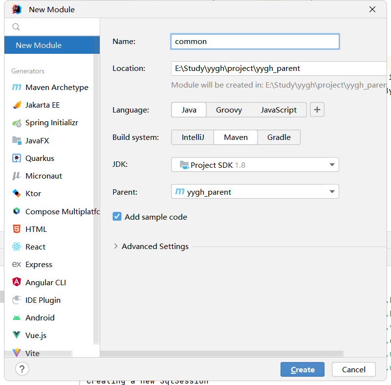
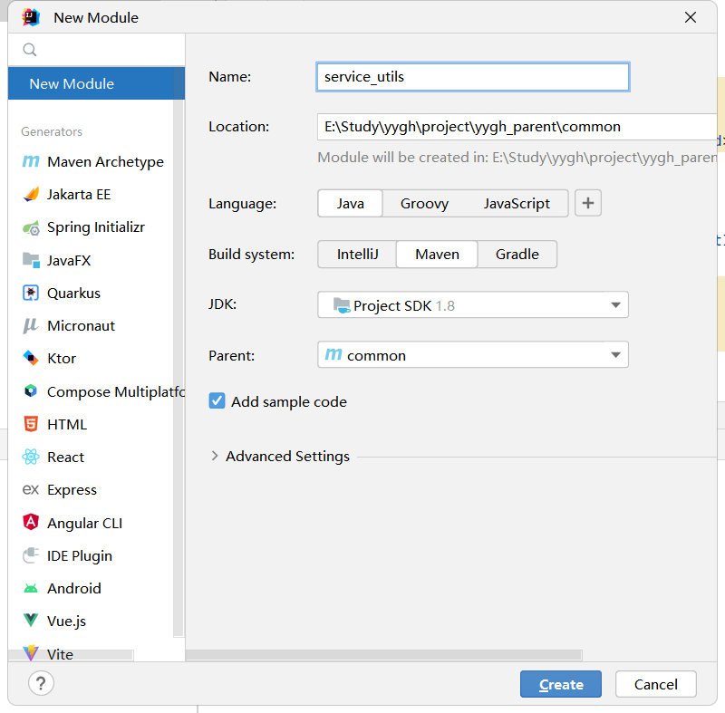
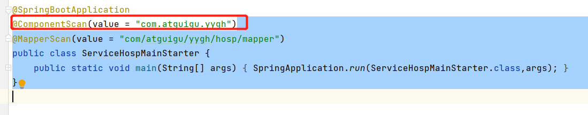
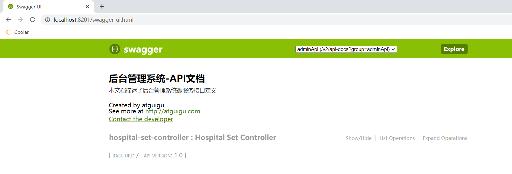
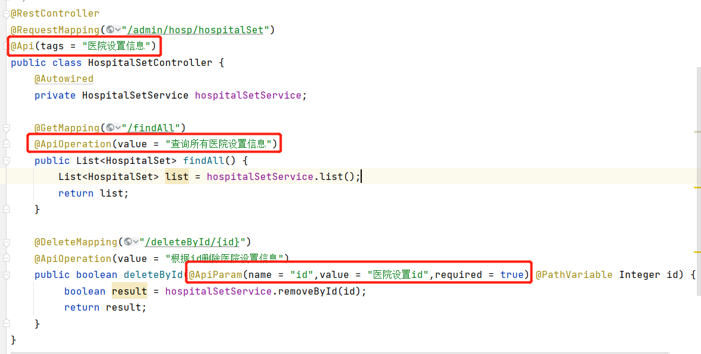

# 一、Swagger2介绍

前后端分离开发模式中，api文档是最好的沟通方式。

Swagger 是一个规范和完整的框架，用于生成、描述、调用和可视化 RESTful 风格的 Web 服务。

1. 及时性 (接口变更后，能够及时准确地通知相关前后端开发人员)
2. 规范性 (并且保证接口的规范性，如接口的地址，请求方式，参数及响应格式和错误信息)
3. 一致性 (接口信息一致，不会出现因开发人员拿到的文档版本不一致，而出现分歧)
4. 可测性 (直接在接口文档上进行测试，以方便理解业务)

# 二、配置Swagger2

## 1、创建common模块

**在yygh_parent下创建模块common**

配置：

groupId：com.atguigu

artifactId：common



注意：common模块的src目录用不到可以删除!

## 2、在common中引入相关依赖

```java
 <dependencies>
    <dependency>
        <groupId>org.springframework.boot</groupId>
        <artifactId>spring-boot-starter-web</artifactId>
        <scope>provided </scope>
    </dependency>
    <!--mybatis-plus-->
    <dependency>
        <groupId>com.baomidou</groupId>
        <artifactId>mybatis-plus-boot-starter</artifactId>
        <scope>provided </scope>
    </dependency>
    <!--lombok用来简化实体类：需要安装lombok插件-->
    <dependency>
        <groupId>org.projectlombok</groupId>
        <artifactId>lombok</artifactId>
    </dependency>
    <!--swagger-->
    <dependency>
        <groupId>io.springfox</groupId>
        <artifactId>springfox-swagger2</artifactId>
    </dependency>
    <dependency>
        <groupId>io.springfox</groupId>
        <artifactId>springfox-swagger-ui</artifactId>
    </dependency>
    <dependency>
        <groupId>com.alibaba</groupId>
        <artifactId>fastjson</artifactId>
    </dependency>
</dependencies>
```

## 3、在common下面创建子模块service_utils



**在模块service-utils中，创建swagger的配置类**

创建包com.atguigu.yygh.common.config，创建类SwaggerConfig

```java
package com.atguigu.common.config;

import com.google.common.base.Predicates;
import org.springframework.boot.SpringBootConfiguration;
import org.springframework.context.annotation.Bean;
import springfox.documentation.builders.ApiInfoBuilder;
import springfox.documentation.builders.PathSelectors;
import springfox.documentation.service.ApiInfo;
import springfox.documentation.service.Contact;
import springfox.documentation.spi.DocumentationType;
import springfox.documentation.spring.web.plugins.Docket;
import springfox.documentation.swagger2.annotations.EnableSwagger2;

@SpringBootConfiguration
@EnableSwagger2
public class SwaggerConfig {
    @Bean
    public Docket webApiConfig() {
        return new Docket(DocumentationType.SWAGGER_2)
                .groupName("webApi")
                .apiInfo(webApiInfo())
                .select()
                //只显示api路径下的页面
                //.paths(Predicates.and(PathSelectors.regex("/api/.*")))
                .build();
    }

    @Bean
    public Docket adminApiConfig() {
        return new Docket(DocumentationType.SWAGGER_2)
                .groupName("adminApi")
                .apiInfo(adminApiInfo())
                .select()
                //只显示admin路径下的页面
                .paths(Predicates.and(PathSelectors.regex("/admin/.*")))
                .build();
    }

    private ApiInfo webApiInfo() {
        return new ApiInfoBuilder()
                .title("网站-API文档")
                .description("本文档描述了网站微服务接口定义")
                .version("1.0")
                .contact(new Contact("atguigu", "http://atguigu.com", "493211102@qq.com"))
                .build();
    }

    private ApiInfo adminApiInfo() {
        return new ApiInfoBuilder()
                .title("后台管理系统-API文档")
                .description("本文档描述了后台管理系统微服务接口定义")
                .version("1.0")
                .contact(new Contact("atguigu", "http://atguigu.com", "49321112@qq.com"))
                .build();
    }
}

```

## 4、在service模块中引入service_utils依赖

```java
<dependency>
    <groupId>com.atguigu</groupId>
    <artifactId>service_utils</artifactId>
    <version>0.0.1-SNAPSHOT</version>
</dependency>
```

## 5、在service_hosp启动类上添加注解，进行测试



## 6、通过地址访问测试

[http://localhost:8201/swagger-ui.html](http://localhost:8201/swagger-ui.html)



可以添加一些自定义设置，例如：

定义样例数据

```java
@ApiModelProperty(value = "创建时间", example = "2019-01-01 8:00:00")
@TableField(fill = FieldFill.INSERT)
private Date gmtCreate;

@ApiModelProperty(value = "更新时间", example = "2019-01-01 8:00:00")
@TableField(fill = FieldFill.INSERT_UPDATE)
private Date gmtModified;
```
## 7、定义接口说明和参数说明
定义在类上：@Api(tags = "")
定义在方法上：@ApiOperation(value = "")
定义在参数上：@ApiParam(name = "",value = "",required = true)

