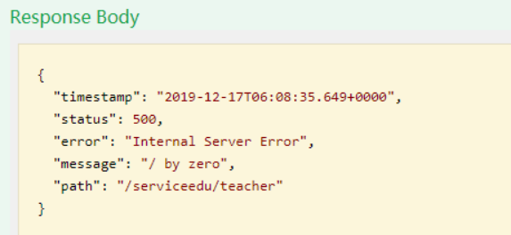
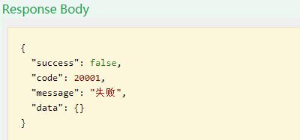

# 一、什么是统一异常处理

## 1、制造异常

除以0

``int a = 10/0;``


## 2、什么是统一异常处理
我们想让异常结果也显示为统一的返回结果对象，并且统一处理系统的异常信息，那么需要统一
异常处理
# 二、统一异常处理
## 1、创建统一异常处理器
在service_utils中创建统一异常处理类GlobalExceptionHandler.java：
```java
@ControllerAdvice // 凡是标记@ControllerAdvice的类都表示全局异常处理类
public class GlobalExceptionHandler {
    @ExceptionHandler(Exception.class)
    public R error(Exception e){
        e.printStackTrace();
        return R.error();
    }
}
```
## 2、测试
返回统一错误结果


# 三、处理特定异常
## 1、添加异常处理方法
GlobalExceptionHandler.java中添加
```java
@ExceptionHandler(SQLException.class)
    public R error(SQLException e) {
        e.printStackTrace();
        return R.error().message("SQL执行异常");
    }
```
# 四、自定义异常
## 1、创建自定义异常类
```java
@Data
@AllArgsConstructor
@NoArgsConstructor
public class YyghException extends RuntimeException {
    @ApiModelProperty(value = "状态码")
    private Integer code;
    private String msg;
}
```
## 2、业务中需要的位置抛出自定义的异常
```java
try {
 int a = 10/0;
}catch(Exception e) {
 throw new YyghException(20001,"出现自定义异常");
}
```
## 3、添加异常处理方法
GlobalExceptionHandler.java中添加
```java
/**
     * 预约挂号业务异常
     * @param e
     * @return
     */
    @ExceptionHandler(YyghException.class)
    public R error(YyghException e){ e.printStackTrace();
        return R.error().code(e.getCode()).message(e.getMessage());
    }
```