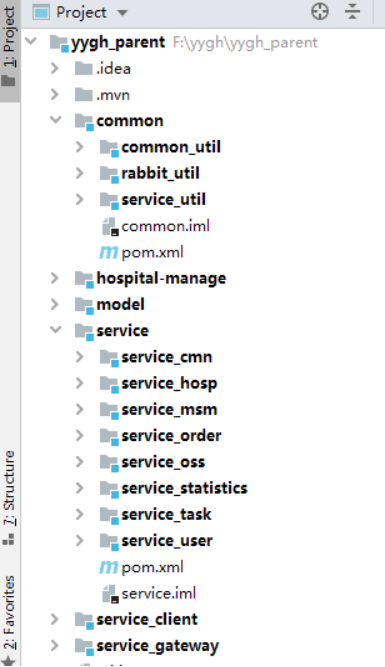
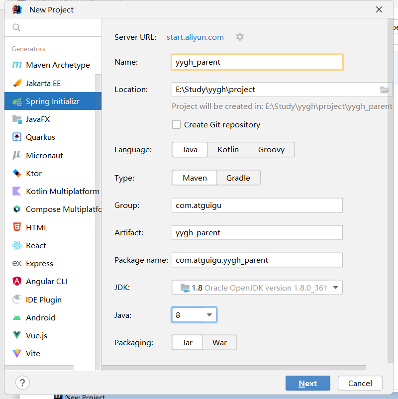
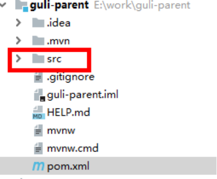
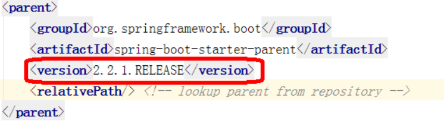

# 一、工程结构介绍

## 1、工程结构



## 2、模块说明

> yygh_parent：预约挂号根目录（父工程），管理多个子模块：

>> common：公共模块父节点
>>
>>> common_util：工具类模块，所有模块都可以依赖于它
>>> service_utils：service服务的base包，包含service服务的公共配置类，所有service模块依赖于它
>>> rabbit_utils：rabbitmq封装工具类
>>> hospital-manage：医院模拟系统
>>>
>>

>> model：实体类相关模块
>>

>> service：api接口服务父节点
>>
>>> service_hosp：医院api接口服务
>>> service_cmn：公共api接口服务
>>> service_user：用户api接口服务
>>> service_order：订单api接口服务
>>> service_oss：文件api接口服务
>>> service_msm：短信 api接口服务
>>> service_task：定时任务服务
>>> service_statistics：统计api接口服务

>> service-client：feign服务调用父节点
>>> service-cmn-client：公共api接口
>>> service-hosp-client：医院api接口
>>> service-order-client：订单api接口
>>>
>>

>> server-gateway：服务网关
>>

# 二、创建父工程
## 1、创建sprigboot工程yygh_parent
在idea开发工具中，使用 Spring Initializr 快速初始化一个 Spring Boot 模块，版本使用：2.2.1.RELEASE
配置：
* groupId：com.atguigu
* artifactId：yygh_parent

一直下一步到完成

## 2、删除 src 目录

## 3、配置 pom.xml
修改版本为 ：2.2.1.RELEASE

节点后面添加 pom类型
```java
<artifactId>guli-parent</artifactId>
<packaging>pom</packaging>
```
## 4、在pom.xml中添加依赖的版本
删除pom.xml中<dependencies>的内容
```java
<!-- 以下内容删除 -->
<dependencies>
 <dependency>
 <groupId>org.springframework.boot</groupId>
 <artifactId>spring-boot-starter</artifactId>
 </dependency>
 <dependency>
 <groupId>org.springframework.boot</groupId>
 <artifactId>spring-boot-starter-test</artifactId>
 <scope>test</scope>
 </dependency>
</dependencies>
```
添加<properties>确定依赖的版本
```java
<properties>
 <java.version>1.8</java.version>
 <cloud.version>Hoxton.RELEASE</cloud.version>
 <alibaba.version>2.2.0.RELEASE</alibaba.version>
 <mybatis-plus.version>3.3.1</mybatis-plus.version>
 <mysql.version>5.1.46</mysql.version>
 <swagger.version>2.7.0</swagger.version>
 <jwt.version>0.7.0</jwt.version>
 <fastjson.version>1.2.29</fastjson.version>
 <httpclient.version>4.5.1</httpclient.version>
 <easyexcel.version>2.2.0-beta2</easyexcel.version>
 <aliyun.version>4.1.1</aliyun.version>
 <oss.version>3.9.1</oss.version>
 <jodatime.version>2.10.1</jodatime.version>
</properties>
```
配置<dependencyManagement>锁定依赖的版本
```java
<!--配置dependencyManagement锁定依赖的版本-->
<dependencyManagement>
 <dependencies>
 <dependency>
 <groupId>org.springframework.cloud</groupId>
 <artifactId>spring-cloud-dependencies</artifactId>
 <version>${cloud.version}</version>
 <type>pom</type>
 <scope>import</scope>
 </dependency>
 <dependency>
 <groupId>com.alibaba.cloud</groupId>
 <artifactId>spring-cloud-alibaba-dependencies</artifactId>
 <version>${alibaba.version}</version>
 <type>pom</type>
 <scope>import</scope>
 </dependency>
 <!--mybatis-plus 持久层-->
 <dependency>
 <groupId>com.baomidou</groupId>
 <artifactId>mybatis-plus-boot-starter</artifactId>
 <version>${mybatis-plus.version}</version>
 </dependency>
 <dependency>
 <groupId>mysql</groupId>
 <artifactId>mysql-connector-java</artifactId>
 <version>${mysql.version}</version>
 </dependency>
 <!--swagger-->
 <dependency>
 <groupId>io.springfox</groupId>
 <artifactId>springfox-swagger2</artifactId>
 <version>${swagger.version}</version>
 </dependency>
 <!--swagger ui-->
 <dependency>
 <groupId>io.springfox</groupId>
 <artifactId>springfox-swagger-ui</artifactId>
 <version>${swagger.version}</version>
  </dependency>
 <dependency>
 <groupId>io.jsonwebtoken</groupId>
 <artifactId>jjwt</artifactId>
 <version>${jwt.version}</version>
 </dependency>
 <dependency>
 <groupId>org.apache.httpcomponents</groupId>
 <artifactId>httpclient</artifactId>
 <version>${httpclient.version}</version>
 </dependency>
 <dependency>
 <groupId>com.alibaba</groupId>
 <artifactId>fastjson</artifactId>
 <version>${fastjson.version}</version>
 </dependency>
 <dependency>
 <groupId>com.alibaba</groupId>
 <artifactId>easyexcel</artifactId>
 <version>${easyexcel.version}</version>
 </dependency>
 <dependency>
 <groupId>com.aliyun</groupId>
 <artifactId>aliyun-java-sdk-core</artifactId>
 <version>${aliyun.version}</version>
 </dependency>
 <dependency>
 <groupId>com.aliyun.oss</groupId>
 <artifactId>aliyun-sdk-oss</artifactId>
 <version>${oss.version}</version>
 </dependency>
 <!--日期时间工具-->
 <dependency>
 <groupId>joda-time</groupId>
 <artifactId>joda-time</artifactId>
 <version>${jodatime.version}</version>
  </dependency>
 </dependencies>
</dependencyManagement>
```