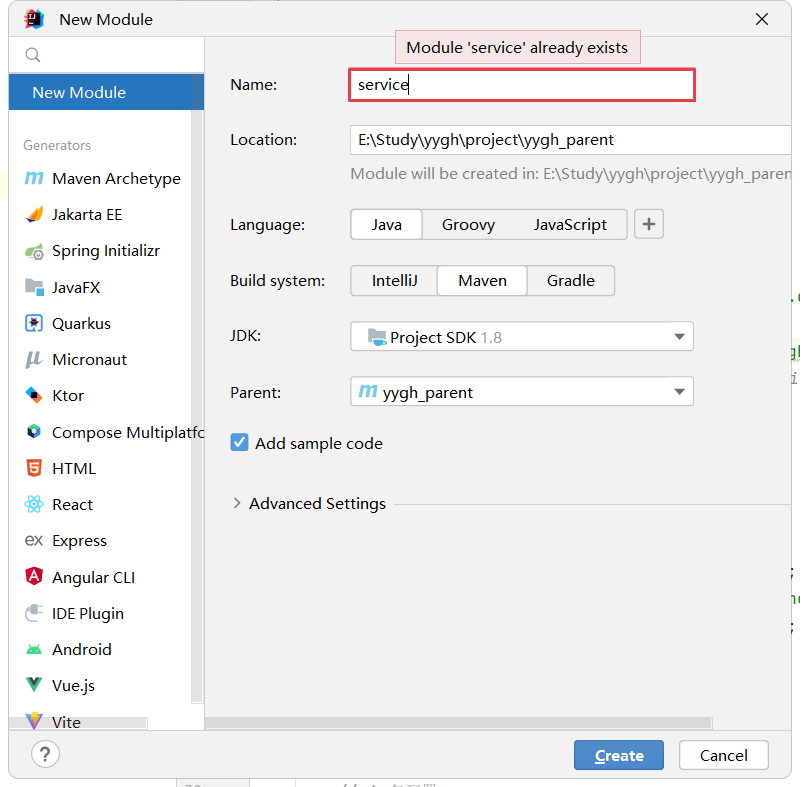
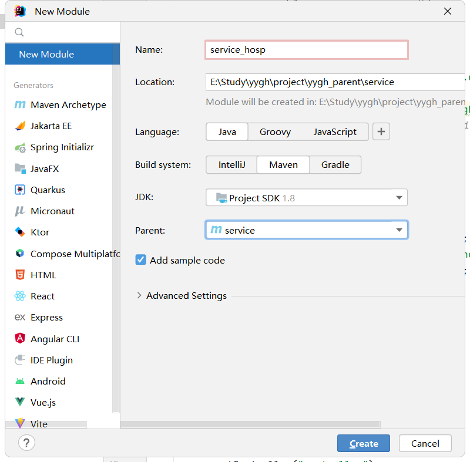

# 一、搭建service模块

## 1、在父工程yygh_parent下面创建模块service

选择父工程点击New Module，Name填写service，点击create



## 2、添加模块类型是pom
<artifactId> 节点后面添加 pom类型
```java
<artifactId>service</artifactId>
<packaging>pom</packaging>
```
## 3、添加项目需要的依赖
```java
<dependencies>
 <dependency>
 <groupId>com.atguigu</groupId>
 <artifactId>model</artifactId>
 <version>0.0.1-SNAPSHOT</version>
 </dependency>
 <!--web-->
 <dependency>
 <groupId>org.springframework.boot</groupId>
 <artifactId>spring-boot-starter-web</artifactId>
 </dependency>
 <!--mybatis-plus-->
 <dependency>
 <groupId>com.baomidou</groupId>
 <artifactId>mybatis-plus-boot-starter</artifactId>
 </dependency>
 <!--mysql-->
 <dependency>
 <groupId>mysql</groupId>
 <artifactId>mysql-connector-java</artifactId>
 </dependency>
 <!--开发者工具-->
 <dependency>
 <groupId>org.springframework.boot</groupId>
 <artifactId>spring-boot-devtools</artifactId>
 <optional>true</optional>
 </dependency>
 <!-- 服务调用feign -->
 <dependency>
 <groupId>org.springframework.cloud</groupId>
 <artifactId>spring-cloud-starter-openfeign</artifactId>
 </dependency>
 <!-- 服务注册 -->
 <dependency>
 <groupId>com.alibaba.cloud</groupId>
 <artifactId>spring-cloud-starter-alibaba-nacos-discovery</artifactId>
 </dependency>
</dependencies>
```
# 二、搭建医院模块service_hosp模块
## 1、在父工程service模块下面创建子模块service_hosp

