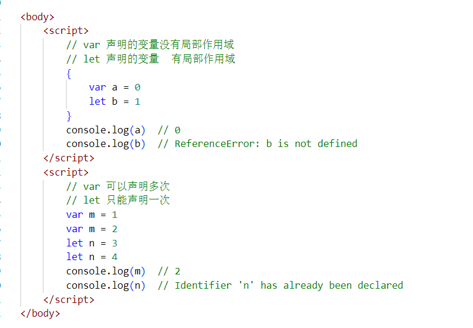
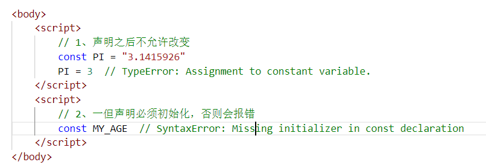
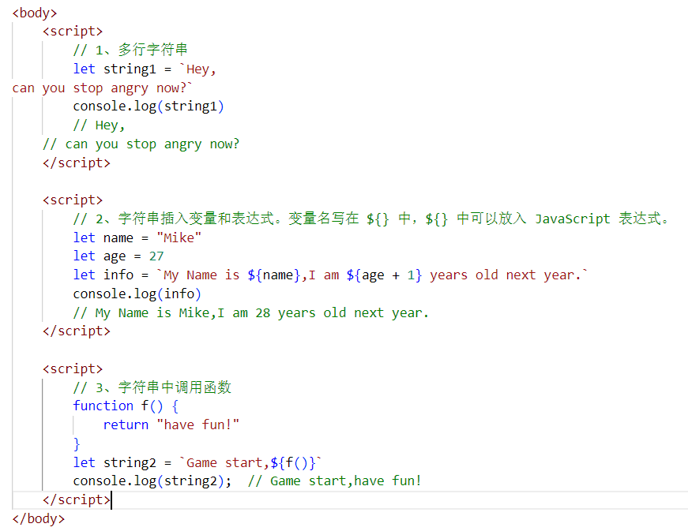
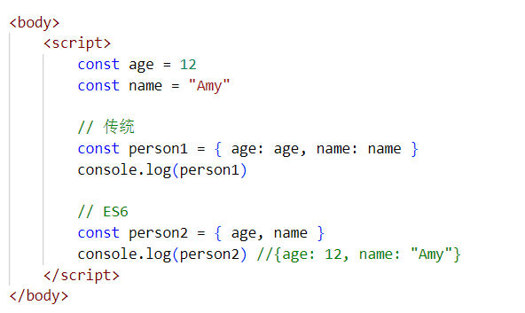
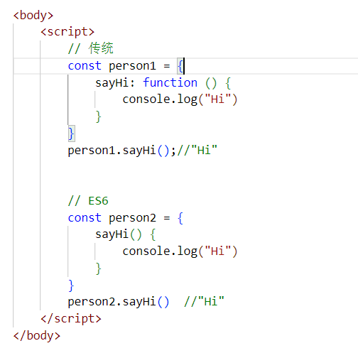
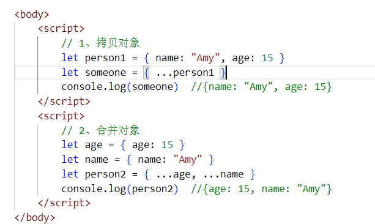
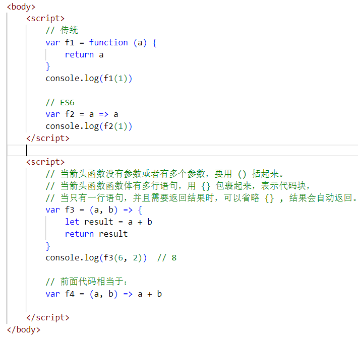

自学参考：[http://es6.ruanyifeng.com/](http://es6.ruanyifeng.com/)

# 一、ECMAScript 6 简介

ECMAScript 6.0（以下简称 ES6）是 JavaScript 语言的下一代标准，已经在 2015 年 6 月正式发布了。它的目标，是使得 JavaScript 语言可以用来编写复杂的大型应用程序，成为企业级开发语言。

## 1、ECMAScript 和 JavaScript 的关系

一个常见的问题是，ECMAScript 和 JavaScript 到底是什么关系？

要讲清楚这个问题，需要回顾历史。1996 年 11 月，JavaScript 的创造者 Netscape 公司，决定将 JavaScript 提交给标准化组织 ECMA，希望这种语言能够成为国际标准。次年，ECMA 发布 262 号标准文件（ECMA-262）的第一版，规定了浏览器脚本语言的标准，并将这种语言称为 ECMAScript，这个版本就是 1.0 版。

因此，ECMAScript 和 JavaScript 的关系是，前者是后者的规格，后者是前者的一种实现（另外的 ECMAScript 方言还有 Jscript 和 ActionScript）

## 2、ES6 与 ECMAScript 2015 的关系

ECMAScript 2015（简称 ES2015）这个词，也是经常可以看到的。它与 ES6 是什么关系呢？

2011 年，ECMAScript 5.1 版发布后，就开始制定 6.0 版了。因此，ES6 这个词的原意，就是指 JavaScript 语言的下一个版本。

ES6 的第一个版本，在 2015 年 6 月发布，正式名称是《ECMAScript 2015 标准》（简称 ES2015）。

2016 年 6 月，小幅修订的《ECMAScript 2016 标准》（简称 ES2016）如期发布，这个版本可以看作是 ES6.1 版，因为两者的差异非常小，基本上是同一个标准。根据计划，2017 年 6 月发布 ES2017 标准。

因此，ES6 既是一个历史名词，也是一个泛指，含义是 5.1 版以后的 JavaScript 的下一代标准，涵盖了 ES2015、ES2016、ES2017 等等，而 ES2015 则是正式名称，特指该年发布的正式版本的语言标准。本书中提到 ES6 的地方，一般是指 ES2015 标准，但有时也是泛指“下一代 JavaScript 语言”。

# 二、基本语法

ES标准中不包含 DOM 和 BOM的定义，只涵盖基本数据类型、关键字、语句、运算符、内建对象、内建函数等通用语法。

本部分只学习前端开发中ES6的最少必要知识，方便后面项目开发中对代码的理解。

## 1、let声明变量



## 2、const声明常量（只读变量）




## 3、解构赋值

创建 解构赋值.html

解构赋值是对赋值运算符的扩展。

他是一种针对数组或者对象进行模式匹配，然后对其中的变量进行赋值。

在代码书写上简洁且易读，语义更加清晰明了；也方便了复杂对象中数据字段获取。


## 4、模板字符串

模板字符串相当于加强版的字符串，用反引号 `,除了作为普通字符串，还可以用来定义多行字符串，还可以在字符串中加入变量和表达式。



## 5、声明对象简写



## 6、定义方法简写



## 7、对象拓展运算符

拓展运算符（...）用于取出参数对象所有可遍历属性然后拷贝到当前对象。



## 8、箭头函数

箭头函数提供了一种更加简洁的函数书写方式。基本语法是：

```
参数=>函数体
```



箭头函数多用于匿名函数的定义
