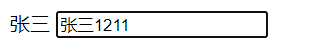
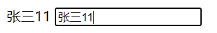
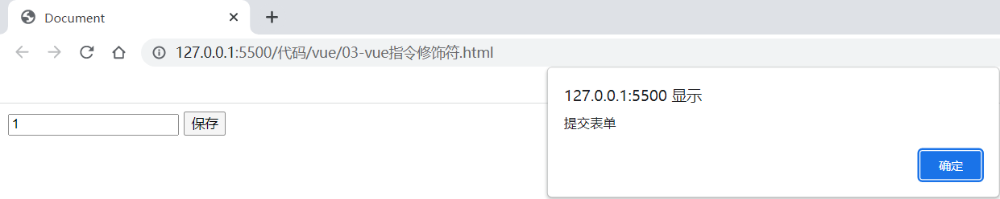
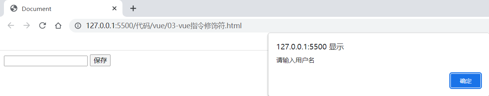
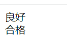
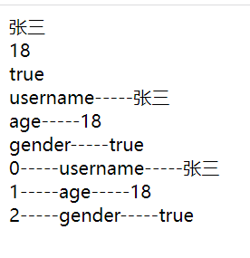
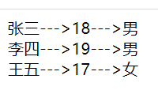

# 一、介绍

## 1、Vue.js 是什么

Vue (读音 /vjuː/，类似于 view) 是一套用于构建用户界面的渐进式框架。

Vue 的核心库只关注视图层，不仅易于上手，还便于与第三方库或既有项目整合。另一方面，当与现代化的工具链以及各种支持类库结合使用时，Vue 也完全能够为复杂的单页应用提供驱动。

官方网站：[https://cn.vuejs.org](https://cn.vuejs.org/)

架构：MVVM（model-view-viewmodel）

## 2、初始Vue.js

```html
<!-- id标识vue作用的范围 -->
<div id="app">
    <!-- {{}} 插值表达式，绑定vue中的data数据 -->
    {{ message }}
</div>
<script src="vue.min.js"></script>
<script>

    // 创建一个vue对象
    new Vue({
        el: '#app',//绑定vue作用的范围
        data: {//定义页面中显示的模型数据
            message: 'Hello Vue!'
        }
    })

</script>
```

这就是声明式渲染：Vue.js 的核心是一个允许采用简洁的模板语法来声明式地将数据渲染进 DOM 的系统

这里的核心思想就是没有繁琐的DOM操作，例如jQuery中，我们需要先找到div节点，获取到DOM对象，然后进行一系列的节点操作

**在vs code中创建代码片段：**

文件 =>  首选项 => 用户代码片段 => 新建全局代码片段/或文件夹代码片段：vue-html.code-snippets

注意：制作代码片段的时候，字符串中如果包含文件中复制过来的“Tab”键的空格，要换成“空格键”的空格

```html
{
	"vue htm": {
	"scope": "html",
	"prefix": "vuehtml",
	"body": [
	"<!DOCTYPE html>",
	"<html lang=\"en\">",
	"<head>",
	"    <meta charset=\"UTF-8\">",
	"    <meta name=\"viewport\" content=\"width=device-width, initial-scale=1.0\">",
	"    <meta http-equiv=\"X-UA-Compatible\" content=\"ie=edge\">",
	"    <title>Document</title>",
	"</head>",
	"<body>",
	"    <div id=\"app\">",
	"        ",
	"    </div>",
	"    <script src=\"vue.min.js\"></script>",
	"    <script>",
	"        new Vue({",
	"            el: '#app',",
	"            data: {",
	"                $1",
	"            }",
	"        })",
	"    </script>",
	"</body>",
	"</html>",
	],
	"description": "my vue template in html"
	}
   }
   
```

# 二、基本语法

## 1、基本数据渲染和指令

你看到的 v-bind 特性被称为指令。指令带有前缀 v-

除了使用插值表达式{{}}进行数据渲染，也可以使用 v-bind指令，它的简写的形式就是一个冒号（:）

```html
<body>
    <div id="app">
        {{username}}
        <input type="text" name="username" v-bind:value="username"></input>
    </div>
    <script src="vue.min.js"></script>
    <script>
        new Vue({
            el: '#app',
            data: {
                username:"张三" 
            }
        })
    </script>
</body>
```



## 2、双向数据绑定

双向数据绑定和单向数据绑定：使用 v-model 进行双向数据绑定

```html
<body>
    <div id="app">
        {{username}}
        <input type="text" name="username" v-model:value="username"></input>
    </div>
    <script src="vue.min.js"></script>
    <script>
        new Vue({
            el: '#app',
            data: {
                username:"张三" 
            }
        })
    </script>
</body>
```



## 3、事件

 **需求：** 点击按钮，触发点击事件

使用v-on进行事件处理，v-on:click表示处理鼠标点击事件，事件调用的方法定义在vue 对象声明的methods节点中，它的简写为@名称

```html
<body>
    <div id="app">
        <input type="button" value="您瞅啥" v-on:click="func()"></input> 
    </div>
    <script src="vue.min.js"></script>
    <script>
        new Vue({
            el: '#app',
            data: {
  
            },
            methods:{
                func(){
                    alert("瞅你咋地")
                }
            }
        })
    </script>
</body>
```


## 4、修饰符

修饰符 (Modifiers) 是以半角句号（.）指明的特殊后缀，用于指出一个指令应该以特殊方式绑定。

例如，.prevent 修饰符告诉 v-on 指令对于触发的事件调用 event.preventDefault()：

即阻止事件原本的默认行为

```html
<body>
    <div id="app">
        <!-- 修饰符用于指出一个指令应该以特殊方式绑定。
     这里的 .prevent 修饰符告诉 v-on 指令对于触发的事件调用js的 event.preventDefault()：
     即阻止表单提交的默认行为 -->
        <form action="save" v-on:submit.prevent="onSubmit">
            <label for="username">
                <input type="text" id="username" v-model="user.username">
                <button type="submit">保存</button>
            </label>
        </form>
  
    </div>
    <script src="vue.min.js"></script>
    <script>
        new Vue({
            el: '#app',
            data: {
                user: {}
            },
            methods: {
                onSubmit() {
                    if (this.user.username) {
                        alert('提交表单')
                    } else {
                        alert('请输入用户名')
                    }
                }
            }
        })
    </script>
</body>
```





## 5、条件渲染

v-if、v-else-if、v-else：条件指令

v-show：条件指令

```html
<body>
    <div id="app">
        <div v-if=" score > 90">
            优秀
        </div>
        <div v-else-if=" score > 70">
            良好
        </div>
        <div v-else=" score > 60">
            及格
        </div>

        <div v-show=" score > 60">
            合格
        </div> 
    </div>
    <script src="vue.min.js"></script>
    <script>
        new Vue({
            el: '#app',
            data: {
                score:85
            }
        })
    </script>
</body>
```



* ``v-if`` 是“真正”的条件渲染，因为它会确保在切换过程中条件块内的事件监听器和子组件适当地被销毁和重建。
* ``v-if``也是 **惰性的** ：如果在初始渲染时条件为假，则什么也不做——直到条件第一次变为真时，才会开始渲染条件块。
* 相比之下，``v-show``就简单得多——不管初始条件是什么，元素总是会被渲染，并且只是简单地基于 CSS 进行切换。
* 一般来说，``v-if`` 有更高的切换开销，而 ``v-show`` 有更高的初始渲染开销。因此，如果需要非常频繁地切换，则使用 ``v-show`` 较好；如果在运行时条件很少改变，则使用 ``v-if`` 较好。

## 6、列表渲染

v-for：列表循环指令

例1：简单的列表渲染

```html
<body>
    <div id="app">
        <div v-for="value in obj">
            {{value}}
        </div>
        
        <div v-for="value,key in obj">
            {{key}}-----{{value}}
        </div>

        <div v-for="value,key,index in obj">
            {{index}}-----{{key}}-----{{value}}
        </div>

    </div>
    
    <script src="vue.min.js"></script>
    <script>
        new Vue({
            el: '#app',
            data: {
                obj:{username:"张三",age:18,gender:true}    
            }
        })
    </script>
</body>
```

```html
<body>
    <div id="app">
        <div v-for="obj in items">
            {{obj.username}}--->{{obj.age}}--->{{obj.gender?"男":"女"}}
        </div>

    </div>
  
    <script src="vue.min.js"></script>
    <script>
        new Vue({
            el: '#app',
            data: {
                items:[
                    {username:"张三",age:18,gender:true},
                    {username:"李四",age:19,gender:true},
                    {username:"王五",age:17,gender:false},
                ]   
            }
        })
    </script>
</body>
```


