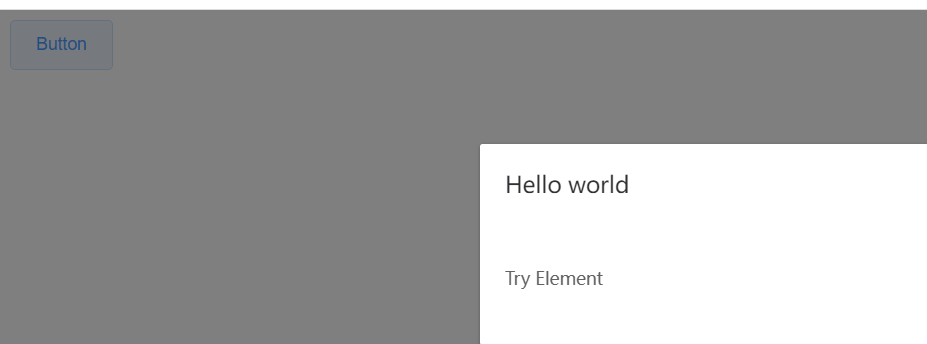

# 一、组件（重点）

组件（Component）是 Vue.js 最强大的功能之一。

组件可以扩展 HTML 元素，封装可重用的代码。

组件系统让我们可以用独立可复用的小组件来构建大型应用，几乎任意类型的应用的界面都可以抽象为一个组件树：


## 1、局部组件

定义组件

```html
var app = new Vue({
    el: '#app',
    // 定义局部组件，这里可以定义多个局部组件
    components: {
        //组件的名字
        'Navbar': {
            //组件的内容
            template: '<ul><li>首页</li><li>学员管理</li></ul>'
        }
    }
})
```

使用组件

```html
<div id="app">
    <Navbar></Navbar>
</div>
```

## 2、全局组件

定义全局组件：components/Navbar.js

```html
// 定义全局组件
Vue.component('Navbar', {
    template: '<ul><li>首页</li><li>学员管理</li><li>讲师管理</li></ul>'
})
```

```html
<div id="app">
    <Navbar></Navbar>
</div>
<script src="vue.min.js"></script>
<script src="components/Navbar.js"></script>
<script>
    var app = new Vue({
        el: '#app'
    })
</script>
```

# 二、实例生命周期


# 四、路由

Vue.js 路由允许我们通过不同的 URL 访问不同的内容。
通过 Vue.js 可以实现多视图的单页Web应用（single page web application，SPA）。

Vue.js 路由需要载入 vue-router 库

## 1、引入js

```html
<script src="vue.min.js"></script>
<script src="vue-router.min.js"></script>
```

## 2、编写html

```html
<div id="app">
    <h1>Hello App!</h1>
    <p>
        <!-- 使用 router-link 组件来导航. -->
        <!-- 通过传入 `to` 属性指定链接. -->
        <!-- <router-link> 默认会被渲染成一个 `<a>` 标签 -->
        <router-link to="/">首页</router-link>
        <router-link to="/student">会员管理</router-link>
        <router-link to="/teacher">讲师管理</router-link>
    </p>
    <!-- 路由出口 -->
    <!-- 路由匹配到的组件将渲染在这里 -->
    <router-view></router-view>
</div>
```

## 3、编写js

```html
<script>
    // 1. 定义（路由）组件。
    // 可以从其他文件 import 进来
    const Welcome = { template: '<div>欢迎</div>' }
    const Student = { template: '<div>student list</div>' }
    const Teacher = { template: '<div>teacher list</div>' }

    // 2. 定义路由
    // 每个路由应该映射一个组件。
    const routes = [
        { path: '/', redirect: '/welcome' }, //设置默认指向的路径
        { path: '/welcome', component: Welcome },
        { path: '/student', component: Student },
        { path: '/teacher', component: Teacher }
    ]

    // 3. 创建 router 实例，然后传 `routes` 配置
    const router = new VueRouter({
        routes // （缩写）相当于 routes: routes
    })

    // 4. 创建和挂载根实例。
    // 从而让整个应用都有路由功能
    const app = new Vue({
        el: '#app',
        router
    })

    // 现在，应用已经启动了！
</script>
```

# 五、axios

axios是独立于vue的一个项目，基于promise用于浏览器和node.js的http客户端

* 在浏览器中可以帮助我们完成 ajax请求的发送
* 在node.js中可以向远程接口发送请求
  获取数据

```html
<script src="vue.min.js"></script>
<script src="axios.min.js"></script>
```

注意：测试时需要开启后端服务器，并且后端开启跨域访问权限

```html
var app = new Vue({
    el: '#app',
    data: {
        memberList: []//数组
    },
    created() {
        this.getList()
    },

    methods: {

        getList(id) {
            //vm = this
            axios.get('http://localhost:8081/admin/ucenter/member')
            .then(response => {
                console.log(response)
                this.memberList = response.data.data.items
            })
            .catch(error => {
                console.log(error)
            })
        }
    }
})
```

控制台查看输出

### 2、显示数据

```html
<div id="app">
    <table border="1">
        <tr>
            <td>id</td>
            <td>姓名</td>
        </tr>
        <tr v-for="item in memberList">
            <td>{{item.memberId}}</td>
            <td>{{item.nickname}}</td>
        </td>
    </tr>
</table>
</div>
```

### 六、element-ui：

element-ui 是饿了么前端出品的基于 Vue.js的 后台组件库，方便程序员进行页面快速布局和构建

官网： [https://element.eleme.cn/#/zh-CN](https://element.eleme.cn/#/zh-CN)

## 1、引入CSS和JS

```html
<!-- 引入样式 -->
<link rel="stylesheet" href="https://unpkg.com/element-ui/lib/theme-chalk/index.css">
<!-- 引入组件库 -->
<script src="https://unpkg.com/element-ui/lib/index.js"></script>
```

## 2、编写html和js

```html
<body>
    <div id="app">
        <el-button @click="visible = true">Button</el-button>
        <el-dialog :visible.sync="visible" title="Hello world">
            <p>Try Element</p>
        </el-dialog>
    </div>
    <script src="vue.min.js"></script>
    <!-- 引入样式 -->
    <link rel="stylesheet" href="https://unpkg.com/element-ui/lib/theme-chalk/index.css">
    <!-- 引入组件库 -->
    <script src="https://unpkg.com/element-ui/lib/index.js"></script>
    <script>
        new Vue({
            el: '#app',
            data: {
                visible: false
            }
        })
    </script>
</body>
```

## 3、测试


