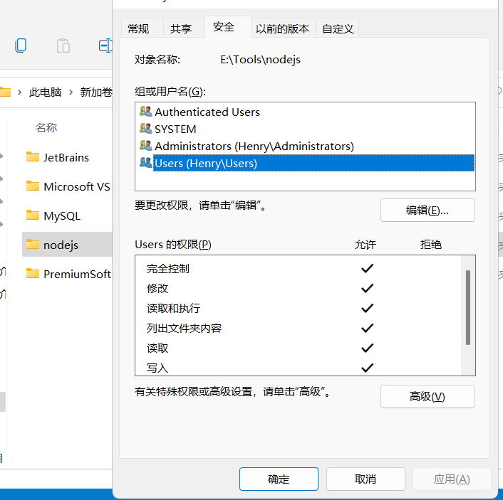
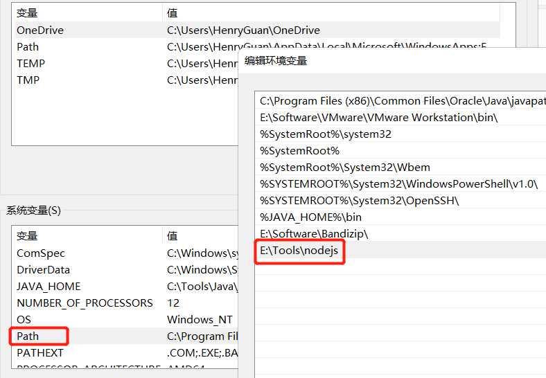
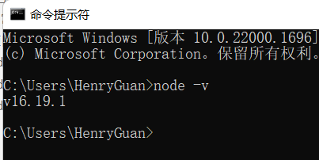
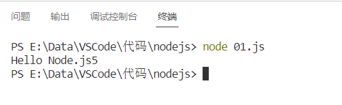

# 一、简介

## 1、什么是Node.js

简单的说 Node.js 就是运行在服务端的 JavaScript。

Node.js是一个事件驱动I/O服务端JavaScript环境，基于Google的V8引擎，V8引擎执行Javascript的速度非常快，性能非常好。

## 2、Node.js有什么用

如果你是一个前端程序员，你不懂得像PHP、Python或Ruby等动态编程语言，然后你想创建自己的服务，那么Node.js是一个非常好的选择。

Node.js 是运行在服务端的 JavaScript，如果你熟悉Javascript，那么你将会很容易的学会Node.js。

当然，如果你是后端程序员，想部署一些高性能的服务，那么学习Node.js也是一个非常好的选择。

Node.js 作用

* 解析js文件、运行js文件。
* 充当前端服务器，部署应用。

# 二、安装

## 1、下载

官网：[https://nodejs.org/en/](https://nodejs.org/en/)

中文网：[http://nodejs.cn/](http://nodejs.cn/)

LTS：长期支持版本

Current：最新版

## 2、安装

### 1、安装后，设置安装目录的权限



### 2、配置环境变量



### 3、查看版本

```
node -v
```



# 三、快速入门

## 1、创建文件夹nodejs

## 2、控制台程序

创建 01.js

```js
function add(a,b) {
    return parseInt(a)+parseInt(b);
}

console.log('Hello Node.js'+add(2,3))
```

选中文件，右键打开命令行终端

输入命令

```
node 01.js
```



浏览器的内核包括两部分核心：

* DOM渲染引擎；
* js解析器（js引擎）
* js运行在浏览器中的内核中的js引擎内部

Node.js是脱离浏览器环境运行的JavaScript程序，基于V8 引擎（Chrome 的 JavaScript的引擎）

## 3、服务器端应用开发（了解）

创建02.js

```js
const http = require('http')

const hostname = '127.0.0.1'
const port = 3000

const server = http.createServer((req, res) => {
    // 发送 HTTP 头部 
    // HTTP 状态值: 200 : OK
    // 内容类型: text/plain
    res.statusCode = 200
    res.setHeader('Content-Type', 'text/plain')
    // 发送响应数据 "Hello World"
    res.end('Hello World\n')
})

server.listen(port, hostname, () => {
    // 终端打印如下信息
    console.log(`Server running at http://${hostname}:${port}/`)
})
```

终端运行服务器程序

```js
node 02.js
```

服务器启动成功后，在浏览器中输入：[http://localhost:8888/](http://localhost:8888/) 查看webserver成功运行，并输出html页面

停止服务：ctrl + c
