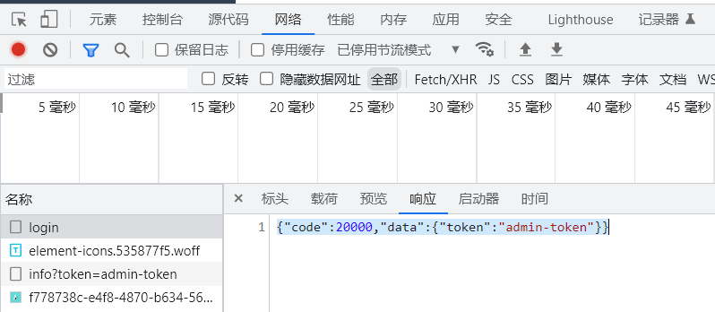
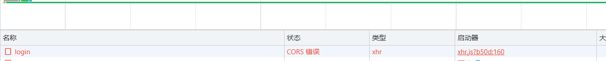
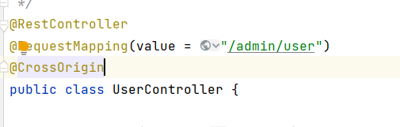
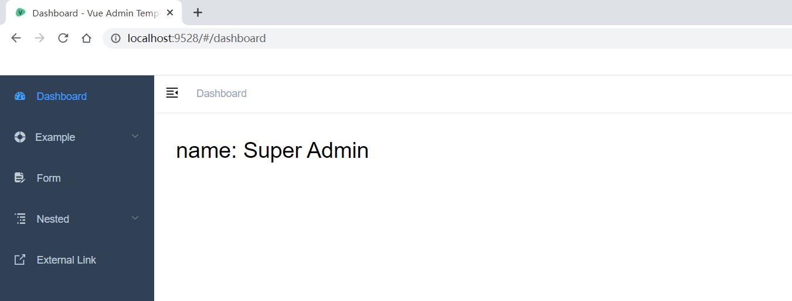

# 一、分析前端登录

打开F12，点击Login，监测网络



## login:

* 请求网址:

  http://localhost:9528/dev-api/vue-admin-template/user/login
* 请求方法:

  POST
* 响应信息

```json
{
    "code": 20000,
    "data": {
        "token": "admin-token"
    }
}
```

## info?token=admin-token

* 请求网址: http://localhost:9528/dev-api/vue-admin-template/user/info?token=admin-token
* 请求方法: GET
* 响应信息

```json
{
    "code": 20000,
    "data": {
        "roles": [
            "admin"
        ],
        "introduction": "I am a super administrator",
        "avatar": "https://wpimg.wallstcn.com/f778738c-e4f8-4870-b634-56703b4acafe.gif",
        "name": "Super Admin"
    }
}
```

# 二、编写后端登录方法

```java
@RestController
@RequestMapping(value = "/admin/user")
public class UserController {

    @PostMapping(value = "/login")
    public R login(@RequestBody User user){
        return R.ok().data("token","admin-token");
    }

    @GetMapping(value ="/info")
    public R info(String token) {
        return R.ok().data("roles","[admin]")
                .data("introduction","I am a super administrator")
                .data("avatar","https://wpimg.wallstcn.com/f778738c-e4f8-4870-b634-56703b4acafe.gif")
                .data("name","Super Admin");
    }

}
```

# 三、改造前端代码

## 1、修改.env.development文件

将VUE_APP_BASE_API参数改为后台启动的ip

```java
# base api
VUE_APP_BASE_API = 'http//localhost:8201'
```

## 2、修改src/api/user.js

```js
export function login(data) {
  return request({
    url: '/admin/user/login',
    method: 'post',
    data
  })
}

export function getInfo(token) {
  return request({
    url: '/admin/user/info',
    method: 'get',
    params: { token }
  })
}
```

## 3、登录测试


报错：CORS  跨域问题错误

# 四、解决跨域问题

在Contoller上加上注解@CrossOrigin


# 五、测试登录


