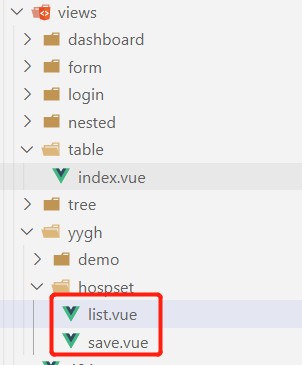
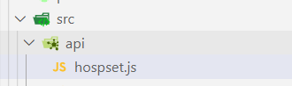

# 一、编写路由相关信息

src/router/index.js

```js
//医院设置管理
  {
    path: '/yygh/hospset',
    component: Layout,
    redirect: '/yygh/hospset/list',
    name: '医院设置信息',
    meta: { title: '医院设置信息', icon: 'el-icon-s-help' },
    children: [
      {
        path: 'list',
        name: '医院设置列表',
        component: () => import('@/views/yygh/hospset/list'),
        meta: { title: '医院设置列表', icon: 'table' }
      },
      {
        path: 'save',
        name: '医院设置添加',
        component: () => import('@/views/yygh/hospset/save'),
        meta: { title: '医院设置添加', icon: 'tree' }
      }
    ]
  },
```

# 二、编写路由跳转的页面

src/views/xxxx/xxxx/xx.vue



list.vue

```js
<template>
    <div class="app-container">医院设置列表</div>
</template>
<script>

</script>
```

save.vue

```js
<template>
    <div class="app-container">医院设置添加</div>
</template>
<script>

</script>
```

# 三、封装专门的js文件，调用后端接口

src/api/xxx.js



```js
import request from '@/utils/request'

const API = "/admin/hosp/hospitalSet"


export default {
    getHospSetPage(pageNum,pageSize,searchObj) {
        return request({
          url: `${API}/page/${pageNum}/${pageSize}`,
          method: 'post',
          // 如果携带是普通参数，params；如果是携带的json，data
          data:searchObj
        })
    }
}
```

# 四、回到路由跳转的页面

src/views/xxxx/xxxx/xx.vue

## 1、引入js文件

## 2、调用js文件中的方法请求后端接口

## 3、将后端返回的数据在页面中展示

```html

<template>
    <div class="app-container">
        <template>
            <el-table :data="rows" style="width: 100%">
                <el-table-column prop="id" label="id" width="80"/>
                <el-table-column prop="hosname" label="医院名称" width="180" />
                <el-table-column prop="hoscode" label="医院编号" width="160" />
                <el-table-column prop="apiUrl" label="api基础路径" width="200" />
                <el-table-column prop="contactsName" label="联系人" width="200" />
                <el-table-column prop="contactsPhone" label="联系人电话" width="200" />
                <el-table-column prop="status" label="状态" width="200">
                    <template slot-scope="scope">
                        {{ scope.row.status === 1 ? '可用' : '不可用' }}
                    </template>
                </el-table-column>
                <el-table-column prop="createTime" label="创建时间" width="180"/>
                <el-table-column prop="updateTime" label="更新时间" width="180"/>
          
            </el-table>
        </template>
    </div>
</template>
<script>
import hospset from '@/api/hospset.js'
export default {
    data() {
        return {
            total: 0,
            rows: [],
            searchObj:{}
        }
    },
    methods: {

    },
    created() {
        hospset.getHospSetPage(1, 5, this.searchObj).then(resp => {
            this.total = resp.data.total;
            this.rows = resp.data.rows;
        })
    }
}
</script>
```

# 五、处理跨域问题

在Contoller上加上注解@CrossOrigin
