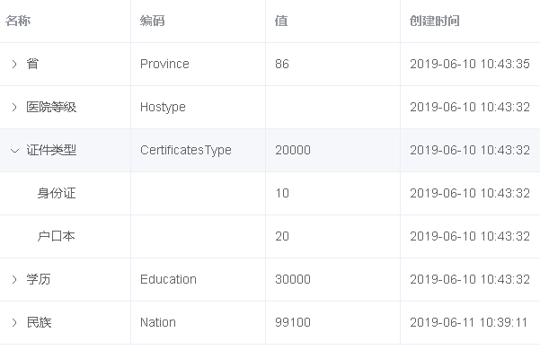
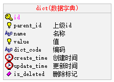
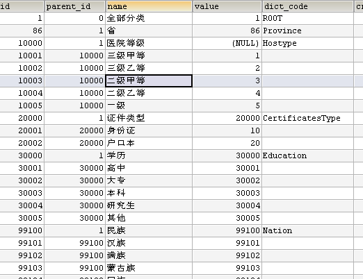
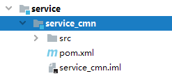

# 一、数据字典介绍

## 1、什么是数据字典

数据字典就是管理系统常用的分类数据或者一些固定数据，例如：省市区三级联动数据、民族数据、行业数据、学历数据等，由于该系统大量使用这种数据，所以我们要做一个数据管理方便管理系统数据，一般系统基本都会做数据管理。

## 2、页面展示效果



## 3、数据字典表设计



## 4、数据分析



parent_id：

上级id，通过id与parent_id构建上下级关系，例如：我们要获取所有行业数据，那么只需要查询parent_id=20000的数据

name：名称，例如：填写用户信息，我们要select标签选择民族，“汉族”就是数据字典的名称

value：值，例如：填写用户信息，我们要select标签选择民族，“1”（汉族的标识）就是数据字典的值

dict_code：编码，编码是我们自定义的，全局唯一，例如：我们要获取行业数据，我们可以通过parent_id获取，但是parent_id是不确定的，所以我们可以根据编码来获取行业数据

说明：系统中会使用省市区三级联动数据，该数据我们来自“国家统计局”官方数据，地址：[http://www.stats.gov.cn/tjsj/tjbz/tjyqhdmhcxhfdm/2019/index.html](http://www.stats.gov.cn/tjsj/tjbz/tjyqhdmhcxhfdm/2019/index.html)

## 5、根据页面效果分析数据接口

数据字典是树形展示，由于数据众多，我们使用“树形数据与懒加载”的方式展现数据列表，其他就是对数据的新增、修改与删除操作，因此需要提供的接口如下：

1，根据上级id获取下级数据（构造树形数据），参考文档：[https://element.eleme.cn/#/zh-CN/component/table](https://element.eleme.cn/#/zh-CN/component/table)，页面搜索：树形数据与懒加载

2，导入接口

3，导出接口

# 二、搭建数据字典模块

## 1、创建service_cmn模块



## 2、创建application.properties配置文件

```java
# 服务端口
server.port=8202
# 服务名
spring.application.name=service-cmn

# 环境设置：dev、test、prod
spring.profiles.active=dev

# mysql数据库连接
spring.datasource.driver-class-name=com.mysql.jdbc.Driver
spring.datasource.url=jdbc:mysql://localhost:3306/yygh_cmn?characterEncoding=utf-8&useSSL=false
spring.datasource.username=root
spring.datasource.password=root123

#返回json的全局时间格式
spring.jackson.date-format=yyyy-MM-dd HH:mm:ss
spring.jackson.time-zone=GMT+8
```

## 3、使用代码生成器生成mapper接口，service，controller层，entity层生成之后删除!

代码生成器从yygh_hosp模块的拷贝[同时注意拷贝代码生成器的两个依赖哦]

## 4.创建启动类

```java
@SpringBootApplication
@ComponentScan(value = "com.atguigu")
@MapperScan(value = "com.atguigu.yygh.cmn.mapper")
public class ServiceCmnApplication {
    public static void main(String[] args) {
        SpringApplication.run(ServiceCmnApplication.class, args);
    }
}
```
