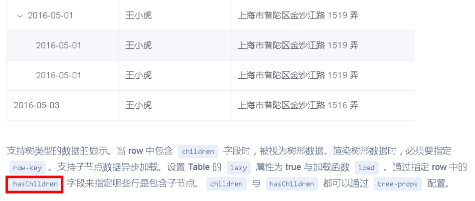
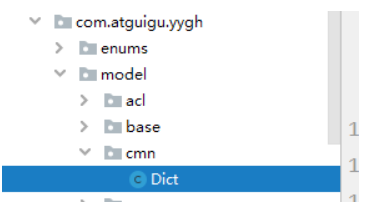

# 一、数据字典列表接口

根据element组件要求，返回列表数据必须包含hasChildren字典，如图：

https://element.eleme.cn/#/zh-CN/component/table



## 1、model模块添加数据字典实体



```java
@Data
@ApiModel(description = "数据字典")
@TableName("dict")
public class Dict {

    private static final long serialVersionUID = 1L;

    @ApiModelProperty(value = "id")
    private Long id;

    @ApiModelProperty(value = "创建时间")
    @JsonFormat(pattern = "yyyy-MM-dd HH:mm:ss")
    @TableField("create_time")
    private Date createTime;

    @ApiModelProperty(value = "更新时间")
    @TableField("update_time")
    private Date updateTime;

    @ApiModelProperty(value = "逻辑删除(1:已删除，0:未删除)")
    @TableLogic
    @TableField("is_deleted")
    private Integer isDeleted;

    @ApiModelProperty(value = "其他参数")
    @TableField(exist = false)
    private Map<String,Object> param = new HashMap<>();

    @ApiModelProperty(value = "上级id")
    @TableField("parent_id")
    private Long parentId;

    @ApiModelProperty(value = "名称")
    @TableField("name")
    private String name;

    @ApiModelProperty(value = "值")
    @TableField("value")
    private String value;

    @ApiModelProperty(value = "编码")
    @TableField("dict_code")
    private String dictCode;

    @ApiModelProperty(value = "是否包含子节点")
    @TableField(exist = false)
    private boolean hasChildren;

}
```

**说明：hasChildren为树形组件所需字典，标识为数据库表不存在该字段**

## 2、添加数据字典mapper

```java
public interface DictMapper extends BaseMapper<Dict> {
}
```

## 3、添加数据字典service

```java
public interface DictService extends IService<Dict> {
    //根据数据id查询子数据列表
    List<Dict> findChlidData(Long id);
}

@Service
public class DictServiceImpl extends ServiceImpl<DictMapper, Dict> implements DictService {
    //根据数据id查询子数据列表
    @Override
    public List<Dict> findChlidData(Long id) {
        QueryWrapper<Dict> wrapper = new QueryWrapper<>();
        wrapper.eq("parent_id",id);
        List<Dict> dictList = baseMapper.selectList(wrapper);
        //向list集合每个dict对象中设置hasChildren
        for (Dict dict:dictList) {
            Long dictId = dict.getId();
            boolean isChild = this.isChildren(dictId);
            dict.setHasChildren(isChild);
        }
        return dictList;
    }
    //判断id下面是否有子节点
    private boolean isChildren(Long id) {
        QueryWrapper<Dict> wrapper = new QueryWrapper<>();
        wrapper.eq("parent_id",id);
        Integer count = baseMapper.selectCount(wrapper);
        return count>0;
    }
}
```

## 4、添加数据字典controller

```java
@Api(description = "数据字典接口")
@RestController
@RequestMapping("/admin/cmn/dict")
@CrossOrigin
public class DictController {

    @Autowired
    private DictService dictService;

    //根据数据id查询子数据列表
    @ApiOperation(value = "根据数据id查询子数据列表")
    @GetMapping("findChildData/{id}")
    public R findChildData(@PathVariable Long id) {
        List<Dict> list = dictService.findChlidData(id);
        return R.ok().data("list",list);
    }
}
```

# 二、数据字典列表前端

## 1、添加数据字典路由

修改router/index.js文件

```js
  {
    path: '/cmn',
    component: Layout,
    redirect: '/cmn/list',
    name: '数据管理',
    alwaysShow: true,
    meta: { title: '数据管理', icon: 'example' },
    children: [
      {
        path: 'list',
        name: '数据字典',
        component: () => import('@/views/dict/list'),
        meta: { title: '数据字典', icon: 'table' }
      }
    ]
  },
```

## 2、定义数据字典列表接口

创建文件 src/api/yygh/dict.js

```js
import request from '@/utils/request'
export default {
    dictList(id) {//数据字典列表
      return request ({
        url: `/admin/cmn/dict/findChildData/${id}`,
        method: 'get'
      })
    }
}
```

## 3、在dict/list.vue调用

```js
<script>
import dict from '@/api/yygh/dict'
export default {
    data() {
        return {
            list:[] //数据字典列表数组
        }
    },
    created() {
        this.getDictList(1)
    },
    methods: {
        //数据字典列表
        getDictList(id) {
            dict.dictList(id)
                .then(response => {
                    this.list = response.data.list
                })
        },
        load(tree, treeNode, resolve) {
            dict.dictList(tree.id).then(response => {
                resolve(response.data.list)
            })
      }
    }
}
</script>
```

## 4、页面数据渲染

修改dict/list.vue页面

```js
<template>
    <div  class="app-container">
    <el-table
        :data="list"
        style="width: 100%"
        row-key="id"
        border
        lazy
        :load="load"
        :tree-props="{children: 'children', hasChildren: 'hasChildren'}">

        <el-table-column
        prop="name"
        label="名称"
        width="150">
        </el-table-column>

        <el-table-column
        prop="dictCode"
        label="编码"
        width="150">
        </el-table-column>

        <el-table-column
        prop="value"
        label="值"
        width="150">
        </el-table-column>

        <el-table-column
        prop="createTime"
        label="创建时间">
        </el-table-column>

    </el-table>
    </div>
</template>
```
