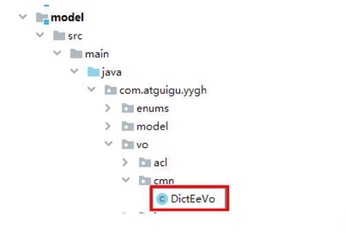

# 一、数据字典导出后端接口

## 1、查看model实体类

在model模块查看实体：com.atguigu.yygh.vo.cmn.DictEeVo



```java
@Data
public class DictEeVo {

	@ExcelProperty(value = "id" ,index = 0)
	private Long id;

	@ExcelProperty(value = "上级id" ,index = 1)
	private Long parentId;

	@ExcelProperty(value = "名称" ,index = 2)
	private String name;

	@ExcelProperty(value = "值" ,index = 3)
	private String value;

	@ExcelProperty(value = "编码" ,index = 4)
	private String dictCode;

}
```

## 2、在DictService添加方法和实现

```java
public interface DictService extends IService<Dict> {
 /**
 * 导出
 * @param response
 */
 void exportData(HttpServletResponse response);
}
 @Override
 public void exportData(HttpServletResponse response) {
 try {
 response.setContentType("application/vnd.ms-excel");
 response.setCharacterEncoding("utf-8");
 // 这里URLEncoder.encode可以防止中文乱码 当然和easyexcel没有关系
 String fileName = URLEncoder.encode("数据字典", "UTF-8");
 response.setHeader("Content-disposition", "attachment;filename="+ fileNam
 List<Dict> dictList = baseMapper.selectList(null);
 List<DictEeVo> dictVoList = new ArrayList<>(dictList.size());
 for(Dict dict : dictList) {
 DictEeVo dictVo = new DictEeVo();
 BeanUtils.copyProperties(dict,dictVo);
 dictVoList.add(dictVo);
 }
 EasyExcel.write(response.getOutputStream(), DictEeVo.class).sheet("数据字典
 } catch (IOException e) {
 e.printStackTrace();
 }
 }
```

## 3、添加Controller方法

```java
@ApiOperation(value="导出")
@GetMapping(value = "/exportData")
public void exportData(HttpServletResponse response) {
 dictService.exportData(response);
}
```

# 二、数据字典导出前端

list.vue页面添加导出按钮

```html
<div class="el-toolbar">
 <div class="el-toolbar-body" style="justify-content: flex-start;">
 <el-button type="text" @click="exportData"><i class="fa fa-plus"/> 导出</el-b
 </div>
</div>
```

编写调用方法

```html
exportData() {
 window.open("http://localhost:8202/admin/cmn/dict/exportData")
},
```
