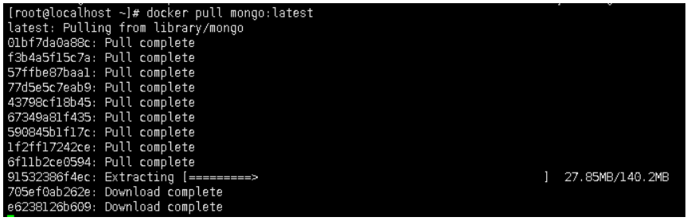

# 一、MongoDB安装（docker方式）

## 1、拉取镜像

docker pull mongo:latest

或者

docker pull mongo:4.4.8

## 2、创建和启动容器

### （1）对data目录授权

chmod 777 /data

### （2）创建和启动容器

docker run -d --restart=always -p 27017:27017 --name mymongo -v /data/db:/data/db -d mongo

或者

docker run -d --restart=always -p 27017:27017 --name mymongo -v /data/db:/data/db -d mongo:4.4.8

## 3、进入容器

sudo service docker restart  --重启docker

docker exec -it  mymongo  /bin/bash

## 4、使用MongoDB客户端进行操作

mongo

show dbs         #查询所有的数据库

# 二、MongoDB安装（普通方式）

参考资料中《mongodb安装文档》

# 三、MongoDB 概念解析

不管我们学习什么数据库都应该学习其中的基础概念，在mongodb中基本的概念是文档、集合、数据库，下面我们详细介绍，下表将帮助您更容易理解Mongo中的一些概念：

| SQL术语/概念 | MongoDB术语/概念 | 解释/说明                           |
| ------------ | ---------------- | ----------------------------------- |
| database     | database         | 数据库                              |
| table        | collection       | 数据库表/集合                       |
| row          | document         | 数据记录行/文档                     |
| column       | field            | 数据字段/域                         |
| index        | index            | 索引                                |
| table joins  |                  | 表连接,MongoDB不支持                |
| primary key  | primary key      | 主键,MongoDB自动将_id字段设置为主键 |

**1、数据库**

一个mongodb中可以建立多个数据库，常用操作如下：

（1）Help查看命令提示

db.help();

（2）切换/创建数据库

use test

如果数据库不存在，则创建数据库，否则切换到指定数据库

（3） 查询所有数据库

show dbs;

（4）删除当前使用数据库

db.dropDatabase();

（5）查看当前使用的数据库

db.getName();

（6）显示当前db状态

db.stats();

（7）当前db版本

db.version();

（8） 查看当前db的链接机器地址

db.getMongo();

**2、文档**

文档是一组键值(key-value)对(即BSON)。MongoDB 的文档不需要设置相同的字段，并且相同的字段不需要相同的数据类型，这与关系型数据库有很大的区别，也是 MongoDB 非常突出的特点。

下表列出了 RDBMS 与 MongoDB 对应的术语：

| RDBMS  | MongoDB                           |
| ------ | --------------------------------- |
| 数据库 | 数据库                            |
| 表格   | 集合                              |
| 行     | 文档                              |
| 列     | 字段                              |
| 表联合 | 嵌入文档                          |
| 主键   | 主键 (MongoDB 提供了 key 为 _id ) |

**需要注意的是：**

1、文档中的键/值对是有序的。

2、文档中的值不仅可以是在双引号里面的字符串，还可以是其他几种数据类型（甚至可以是整个嵌入的文档)。

3、MongoDB区分类型和大小写。

4、MongoDB的文档不能有重复的键。

5、文档的键是字符串。除了少数例外情况，键可以使用任意UTF-8字符。

**文档键命名规范：**

1、键不能含有\0 (空字符)。这个字符用来表示键的结尾。

2、.和$有特别的意义，只有在特定环境下才能使用。

3、以下划线"_"开头的键是保留的(不是严格要求的)。

3、集合

集合就是 MongoDB 文档组，类似于 RDBMS （关系数据库管理系统：Relational Database Management System)中的表格。

集合存在于数据库中，集合没有固定的结构，这意味着你在对集合可以插入不同格式和类型的数据，但通常情况下我们插入集合的数据都会有一定的关联性。

常用命令：

1、 创建一个集合（table)

db.createCollection( "collName");

2、 得到指定名称的集合（table )

db.getCollection("user");

4、MongoDB的数据类型

数据类型描述String字符串。存储数据常用的数据类型。在 MongoDB 中，UTF-8 编码的字符串才是合法的。Integer整型数值。用于存储数值。根据你所采用的服务器，可分为 32 位或 64 位。Boolean布尔值。用于存储布尔值（真/假）。Double双精度浮点值。用于存储浮点值。Min/Max keys将一个值与 BSON（二进制的 JSON）元素的最低值和最高值相对比。Arrays用于将数组或列表或多个值存储为一个键。Timestamp时间戳。记录文档修改或添加的具体时间。Object用于内嵌文档。Null用于创建空值。Symbol符号。该数据类型基本上等同于字符串类型，但不同的是，它一般用于采用特殊符号类型的语言。Date日期时间。用 UNIX 时间格式来存储当前日期或时间。你可以指定自己的日期时间：创建 Date 对象，传入年月日信息。Object ID对象 ID。用于创建文档的 ID。Binary Data二进制数据。用于存储二进制数据。Code代码类型。用于在文档中存储 JavaScript 代码。Regular expression正则表达式类型。用于存储正则表达式。

5、MongoDB适用场景

适用场景1、网站数据：Mongo非常适合实时的插入，更新与查询，并具备网站实时数据存储所需的复制及高度伸缩性。2、缓存：由于性能很高，Mongo也适合作为信息基础设施的缓存层。在系统重启之后，由Mongo搭建的持久化缓存层可以避免下层的数据源过载。3、大尺寸，低价值的数据：使用传统的关系型数据库存储一些数据时可能会比较昂贵，在此之前，很多时候程序员往往会选择传统的文件进行存储。4、高伸缩性的场景：Mongo非常适合由数十或数百台服务器组成的数据库。Mongo的路线图中已经包含对Map Reduce弓摩的内置支持。5、用于对象及 JSON数据的存储：Mongo的BSON数据格式非常适合文档化格式的存储及查询。不适用场合1、高度事务性系统：例如银行系统。传统的关系型数据库目前还是更适用于需要大量原子性复杂事务的应用程序。2、传统的商业智能应用：针对特定问题的BI数据库会对产生高度优化的查询方式。对于此类应用，数据仓库可能是更合适的选择。
