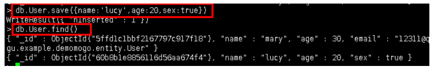
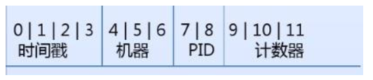
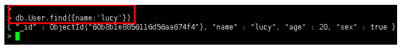
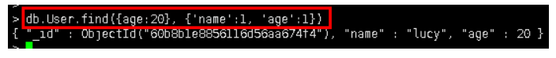
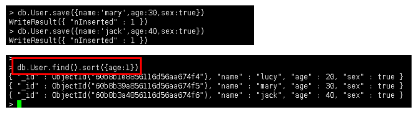
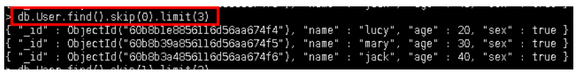
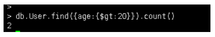
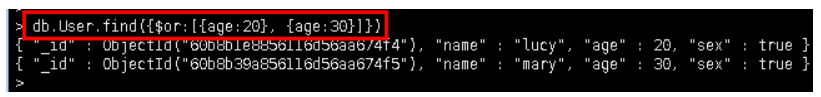

# 一、MongoDB常用操作（一）

## 1、INSERT

`db.User.save({name:'zhangsan',age:21,sex:true})`

`db.User.find()`

_id组合

Objectld是、id”的默认类型。Objectld使用12字节的存储空间，每个字节二位十六进制数字，是一个24位的字符串

1. 时间戳：时间不断变化的
2. 机器：主机的唯_标识码。通常是机器主机名的散列值，这样可以确保不同主机

生成不同的Objectld ,不产生冲突。

3. PID:为了确保在同一台机器上并发的多个进程产生的Objectld是唯一的，

所以加上进程标识符(PID).

4. 计数器：前9个字节保证了同一秒钟不同机器不同进程产生的Objectld是唯一的。

后3个字节就是一个自动增加的计数器，确保相同进程同一秒产生的Objectld也是

不一样。同一秒最多允许每个进程拥有IS 777 2托个不同的Objectld。

## 2、QUERY

### 2.1 WHERE

select * from User where name = 'lucy'

`db.User.find({name:"lucy"})`

### 2.2 FIELDS

select name, age from User where age = 20

`db.User.find({age:20}, {'name':1, 'age':1})`

### 2.3 SORT

在 MongoDB 中使用 sort() 方法对数据进行排序，sort() 方法可以通过参数指定排序的字段，并使用 1 和 -1 来指定排序的方式，其中 1 为升序排列，而 -1 是用于降序排列。

select * from User order by age

`db.User.find().sort({age:1})`

### 2.4 SUCE

在 MongoDB 中使用 limit()方法来读取指定数量的数据，skip()方法来跳过指定数量的数据

select * from User skip 2 limit 3

`db.User.find().skip(0).limit(3)`

### 2.5 IN

select * from User where age in (21, 26, 32)

`db.User.find({age:{$in:[21,26,32]}})`

### 2.6 COUNT

select count(*) from User where age >20

`db.User.find({age:{$gt:20}}).count()`

### 2.7 OR

select * from User where age = 20 or age = 30

`db.User.find({$or:[{age:20}, {age:30}]})`

