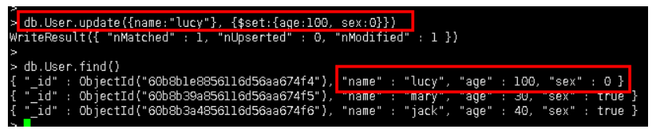
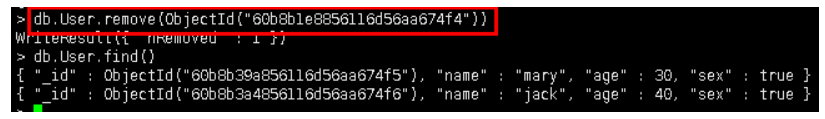
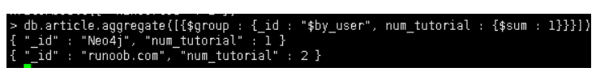
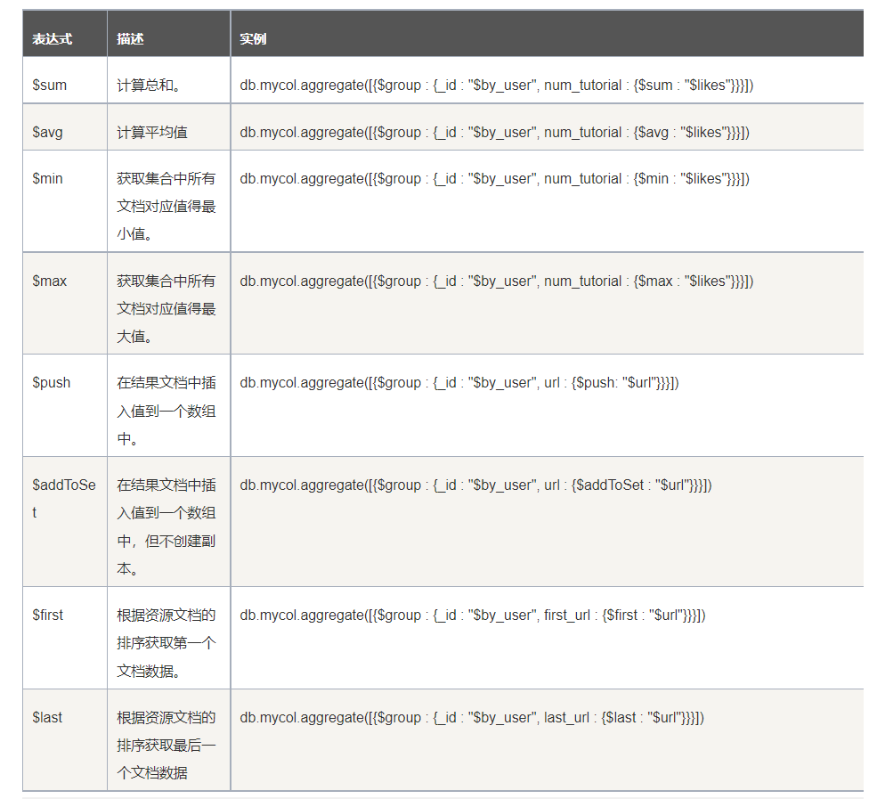

# 一、MongoDB常用操作（二）

## 1、UPDATE

update User set age = 100, sex = 0 where name = 'lucy'

```db.User.update({name:"lucy"}, {$set:{age:100, sex:0}})```



Update()有几个参数需要注意。

```db.collection.update(criteria, objNew, upsert, mult)```

criteria:需要更新的条件表达式

objNew:更新表达式

upsert:如FI标记录不存在，是否插入新文档。

multi:是否更新多个文档。

## 2、Remove

remove()用于删除单个或全部文档，删除后的文档无法恢复

//移除对应id的行

```db.User.remove(id)```



//移除所有

```db.User.remove({})```


## 3、aggregate聚合

MongoDB中聚合(aggregate)主要用于处理数据(诸如统计平均值,求和等)，并返回计算后的数据结果。有点类似sql语句中的 count(*)

插入测试数据

```sql
db.article.insert({title: 'MongoDB Overview',description: 'MongoDB is no sql database',by_user: 'runoob.com',url: 'http://www.runoob.com',tags: ['mongodb', 'database', 'NoSQL'],likes: 100})db.article.insert({title: 'NoSQL Overview',description: 'No sql database is very fast',by_user: 'runoob.com',url: 'http://www.runoob.com',tags: ['mongodb', 'database', 'NoSQL'],likes: 10})db.article.insert({title: 'Neo4j Overview',description: 'Neo4j is no sql database',by_user: 'Neo4j',url: 'http://www.neo4j.com',tags: ['neo4j', 'database', 'NoSQL'],likes: 750})
```

**通过以上集合计算每个作者所写的文章数**

select by_user, count(*) from article group by by_user

```
db.article.aggregate([{$group : {_id : "$by_user", num_tutorial : {$sum : 1}}}])
```




## 4、常见的聚合表达式



## 5、索引

索引通常能够极大的提高查询的效率，如果没有索引，MongoDB在读取数据时必须扫描集合中的每个文件并选取那些符合查询条件的记录。这种扫描全集合的查询效率是非常低的，特别在处理大量的数据时，查询可以要花费几十秒甚至几分钟，这对网站的性能是非常致命的。索引是特殊的数据结构，索引存储在一个易于遍历读取的数据集合中，索引是对数据库表中一列或多列的值进行排序的一种结构。

```db.User.createIndex({"name":1})```

**语法中 name值为你要创建的索引字段，1 为指定按升序创建索引，如果你想按降序来创建索引指定为 -1 即可**
