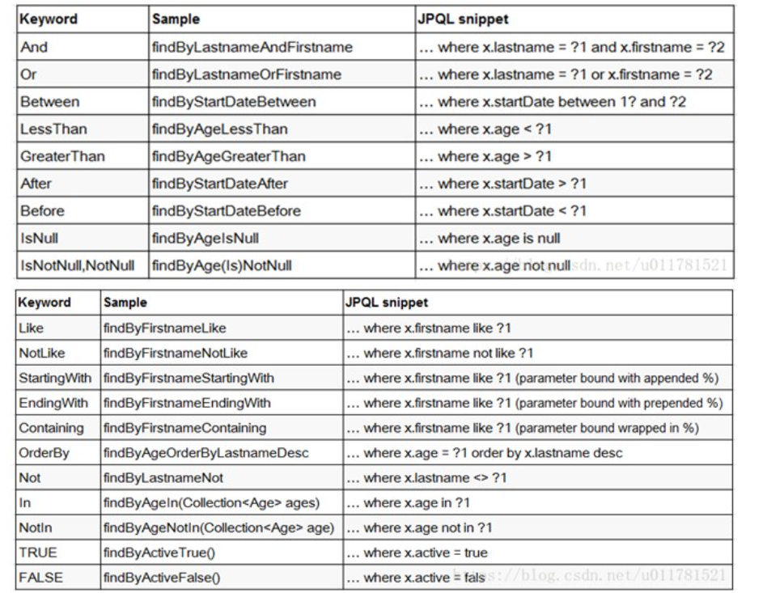

# 一、基于MongoRepository开发CRUD

Spring Data提供了对mongodb数据访问的支持，我们只需要继承MongoRepository类，按照Spring Data规范就可以了

SpringData 方法定义规范



1、不是随便声明的，而需要符合一定的规范
2、 查询方法以find | read | get开头
3、 涉及条件查询时，条件的属性用条件关键字连接
4、 要注意的是：条件属性首字母需要大写
5、 支持属性的级联查询，但若当前类有符合条件的属性则优先使用，而不使用级联属性,若需要使用级联属性，则属性之间使用_强制进行连接

**1、添加Repository类**

```java
@Repository
public interface UserRepository extends MongoRepository<User, String> {
}
```

## 2、编写测试类

```java
@RestController
@RequestMapping("/mongo2")
public class TestMongo2 {
 @Autowired
 private UserRepository userRepository;
 //添加
 @GetMapping("create")
 public void createUser() {
 User user = new User();
 user.setAge(20);
 user.setName("张三");
 user.setEmail("3332200@qq.com");
 User user1 = userRepository.save(user);
 }

 //查询所有
 @GetMapping("findAll")
 public void findUser() {
 List<User> userList = userRepository.findAll();
 System.out.println(userList);
 }
 //id查询
 @GetMapping("findId")
 public void getById() {
 User user = userRepository.findById("60b8d57ed539ed5b124942de").get();
 System.out.println(user);
 }
 //条件查询
 @GetMapping("findQuery")
 public void findUserList() {
 User user = new User();
 user.setName("张三");
 user.setAge(20);
 Example<User> userExample = Example.of(user);
 List<User> userList = userRepository.findAll(userExample);
 System.out.println(userList);
 }
 //模糊查询
 @GetMapping("findLike")
 public void findUsersLikeName() {
 //创建匹配器，即如何使用查询条件
 ExampleMatcher matcher = ExampleMatcher.matching() //构建对象
 .withStringMatcher(ExampleMatcher.StringMatcher.CONTAINING) //改变默认字符串匹配方式：模糊查询
 .withIgnoreCase(true); //改变默认大小写忽略方式：忽略大小写
 User user = new User();
 user.setName("三");
 Example<User> userExample = Example.of(user, matcher);
 List<User> userList = userRepository.findAll(userExample);
 System.out.println(userList);
 }
 //分页查询
 @GetMapping("findPage")
 public void findUsersPage() {
 Sort sort = Sort.by(Sort.Direction.DESC, "age");
//0为第一页
 Pageable pageable = PageRequest.of(0, 10, sort);
//创建匹配器，即如何使用查询条件
 ExampleMatcher matcher = ExampleMatcher.matching() //构建对象
 .withStringMatcher(ExampleMatcher.StringMatcher.CONTAINING) //改变默认字符串匹配方式：模糊查询
 .withIgnoreCase(true); //改变默认大小写忽略方式：忽略大小写
 User user = new User();
 user.setName("三");
 Example<User> userExample = Example.of(user, matcher);
//创建实例
 Example<User> example = Example.of(user, matcher);
 Page<User> pages = userRepository.findAll(example, pageable);
 System.out.println(pages);
 }
 //修改
 @GetMapping("update")
 public void updateUser() {
 User user = userRepository.findById("60b8d57ed539ed5b124942de").get();
 user.setName("张三_1");
 user.setAge(25);
 user.setEmail("883220990@qq.com");

 User save = userRepository.save(user);
 System.out.println(save);
 }
 //删除
 @GetMapping("delete")
 public void delete() {
 userRepository.deleteById("60b8d57ed539ed5b124942de");
 }
}
```

# 3、SpringData方法规范

```java
@GetMapping("testMethod2")
public void testMethod2() {
 List<User> users = userRepository.findByNameLike("张");
 System.out.println(users);
}
@GetMapping("testMethod1")
public void testMethod1() {
 List<User> users = userRepository.findByName("张三");
 System.out.println(users);
}
@Repository
public interface UserRepository extends MongoRepository<User, String> {
 List<User> findByName(String name);
 List<User> findByNameLike(String name);
}
```
