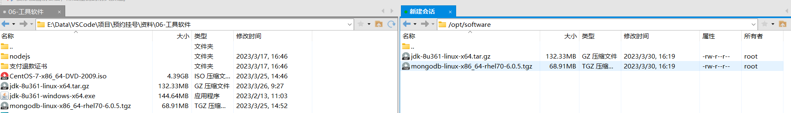

##### 1.上传mongodb安装文件到linux系统



##### 2.将其解压

```shell
tar -zxvf mongodb-linux-x86_64-rhel70-6.0.5.tgz
```

##### 3.将解压后的文件夹复制到/usr/local/的mongodb目录下

```shell
cp -r mongodb-linux-x86_64-rhel70-6.0.5  /usr/local/mongodb
```

删除原文件夹

```shell
rm -rf mongodb-linux-x86_64-rhel70-6.0.5
```

##### 4.配置系统文件profile

```shell
sudo vi /etc/profile
```

输入:$进入最后一行

```shell
:$
```

插入下列内容：

```shell
################MONGODB_HOME##################
export MONGODB_HOME=/usr/local/mongodb
export PATH=$PATH:$MONGODB_HOME/bin
```

输入:wq!保存退出

```shell
:wq!
```

注意保存后要重启系统配置：

```shell
source /etc/profile
```

##### 5.创建用于存放数据和日志文件的文件夹，并修改其权限

```shell
cd /usr/local/mongodb
sudo mkdir -p data/db
chmod -R 777 data


cd /usr/local/mongodb
sudo mkdir logs
chmod 777 logs


cd logs
touch mongodb.log
```

##### 6.mongodb启动配置

进入到bin目录，增加一个配置文件

```shell
cd /usr/local/mongodb/bin
sudo vi mongodb.conf
```

插入下列内容(注意：先在编辑器中删除注释信息)

```shell
dbpath=/usr/local/mongodb/data/db #数据文件存放目录
logpath=/usr/local/mongodb/logs/mongodb.log #日志文件存放目录
port=27018 #端口
fork=true #以守护程序的方式启用，即在后台运行
bind_ip=0.0.0.0
```

输入:wq!保存退出

```shell
:wq!
```

##### 7.启动mongodb数据库服务，以配置文件的方式启动

```shell
cd /usr/local/mongodb/bin
./mongod -f mongodb.conf
```

##### 8.连接mongodb数据库

```shell
./mongo
```

**启动mongodb**

mongod -f /usr/local/mongodb/bin/mongo.conf

检查是否启动成功

```shell
ps -ef | grep mongodb
```
