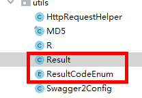

# 一、查询医院接口

参考《尚医通API接口文档.docx》业务接口4.4查询医院

## 1、复制Result返回结果类

复制到common\_utils



## 2、添加service方法

```java
    /**
     * 查询医院
     * @param hoscode
     * @return
     */
    Hospital getByHoscode(String hoscode);

    @Override
    public Hospital getByHoscode(String hoscode) {
        return hospitalRepository.getHospitalByHoscode(hoscode);
    }
```

## 3、添加controller

```java
    @ApiOperation(value = "获取医院信息")
    @PostMapping("hospital/show")
    public Result hospital(HttpServletRequest request) {
        Map<String, Object> paramMap = HttpRequestHelper.switchMap(request.getParameterMap());
        //必须参数校验
        String hoscode = (String)paramMap.get("hoscode");
        if(StringUtils.isEmpty(hoscode)) {
            throw new YyghException(20001,"失败");
        }
        //签名校验 略
        Hospital hospital = hospitalService.getByHoscode(hoscode);
        return Result.ok(hospital);
    }
```

---

---
