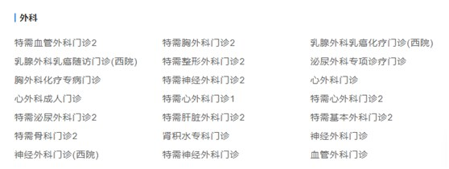

# 一、上传科室接口  

参考《尚医通API接口文档.docx》业务接口4.2上传科室  

## 1、添加科室基础类
### 1.1 添加model

说明：由于实体对象没有逻辑，我们已经统一导入

com.atguigu.yygh.model.hosp.Department  


### 1.2 添加repository

```java
@Repository
public interface DepartmentRepository extends MongoRepository<Department,String> {
}
```
### 1.3 添加service接口和实现类
```java
public interface DepartmentService {
}

@Service
public class DepartmentServiceImpl implements DepartmentService {

    @Autowired
    private DepartmentRepository departmentRepository;

}
```
## 2、上传科室实现
### 2.1 接口数据分析

```java
{
    "hoscode": "1000_0",
    "depcode": "200050923",
    "depname": "门诊部核酸检测门诊(东院)",
    "intro": "门诊部核酸检测门诊(东院)",
    "bigcode": "44f162029abb45f9ff0a5f743da0650d",
    "bigname": "体检科"
}

```
说明：一个大科室下可以有多个小科室，如图：



### 2.2 添加service方法和实现

```java
/**
 * 上传科室信息
 * @param paramMap
*/
void save(Map<String, Object> paramMap);

//实现方法
@Service
public class DepartmentServiceImpl implements DepartmentService {

    @Autowired
    private DepartmentRepository departmentRepository;

    @Override
    public void save(Map<String, Object> paramMap) {
        //paramMap 转换department对象
        String paramMapString = JSONObject.toJSONString(paramMap);
        Department department = JSONObject.parseObject(paramMapString,Department.class);

        //根据医院编号 和 科室编号查询
        Department departmentExist = departmentRepository.
                getDepartmentByHoscodeAndDepcode(department.getHoscode(),department.getDepcode());
        //判断
        if(departmentExist!=null) {
            department.setCreateTime(departmentExist.getCreateTime());
            department.setUpdateTime(new Date());
            department.setIsDeleted(0);
            department.setId(departmentExist.getId());
            departmentRepository.save(department);
        } else {
            department.setCreateTime(new Date());
            department.setUpdateTime(new Date());
            department.setIsDeleted(0);
            departmentRepository.save(department);
        }
    }
}
```
### 2.3 添加repository方法

```java
@Repository
public interface DepartmentRepository extends MongoRepository<Department,String> {

    Department getDepartmentByHoscodeAndDepcode(String hoscode, String depcode);
}
```
### 2.4 添加controller
```java
@Autowired
private DepartmentService departmentService;

@ApiOperation(value = "上传科室")
@PostMapping("saveDepartment")
public Result saveDepartment(HttpServletRequest request) {
    Map<String, Object> paramMap = HttpRequestHelper.switchMap(request.getParameterMap());
    //必须参数校验 略
    //签名校验

    departmentService.save(paramMap);
    return Result.ok();
}
```
---