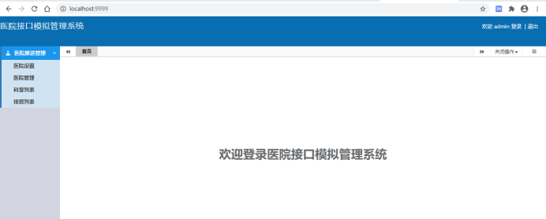
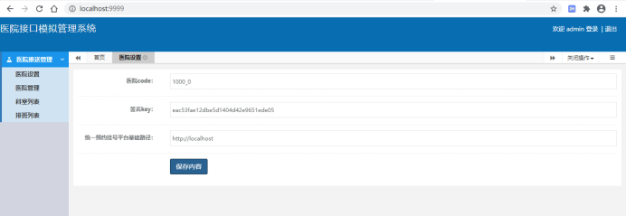

# **医院接口模拟系统**

版本：V1.0

# 1、文档介绍

## 1.1文档说明

该系统用于医院端接口模拟，配合尚医通完成接口调试。

## 1.2阅读对象

编程人员及测试人员。

# 2、服务部署

1. 找到资源文件夹下面的hospital-manage项目，导入idea
2. 导入sql，路径：hospital-manage/资源文件/sql/表结构.sql
3. 修改application-dev.yml文件数据库连接
4. 启动项目
5. 

# 操作说明

### 3.1 访问项目

浏览器：[http://localhost:9999/](http://localhost:9999/)，如图：

### 3.2 医院设置

我们在尚医通管理后台设置的医院信息配置到"医院接口模拟系统"，如图：

配置参数：

医院code：尚医通分配的医院code

签名key：尚医通分配的签名key

统一预约挂号平台基础路径：尚医通接口基础路径

### 3.3 上传接口

参考《尚医通API接口文档.docx》

医院、科室与排班等

对应的测试数据在：hospital-manage/资源文件/示例数据

### 3.4 回调接口

参考《尚医通API接口文档.docx》

预约下单、更新支付状态和取消预约等
