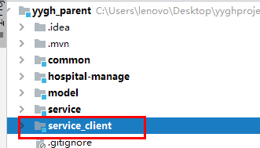
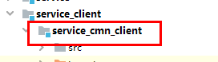
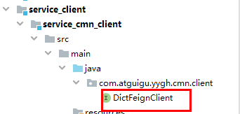

# 一、医院列表功能（接口）  


## 1、添加service分页接口与实现
（1）在HospitalService定义医院列表方法

```java
/**
 * 分页查询
 * @param page 当前页码
 * @param limit 每页记录数
 * @param hospitalQueryVo 查询条件
*/
Page<Hospital> selectPage(Integer page, Integer limit, HospitalQueryVo hospitalQueryVo);
```
（2）在HospitalServiceImpl添加医院列表实现的方法

```java
@Override
public Page<Hospital> selectPage(Integer page, Integer limit, HospitalQueryVo hospitalQueryVo) {
    Sort sort = Sort.by(Sort.Direction.DESC, "createTime");
    //0为第一页
    Pageable pageable = PageRequest.of(page-1, limit, sort);

    Hospital hospital = new Hospital();
    BeanUtils.copyProperties(hospitalQueryVo, hospital);

    //创建匹配器，即如何使用查询条件
    ExampleMatcher matcher = ExampleMatcher.matching() //构建对象
        .withStringMatcher(ExampleMatcher.StringMatcher.CONTAINING) //改变默认字符串匹配方式：模糊查询
        .withIgnoreCase(true); //改变默认大小写忽略方式：忽略大小写

    //创建实例
    Example<Hospital> example = Example.of(hospital, matcher);
    Page<Hospital> pages = hospitalRepository.findAll(example, pageable);

    return pages;
}
```
## 2、添加controller方法  

---
在HospitalController添加医院列表方法

```java
@Api(description = "医院接口")
@RestController
@RequestMapping("/admin/hosp/hospital")
@CrossOrigin
public class HospitalController {

    //注入service
    @Autowired
    private HospitalService hospitalService;

    @ApiOperation(value = "获取分页列表")
    @GetMapping("{page}/{limit}")
    public R index(@PathVariable Integer page, @PathVariable Integer limit, HospitalQueryVo hospitalQueryVo) {
        //调用方法
        return R.ok().data("pages",hospitalService.selectPage(page, limit, hospitalQueryVo));
    }
}
```
## 3、service\_cmn模块提供接口  

**因为医院信息中包括医院等级信息，需要调用数据字典接口获取**

### 3.1 添加service接口与实现

在DictService添加查询数据字典方法

```java
/**
 * 根据上级编码与值获取数据字典名称
 * @param parentDictCode
* @param value
*/
String getNameByParentDictCodeAndValue(String parentDictCode, String value);
```

在DictServiceImpl实现查询数据字典方法

```java
//实现方法
@Override
public String getNameByParentDictCodeAndValue(String parentDictCode, String value) {
    //如果value能唯一定位数据字典，parentDictCode可以传空，例如：省市区的value值能够唯一确定
    if(StringUtils.isEmpty(parentDictCode)) {
        Dict dict = baseMapper.selectOne(new QueryWrapper<Dict>().eq("value", value));
        if(null != dict) {
            return dict.getName();
        }
    } else {
        Dict parentDict = this.getDictByDictCode(parentDictCode);
        if(null == parentDict) return "";
        Dict dict = baseMapper.selectOne(new QueryWrapper<Dict>().eq("parent_id",
                                                                     parentDict.getId()).eq("value", value));
        if(null != dict) {
            return dict.getName();
        }
    }
    return "";
}
```

在DictServiceImpl实现根据dict_code查询的方法

```java
//实现方法 根据dict_code查询
private Dict getDictByDictCode(String dictCode) {
    QueryWrapper<Dict> wrapper = new QueryWrapper<>();
    wrapper.eq("dict_code",dictCode);
    Dict codeDict = baseMapper.selectOne(wrapper);
    return codeDict;
}
```


### 3.2 添加controller

在DictController添加方法

提供两个api接口，如省市区不需要上级编码，医院等级需要上级编码  

```java
@ApiOperation(value = "获取数据字典名称")
@GetMapping(value = "/getName/{parentDictCode}/{value}")
public String getName(
    @ApiParam(name = "parentDictCode", value = "上级编码", required = true)
    @PathVariable("parentDictCode") String parentDictCode,
    @ApiParam(name = "value", value = "值", required = true)
    @PathVariable("value") String value) {
    return dictService.getNameByParentDictCodeAndValue(parentDictCode, value);
}

@ApiOperation(value = "获取数据字典名称")
@GetMapping(value = "/getName/{value}")
public String getName(
    @ApiParam(name = "value", value = "值", required = true)
    @PathVariable("value") String value) {
    return dictService.getNameByParentDictCodeAndValue("", value);
}
```
---
## 4、封装Feign服务调用  


### 4.1 搭建service\_client父模块




### 4.2 在service\_client模块引入依赖

```xml
<dependencies>
       <dependency>
            <groupId>com.atguigu</groupId>
            <artifactId>service_utils</artifactId>
            <version>0.0.1-SNAPSHOT</version>
            <scope>provided </scope>
        </dependency>

        <dependency>
            <groupId>com.atguigu</groupId>
            <artifactId>model</artifactId>
            <version>0.0.1-SNAPSHOT</version>
            <scope>provided </scope>
        </dependency>

    <dependency>
        <groupId>org.springframework.boot</groupId>
        <artifactId>spring-boot-starter-web</artifactId>
        <scope>provided </scope>
    </dependency>

    <!-- 服务调用feign -->
    <dependency>
        <groupId>org.springframework.cloud</groupId>
        <artifactId>spring-cloud-starter-openfeign</artifactId>
        <scope>provided </scope>
    </dependency>
</dependencies>
```

### 4.3 搭建service\_cmn\_client模块



### 4.4 添加Feign接口类



```java
/**
 * 数据字典API接口
 */
@FeignClient("service-cmn")
public interface DictFeignClient {

    /**
     * 获取数据字典名称
     * @param parentDictCode
     * @param value
     * @return
     */
    @GetMapping(value = "/admin/cmn/dict/getName/{parentDictCode}/{value}")
    String getName(@PathVariable("parentDictCode") String parentDictCode, @PathVariable("value") String value);

    /**
     * 获取数据字典名称
     * @param value
     * @return
     */
    @GetMapping(value = "/admin/cmn/dict/getName/{value}")
    String getName(@PathVariable("value") String value);
}
```
## 5、医院接口远程调用数据字典


### 5.1 service模块引入依赖


### 5.2 在service-hosp添加依赖

```xml
<dependency>
    <groupId>com.atguigu</groupId>
    <artifactId>service_cmn_client</artifactId>
    <version>0.0.1-SNAPSHOT</version>
</dependency>
```

### 5.2 service-hosp模块启动类添加注解

```java
@SpringBootApplication
@ComponentScan(basePackages = {"com.atguigu"})
@EnableDiscoveryClient
@EnableFeignClients(basePackages = "com.atguigu")
//可以保证当前模块能够扫描当前模块依赖的jar包中的FeignClient接口了
public class ServiceHospApplication {

    public static void main(String[] args) {
        SpringApplication.run(ServiceHospApplication.class, args);
    }
}
```
### 5.3 调整service方法

修改HospitalServiceImpl类实现分页  

```java
//注入远程调用数据字典
@Autowired
private DictFeignClient dictFeignClient;


@Override
public Page<Hospital> selectPage(Integer page, Integer limit, HospitalQueryVo hospitalQueryVo) {
    Sort sort = Sort.by(Sort.Direction.DESC, "createTime");
    //0为第一页
    Pageable pageable = PageRequest.of(page-1, limit, sort);

    Hospital hospital = new Hospital();
    BeanUtils.copyProperties(hospitalQueryVo, hospital);

    //创建匹配器，即如何使用查询条件
    ExampleMatcher matcher = ExampleMatcher.matching() //构建对象
        .withStringMatcher(ExampleMatcher.StringMatcher.CONTAINING) //改变默认字符串匹配方式：模糊查询
        .withIgnoreCase(true); //改变默认大小写忽略方式：忽略大小写

    //创建实例
    Example<Hospital> example = Example.of(hospital, matcher);
    Page<Hospital> pages = hospitalRepository.findAll(example, pageable);

    //封装医院等级数据
    pages.getContent().stream().forEach(item -> {
        this.packHospital(item);
    });

    return pages;
}

/**
     * 封装数据
     * @param hospital
     * @return
     */
private Hospital packHospital(Hospital hospital) {
    String hostypeString = dictFeignClient.getName(DictEnum.HOSTYPE.getDictCode(),hospital.getHostype());
    String provinceString = dictFeignClient.getName(hospital.getProvinceCode());
    String cityString = dictFeignClient.getName(hospital.getCityCode());
    String districtString = dictFeignClient.getName(hospital.getDistrictCode());

    hospital.getParam().put("hostypeString", hostypeString);
    hospital.getParam().put("fullAddress", provinceString + cityString + districtString + hospital.getAddress());
    return hospital;
}
```

### 5.4 启动service\_cmn和servvice\_hosp服务，访问service\_hosp的swagger-ui界面测试

## 6、添加数据字典显示接口

用于页面条件查询，多级联动

### 6.1 根据dicode查询下层节点

**（1）添加controller**

```java
@ApiOperation(value = "根据dictCode获取下级节点")
@GetMapping(value = "/findByDictCode/{dictCode}")
public R findByDictCode(
    @ApiParam(name = "dictCode", value = "节点编码", required = true)
    @PathVariable String dictCode) {
    List<Dict> list = dictService.findByDictCode(dictCode);
    return R.ok().data("list",list);
}
```
（2）编写service

定义方法

```java
List<Dict> findByDictCode(String dictCode);
```
实现方法

```java
@Override
public List<Dict> findByDictCode(String dictCode) {
    Dict codeDict = this.getDictByDictCode(dictCode);
    if(null == codeDict) return null;
    return this.findDataChild(codeDict.getId());
}
```