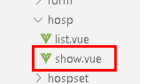
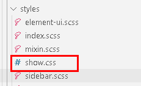

# 一、医院详情（接口）

## 1、添加service方法和实现

### （1）在HospService定义方法

```java
/**
     * 医院详情
     * @param id
     * @return
     */
Map<String, Object> show(String id);

```

### （2）在HospServiceImpl定义方法

```java
@Override
public Map<String, Object> show(String id) {
    Map<String, Object> result = new HashMap<>();
    Hospital hospital = this.packHospital(hospitalRepository.findById(id).get());
    //医院基本信息（包含医院等级）
    result.put("hospital",hospital);
    //单独处理更直观
    result.put("bookingRule", hospital.getBookingRule());
    //不需要重复返回
    hospital.setBookingRule(null);
    return result;
}
```

## 2、添加controller方法

```java
@ApiOperation(value = "获取医院详情")
@GetMapping("show/{id}")
public R show(
    @ApiParam(name = "id", value = "医院id", required = true)
    @PathVariable String id) {
    return R.ok().data("hospital",hospitalService.show(id));
}
```

# 二、医院详情（前端）

## 1、添加隐藏路由

在router/index.js添加

```javascript
{
  path: 'hospital/show/:id',
  name: '查看',
  component: () => import('@/views/hosp/show'),
  meta: { title: '查看', noCache: true },
  hidden: true
}
```

## 2、创建医院详情页面



### （1）添加查看按钮

```html
<router-link :to="'/hosp/hospital/show/'+scope.row.id">
    <el-button type="primary" size="mini">查看</el-button>
</router-link>

```

### （2）封装api请求

```javascript
//查看医院详情
getHospById(id) {
  return request ({
    url: `/admin/hosp/hospital/show/${id}`,
    method: 'get'
  })
}
```

### （3）修改显示页面组件

```html
<template>
<div class="app-container">
    <h4>基本信息</h4>
    <table class="table table-striped table-condenseda table-bordered" width="100%">
        <tbody>
            <tr>
                <th width="15%">医院名称</th>
                <td width="35%"><b style="font-size: 14px">{{ hospital.hosname }}</b> | {{ hospital.param.hostypeString }}</td>
                <th width="15%">医院logo</th>
                <td width="35%">
                    
                </td>
            </tr>
            <tr>
                <th>医院编码</th>
                <td>{{ hospital.hoscode }}</td>
                <th>地址</th>
                <td>{{ hospital.param.fullAddress }}</td>
            </tr>
            <tr>
                <th>坐车路线</th>
                <td colspan="3">{{ hospital.route }}</td>
            </tr>
            <tr>
                <th>医院简介</th>
                <td colspan="3">{{ hospital.intro }}</td>
            </tr>
        </tbody>
        </table>

        <h4>预约规则信息</h4>
        <table class="table table-striped table-condenseda table-bordered" width="100%">
        <tbody>
            <tr>
                <th width="15%">预约周期</th>
                <td width="35%">{{ bookingRule.cycle }}天</td>
                <th width="15%">放号时间</th>
                <td width="35%">{{ bookingRule.releaseTime }}</td>
            </tr>
            <tr>
                <th>停挂时间</th>
                <td>{{ bookingRule.stopTime }}</td>
                <th>退号时间</th>
                <td>{{ bookingRule.quitDay == -1 ? '就诊前一工作日' : '就诊当日' }}{{ bookingRule.quitTime }} 前取消</td>
            </tr>
            <tr>
                <th>预约规则</th>
                <td colspan="3">
                <ol>
                <li v-for="item in bookingRule.rule" :key="item">{{ item }}</li>
                </ol>
                </td>
            </tr>
        <br>
            <el-row>
            <el-button @click="back">返回</el-button>
            </el-row>
        </tbody>
    </table>
</div>
</template>

<script>
import hospApi from '@/api/yygh/hosp'
export default {
    data() {
        return {
            hospital: null,  //医院信息
            bookingRule: null //预约信息
        }
    },
    created() {
        //获取路由id
        const id = this.$route.params.id
        //调用方法，根据id查询医院详情
        this.fetachHospDetail(id)
    },
    methods:{
        //根据id查询医院详情
        fetachHospDetail(id) {
            hospApi.getHospById(id)
                .then(response => {
                    this.hospital = response.data.hospital.hospital
                    this.bookingRule = response.data.hospital.bookingRule
                })
        },
        //返回医院列表
        back() {
            this.$router.push({ path: '/hospSet/hosp/list' })
        }
    }
}
</script>
```

### （4）引入样式

第一、将show.css文件复制到src/styles目录



第二、在src/main.js文件添加引用

```javascript
import '@/styles/show.css'
```
