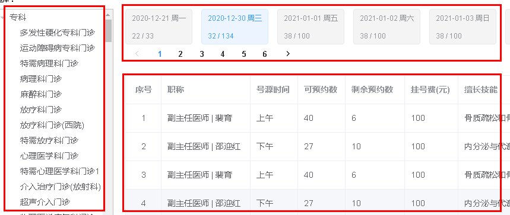

# 一、医院排班管理需求
## 1、页面效果

排班分成三部分显示：

（1）科室信息（大科室与小科室树形展示）

（2）排班日期，分页显示，根据上传排班数据聚合统计产生

（3）排班日期对应的就诊医生信息

## 2、接口分析
（1）科室数据使用el-tree组件渲染展示，需要将医院上传的科室数据封装成两层父子级数据；

（2）聚合所有排班数据，按日期分页展示，并统计号源数据展示；

（3）根据排班日期获取排班详情数据

虽然是一个页面展示所有内容，但是页面相对复杂，我们分步骤实现

第一，先实现左侧科室树形展示；

第二，其次排班日期分页展示

第三，最后根据排班日期获取排班详情数据