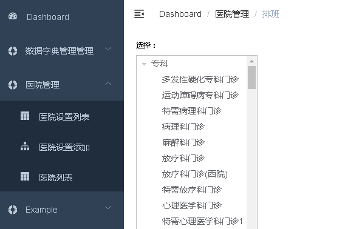

# 一、科室列表（接口）




  

## 1、添加service接口和实现
### （1）在DepartmentService定义方法

```java
//根据医院编号，查询医院所有科室列表
List<DepartmentVo> findDeptTree(String hoscode);
```
### （2）在DepartmentServiceImpl实现方法

```java
//根据医院编号，查询医院所有科室列表
@Override
public List<DepartmentVo> findDeptTree(String hoscode) {
    //创建list集合，用于最终数据封装
    List<DepartmentVo> result = new ArrayList<>();

    //根据医院编号，查询医院所有科室信息
    Department departmentQuery = new Department();
    departmentQuery.setHoscode(hoscode);
    Example example = Example.of(departmentQuery);
    //所有科室列表 departmentList
    List<Department> departmentList = departmentRepository.findAll(example);

    //根据大科室编号  bigcode 分组，获取每个大科室里面下级子科室
    Map<String, List<Department>> deparmentMap =
            departmentList.stream().collect(Collectors.groupingBy(Department::getBigcode));
    //遍历map集合 deparmentMap
    for(Map.Entry<String,List<Department>> entry : deparmentMap.entrySet()) {
        //大科室编号
        String bigcode = entry.getKey();
        //大科室编号对应的全局数据
        List<Department> deparment1List = entry.getValue();
        //封装大科室
        DepartmentVo departmentVo1 = new DepartmentVo();
        departmentVo1.setDepcode(bigcode);
        departmentVo1.setDepname(deparment1List.get(0).getBigname());

        //封装小科室
        List<DepartmentVo> children = new ArrayList<>();
        for(Department department: deparment1List) {
            DepartmentVo departmentVo2 =  new DepartmentVo();
            departmentVo2.setDepcode(department.getDepcode());
            departmentVo2.setDepname(department.getDepname());
            //封装到list集合
            children.add(departmentVo2);
        }
        //把小科室list集合放到大科室children里面
        departmentVo1.setChildren(children);
        //放到最终result里面
        result.add(departmentVo1);
    }
    //返回
    return result;
}
```
## 2、添加DepartmentController方法
```java
@RestController
@RequestMapping("/admin/hosp/department")
public class DepartmentController {

    @Autowired
    private DepartmentService departmentService;

    //根据医院编号，查询医院所有科室列表
    @ApiOperation(value = "查询医院所有科室列表")
    @GetMapping("getDeptList/{hoscode}")
    public R getDeptList(@PathVariable String hoscode) {
        List<DepartmentVo> list = departmentService.findDeptTree(hoscode);
        return R.ok().data("list",list);
    }
}
```
# 二、科室列表（前端）
## 1、添加隐藏路由

```javascript
{
  path: 'hospital/schedule/:hoscode',
  name: '排班',
  component: () => import('@/views/hosp/schedule'),
  meta: { title: '排班', noCache: true },
  hidden: true
} 
```
## 2、封装api方法
```javascript
//查看医院科室
getDeptByHoscode(hoscode) {
    return request ({
        url: `/admin/hosp/department/getDeptList/${hoscode}`,
        method: 'get'
    })
},
```
## 3、添加/views/hosp/schedule.vue组件
```html
<template>
    <div class="app-container">
        <div style="margin-bottom: 10px;font-size: 10px;">选择：</div>
            <el-container style="height: 100%">
            <el-aside width="200px" style="border: 1px silver solid">
                <!-- 部门 -->
                <el-tree
                :data="data"
                :props="defaultProps"
                :default-expand-all="true"
                @node-click="handleNodeClick">
                </el-tree>
            </el-aside>
            <el-main style="padding: 0 0 0 20px;">
                <el-row style="width: 100%">
                <!-- 排班日期 分页 -->
                </el-row>
                <el-row style="margin-top: 20px;">
                <!-- 排班日期对应的排班医生 -->
                </el-row>
            </el-main>
        </el-container>
    </div>
</template>
<script>
import hospApi from '@/api/yygh/hosp'
export default {
    data() {
        return {
            data: [],
            defaultProps: {
                children: 'children',
                label: 'depname'
            },
            hoscode: null
        }
    },
    created(){
        this.hoscode = this.$route.params.hoscode
        this.fetchData()
    },
    methods:{
        fetchData() {
            hospApi.getDeptByHoscode(this.hoscode)
                .then(response => {
                    this.data = response.data.list
                })
        }
    }
}
</script>
<style>
  .el-tree-node.is-current > .el-tree-node__content {
    background-color: #409EFF !important;
    color: white;
   }

  .el-checkbox__input.is-checked+.el-checkbox__label {
    color: black;
   }
</style>
```
说明：底部style标签是为了控制树形展示数据选中效果的