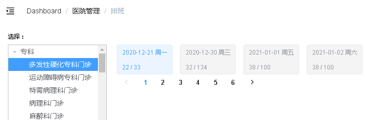

# 一、排班日期列表（接口）



**根据医院编号 和 科室编号 ，查询排班规则数据**  

## 1、在ScheduleService添加方法和实现
### （1）ScheduleService定义方法

```java
//根据医院编号 和 科室编号 ，查询排班规则数据
Map<String, Object> getRuleSchedule(long page, long limit, String hoscode, String depcode);
```
### （2）ScheduleServiceImpl实现方法
```java
@Autowired
private ScheduleRepository scheduleRepository;

@Autowired
private MongoTemplate mongoTemplate;

@Autowired
private HospitalService hospitalService;

@Override
public Map<String, Object> getRuleSchedule(long page, long limit, String hoscode, String depcode) {
    //1 根据医院编号 和 科室编号 查询
    Criteria criteria = Criteria.where("hoscode").is(hoscode).and("depcode").is(depcode);

    //2 根据工作日workDate期进行分组
    Aggregation agg = Aggregation.newAggregation(
        Aggregation.match(criteria),//匹配条件
        Aggregation.group("workDate")//分组字段
        .first("workDate").as("workDate")
        //3 统计号源数量
        .count().as("docCount")
        .sum("reservedNumber").as("reservedNumber")
        .sum("availableNumber").as("availableNumber"),
        //排序
        Aggregation.sort(Sort.Direction.ASC,"workDate"),
        //4 实现分页
        Aggregation.skip((page-1)*limit),
        Aggregation.limit(limit)
    );
    //调用方法，最终执行
    AggregationResults<BookingScheduleRuleVo> aggResults =
        mongoTemplate.aggregate(agg, Schedule.class, BookingScheduleRuleVo.class);
    List<BookingScheduleRuleVo> bookingScheduleRuleVoList = aggResults.getMappedResults();

    //分组查询的总记录数
    Aggregation totalAgg = Aggregation.newAggregation(
        Aggregation.match(criteria),
        Aggregation.group("workDate")
    );
    AggregationResults<BookingScheduleRuleVo> totalAggResults =
        mongoTemplate.aggregate(totalAgg,
                                Schedule.class, BookingScheduleRuleVo.class);
    int total = totalAggResults.getMappedResults().size();

    //把日期对应星期获取
    for(BookingScheduleRuleVo bookingScheduleRuleVo:bookingScheduleRuleVoList) {
        Date workDate = bookingScheduleRuleVo.getWorkDate();
        String dayOfWeek = this.getDayOfWeek(new DateTime(workDate));
        bookingScheduleRuleVo.setDayOfWeek(dayOfWeek);
    }

    //设置最终数据，进行返回
    Map<String, Object> result = new HashMap<>();
    result.put("bookingScheduleRuleList",bookingScheduleRuleVoList);
    result.put("total",total);

    //获取医院名称
    Hospital hospital = hospitalService.getByHoscode(hoscode);
    //其他基础数据
    Map<String, String> baseMap = new HashMap<>();
    baseMap.put("hosname",hospital.getHosname());
    result.put("baseMap",baseMap);
    return result;
}
```
### （3）添加日期转换星期方法  

```java
### 引入依赖
<dependency>
    <groupId>joda-time</groupId>
    <artifactId>joda-time</artifactId>
</dependency>

/**
     * 根据日期获取周几数据
     * @param dateTime
     * @return
     */
private String getDayOfWeek(DateTime dateTime) {
    String dayOfWeek = "";
    switch (dateTime.getDayOfWeek()) {
        case DateTimeConstants.SUNDAY:
            dayOfWeek = "周日";
            break;
        case DateTimeConstants.MONDAY:
            dayOfWeek = "周一";
            break;
        case DateTimeConstants.TUESDAY:
            dayOfWeek = "周二";
            break;
        case DateTimeConstants.WEDNESDAY:
            dayOfWeek = "周三";
            break;
        case DateTimeConstants.THURSDAY:
            dayOfWeek = "周四";
            break;
        case DateTimeConstants.FRIDAY:
            dayOfWeek = "周五";
            break;
        case DateTimeConstants.SATURDAY:
            dayOfWeek = "周六";
        default:
            break;
    }
    return dayOfWeek;
}
```
###  （4）HospService添加医院编号获取医院名称方法
```java
//定义方法
String getHospName(String hoscode);

//实现方法
@Override
public String getHospName(String hoscode) {
    Hospital hospital = hospitalRepository.getHospitalByHoscode(hoscode);
    if(null != hospital) {
        return hospital.getHosname();
    }
    return "";
}
```
### （5）ScheduleController添加方法
```java
@RestController
@RequestMapping("/admin/hosp/schedule")
public class ScheduleController {

    @Autowired
    private ScheduleService scheduleService;

    //根据医院编号 和 科室编号 ，查询排班规则数据
    @ApiOperation(value ="查询排班规则数据")
    @GetMapping("getScheduleRule/{page}/{limit}/{hoscode}/{depcode}")
    public R getScheduleRule(@PathVariable long page,
                             @PathVariable long limit,
                             @PathVariable String hoscode,
                             @PathVariable String depcode) {
        Map<String,Object> map
                = scheduleService.getRuleSchedule(page,limit,hoscode,depcode);
        return R.ok().data(map);
    }

}
```
# 二、排班日期列表（前端）
## 1、封装api方法

在api/yygh创建schedule.js

```javascript
getScheduleRule(page, limit, hoscode, depcode) {
    return request({
        url: `/admin/hosp/schedule/getScheduleRule/${page}/${limit}/${hoscode}/${depcode}`,
        method: 'get'
    })
}
```
## 2、页面显示

修改/views/hosp/schedule.vue组件

```html
<template>
    <div class="app-container">
        <div style="margin-bottom: 10px;font-size: 10px;">选择：</div>
            <el-container style="height: 100%">
            <el-aside width="200px" style="border: 1px silver solid">
                <!-- 部门 -->
                <el-tree
                :data="data"
                :props="defaultProps"
                :default-expand-all="true"
                @node-click="handleNodeClick">
                </el-tree>
            </el-aside>
            <el-main style="padding: 0 0 0 20px;">
                <el-row style="width: 100%">
                    <!-- 排班日期 分页 -->
                    <el-tag v-for="(item,index) in bookingScheduleList" :key="item.id" @click="selectDate(item.workDate, index)" :type="index == activeIndex ? '' : 'info'" style="height: 60px;margin-right: 5px;margin-right:15px;cursor:pointer;">
                        {{ item.workDate }} {{ item.dayOfWeek }}<br/>
                        {{ item.availableNumber }} / {{ item.reservedNumber }}
                    </el-tag>

                    <!-- 分页 -->
                    <el-pagination
                        :current-page="page"
                        :total="total"
                        :page-size="limit"
                        class="pagination"
                        layout="prev, pager, next"
                        @current-change="getPage">
                    </el-pagination>

                </el-row>
                <el-row style="margin-top: 20px;">
                <!-- 排班日期对应的排班医生 -->
                </el-row>
            </el-main>
        </el-container>
    </div>
</template>
<script>
import hospApi from '@/api/yygh/hosp'
import schApi from '@/api/yygh/schedule'
export default {
    data() {
        return {
            data: [],
            defaultProps: {
                children: 'children',
                label: 'depname'
            },
            hoscode: null,
            activeIndex: 0,
            depcode: null,
            depname: null,
            workDate: null,

            bookingScheduleList: [],
            baseMap: {},

            page: 1, // 当前页
            limit: 7, // 每页个数
            total: 0 // 总页码
        }
    },
    created(){
        this.hoscode = this.$route.params.hoscode
        this.workDate = this.getCurDate()
        this.fetchData()
    },
    methods:{
        fetchData() {
            hospApi.getDeptByHoscode(this.hoscode)
                .then(response => {
                    this.data = response.data.list
                    // 默认选中第一个
                    if (this.data.length > 0) {
                        this.depcode = this.data[0].children[0].depcode
                        this.depname = this.data[0].children[0].depname

                        this.getPage()
                    }
            })
        },
        getPage(page = 1) {
            this.page = page
            this.workDate = null
            this.activeIndex = 0
            this.getScheduleRule()
        },

        getScheduleRule() {
        schApi.getScheduleRule(this.page, this.limit, this.hoscode, this.depcode).then(response => {
                this.bookingScheduleList = response.data.bookingScheduleRuleList

                this.total = response.data.total

                this.scheduleList = response.data.scheduleList
                this.baseMap = response.data.baseMap

                // 分页后workDate=null，默认选中第一个
                if (this.workDate == null) {

                    this.workDate = this.bookingScheduleList[0].workDate
                }
            })
        },

        handleNodeClick(data) {
            // 科室大类直接返回
            if (data.children != null) return
            this.depcode = data.depcode
            this.depname = data.depname

            this.getPage(1)
        },

        selectDate(workDate, index) {
            this.workDate = workDate
            this.activeIndex = index
        },

        getCurDate() {
            var datetime = new Date()
            var year = datetime.getFullYear()
            var month = datetime.getMonth() + 1 < 10 ? '0' + (datetime.getMonth() + 1) : datetime.getMonth() + 1
            var date = datetime.getDate() < 10 ? '0' + datetime.getDate() : datetime.getDate()
            return year + '-' + month + '-' + date
        }
    }
}

</script>
<style>
  .el-tree-node.is-current > .el-tree-node__content {
    background-color: #409EFF !important;
    color: white;
   }

  .el-checkbox__input.is-checked+.el-checkbox__label {
    color: black;
   }
</style>
```