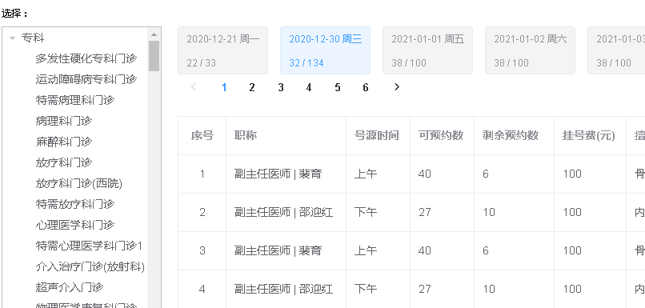

# 一、排班详情列表（接口）


## 1、添加service接口和实现  

**根据医院编号 、科室编号和工作日期，查询排班详细信息**

### （1）在ScheduleService定义方法

```java
//根据医院编号 、科室编号和工作日期，查询排班详细信息
List<Schedule> getDetailSchedule(String hoscode, String depcode, String workDate);
```
### （2）在ScheduleServiceImpl实现方法

```java
//根据医院编号 、科室编号和工作日期，查询排班详细信息
@Override
public List<Schedule> getDetailSchedule(String hoscode, String depcode, String workDate) {
    //根据参数查询mongodb
    List<Schedule> scheduleList =
            scheduleRepository.findScheduleByHoscodeAndDepcodeAndWorkDate(hoscode,depcode,new DateTime(workDate).toDate());
    //把得到list集合遍历，向设置其他值：医院名称、科室名称、日期对应星期
    scheduleList.stream().forEach(item->{
        this.packageSchedule(item);
    });
    return scheduleList;
}
//封装排班详情其他值 医院名称、科室名称、日期对应星期
private void packageSchedule(Schedule schedule) {
    //设置医院名称
    schedule.getParam().put("hosname",hospitalService.getHospName(schedule.getHoscode()));
    //设置科室名称
    schedule.getParam().put("depname",
        departmentService.getDepName(schedule.getHoscode(),schedule.getDepcode()));
    //设置日期对应星期
    schedule.getParam().put("dayOfWeek",this.getDayOfWeek(new DateTime(schedule.getWorkDate())));
}
```
## 2、添加ScheduleRepository方法
```java
//根据医院编号 、科室编号和工作日期，查询排班详细信息
List<Schedule> findScheduleByHoscodeAndDepcodeAndWorkDate(String hoscode, String depcode, Date toDate);
```
## 3、添加根据部门编码获取部门名称

### （1）DepartmentService添加方法

```java
//根据科室编号，和医院编号，查询科室名称
String getDepName(String hoscode, String depcode);
```
### （2）DepartmentServiceImpl实现方法
```java
//根据科室编号，和医院编号，查询科室名称
@Override
public String getDepName(String hoscode, String depcode) {
    Department department = departmentRepository.getDepartmentByHoscodeAndDepcode(hoscode, depcode);
    if(department != null) {
        return department.getDepname();
    }
    return null;
}
```
### （3）在ScheduleController添加方法**

```java
//根据医院编号 、科室编号和工作日期，查询排班详细信息
@ApiOperation(value = "查询排班详细信息")
@GetMapping("getScheduleDetail/{hoscode}/{depcode}/{workDate}")
public R getScheduleDetail( @PathVariable String hoscode,
                           @PathVariable String depcode,
                           @PathVariable String workDate) {
    List<Schedule> list = scheduleService.getDetailSchedule(hoscode,depcode,workDate);
    return R.ok().data("list",list);
}
```
# 二、排班详情列表（前端）
## 1、封装api请求

在api/yygh/schedule.js添加

```javascript
//查询排班详情
getScheduleDetail(hoscode,depcode,workDate) {
    return request ({
        url: `/admin/hosp/schedule/getScheduleDetail/${hoscode}/${depcode}/${workDate}`,
        method: 'get'
    })
}
```

## 2、页面显示

修改/views/hosp/schedule.vue组件

```html
<template>
    <div class="app-container">
        <div style="margin-bottom: 10px;font-size: 10px;">选择：</div>
            <el-container style="height: 100%">
            <el-aside width="200px" style="border: 1px silver solid">
                <!-- 部门 -->
                <el-tree
                :data="data"
                :props="defaultProps"
                :default-expand-all="true"
                @node-click="handleNodeClick">
                </el-tree>
            </el-aside>
            <el-main style="padding: 0 0 0 20px;">
                <el-row style="width: 100%">
                    <!-- 排班日期 分页 -->
                    <el-tag v-for="(item,index) in bookingScheduleList" :key="item.id" @click="selectDate(item.workDate, index)" :type="index == activeIndex ? '' : 'info'" style="height: 60px;margin-right: 5px;margin-right:15px;cursor:pointer;">
                        {{ item.workDate }} {{ item.dayOfWeek }}<br/>
                        {{ item.availableNumber }} / {{ item.reservedNumber }}
                    </el-tag>

                    <!-- 分页 -->
                    <el-pagination
                        :current-page="page"
                        :total="total"
                        :page-size="limit"
                        class="pagination"
                        layout="prev, pager, next"
                        @current-change="getPage">
                    </el-pagination>

                </el-row>
                <el-row style="margin-top: 20px;">
                <!-- 排班日期对应的排班医生 -->
                <el-table
                        v-loading="listLoading"
                        :data="scheduleList"
                        border
                        fit
                        highlight-current-row>
                        <el-table-column
                                    label="序号"
                                    width="60"
                                    align="center">
                            <template slot-scope="scope">
                                            {{ scope.$index + 1 }}
                            </template>
                        </el-table-column>
                        <el-table-column label="职称" width="150">
                            <template slot-scope="scope">
                                            {{ scope.row.title }} | {{ scope.row.docname }}
                            </template>
                        </el-table-column>
                        <el-table-column label="号源时间" width="80">
                            <template slot-scope="scope">
                                            {{ scope.row.workTime == 0 ? "上午" : "下午" }}
                            </template>
                        </el-table-column>
                        <el-table-column prop="reservedNumber" label="可预约数" width="80"/>
                        <el-table-column prop="availableNumber" label="剩余预约数" width="100"/>
                        <el-table-column prop="amount" label="挂号费(元)" width="90"/>
                        <el-table-column prop="skill" label="擅长技能"/>
                    </el-table>
                </el-row>
            </el-main>
        </el-container>
    </div>
</template>
<script>
import hospApi from '@/api/yygh/hosp'
import schApi from '@/api/yygh/schedule'
export default {
    data() {
        return {
            data: [],
            defaultProps: {
                children: 'children',
                label: 'depname'
            },
            hoscode: null,
            activeIndex: 0,
            depcode: null,
            depname: null,
            workDate: null,

            bookingScheduleList: [],
            baseMap: {},

            page: 1, // 当前页
            limit: 7, // 每页个数
            total: 0, // 总页码

            scheduleList:[] //排班详情
        }
    },
    created(){
        this.hoscode = this.$route.params.hoscode
        this.workDate = this.getCurDate()
        this.fetchData()
    },
    methods:{
        //查询排班详情
        getDetailSchedule() {
            schApi.getScheduleDetail(this.hoscode,this.depcode,this.workDate)
                .then(response => {
                    this.scheduleList = response.data.list
                })
        },

        fetchData() {
            hospApi.getDeptByHoscode(this.hoscode)
                .then(response => {
                    this.data = response.data.list
                    // 默认选中第一个
                    if (this.data.length > 0) {
                        this.depcode = this.data[0].children[0].depcode
                        this.depname = this.data[0].children[0].depname

                        this.getPage()
                    }
            })
        },
        getPage(page = 1) {
            this.page = page
            this.workDate = null
            this.activeIndex = 0
            this.getScheduleRule()
        },

        getScheduleRule() {
            schApi.getScheduleRule(this.page, this.limit, this.hoscode, this.depcode).then(response => {
                this.bookingScheduleList = response.data.bookingScheduleRuleList

                this.total = response.data.total

                this.scheduleList = response.data.scheduleList
                this.baseMap = response.data.baseMap

                // 分页后workDate=null，默认选中第一个
                if (this.workDate == null) {

                    this.workDate = this.bookingScheduleList[0].workDate
                }
                //调用查询排班详情
                this.getDetailSchedule()
            })
        },

        handleNodeClick(data) {
            // 科室大类直接返回
            if (data.children != null) return
            this.depcode = data.depcode
            this.depname = data.depname

            this.getPage(1)
        },

        selectDate(workDate, index) {
            this.workDate = workDate
            this.activeIndex = index
            //调用查询排班详情
            this.getDetailSchedule()
        },

        getCurDate() {
            var datetime = new Date()
            var year = datetime.getFullYear()
            var month = datetime.getMonth() + 1 < 10 ? '0' + (datetime.getMonth() + 1) : datetime.getMonth() + 1
            var date = datetime.getDate() < 10 ? '0' + datetime.getDate() : datetime.getDate()
            return year + '-' + month + '-' + date
        }
    }
}

</script>
<style>
  .el-tree-node.is-current > .el-tree-node__content {
    background-color: #409EFF !important;
    color: white;
   }

  .el-checkbox__input.is-checked+.el-checkbox__label {
    color: black;
   }
</style>
```