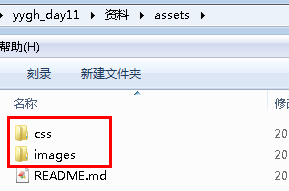
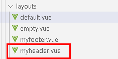
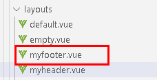

# 一、首页静态数据整合
## 1、添加静态资源
将静态资源下面的css、images文件夹添加到assets目录  




## 2、修改页面布局

### 2.1 提取头文件

创建layouts/myheader.vue文件



```html
<template>
    <div class="header-container">
        <div class="wrapper">
            <!-- logo -->
            <div class="left-wrapper v-link selected">
                
                <span class="text">尚医通 预约挂号统一平台</span>
            </div>
            <!-- 右侧 -->
            <div class="right-wrapper">
                <span class="v-link clickable">帮助中心</span>
                <span class="v-link clickable" @click="dialogUserFormVisible = true">登录/注册</span>
            </div>
        </div>
    </div>
</template>
<script>
export default {
}
</script>
```
### 2.2 提取尾文件

创建layouts/myfooter.vue文件  



```html
<template>
  <div class="footer-container">
    <div class="wrapper">
      <div><span class="record">京ICP备atguigu号</span><span
        class="phone">www.atguigu.com</span></div>
      <div class="right"><span
        class="v-link clickable"> 联系我们 </span><span
        class="v-link clickable"> 合作伙伴 </span><span
        class="v-link clickable"> 用户协议 </span><span
        class="v-link clickable"> 隐私协议 </span></div>
    </div>
  </div>
</template>

<script>
export default {

}
</script>
```
### 2.3 修改默认布局页面

修改layouts/default.vue文件

```html
<template>
  <div class="app-container">
    <div id="main">
      <!-- 公共头 -->
      <myheader/>
      <div class="main-container">
        <el-scrollbar class='page-component__scroll'>
          <!-- 内容区域 -->
          <nuxt/>
        </el-scrollbar>
      </div>
      <!-- 公共底 -->
      <myfooter/>
    </div>
  </div>
</template>
<script>
import '~/assets/css/app.css'
import '~/assets/css/chunk.css'
import '~/assets/css/iconfont.css'
import '~/assets/css/main.css'

import myheader from './myheader'
import myfooter from './myfooter'

export default {

  components: {
    myheader,myfooter
  },

  mounted() {
    window.document.getElementById("__nuxt").classList.add("app-container")
    window.document.getElementById("__layout").classList.add("app-container")
  }
}
</script>
```
### 2.4 修改pages/index.vue页面

```html
<template>
  <div class="home page-component">
    <el-carousel indicator-position="outside">
      <el-carousel-item v-for="item in 1" :key="item">
        
      </el-carousel-item>
    </el-carousel>
    <!-- 搜索 -->
    <div class="search-container">
    <div class="search-wrapper">
    <div class="hospital-search">
      <el-autocomplete
      class="search-input"
      prefix-icon="el-icon-search"
      v-model="state"
      :fetch-suggestions="querySearchAsync"
      placeholder="点击输入医院名称"
      @select="handleSelect"
      >
        <span slot="suffix" class="search-btn v-link highlight clickable selected">搜索 </span>
      </el-autocomplete>
    </div>
    </div>
    </div>
    <!-- bottom -->
    <div class="bottom">
    <div class="left">
    <div class="home-filter-wrapper">
    <div class="title"> 医院</div>
    <div>
      <div class="filter-wrapper">
        <span
        class="label">等级：</span>
        <div class="condition-wrapper"><span
        class="item v-link highlight clickable selected">
                                                    全部 </span><span
        class="item v-link clickable">
                                                    三级医院 </span><span
        class="item v-link clickable">
                                                    二级医院 </span><span
        class="item v-link clickable">
                                                    一级医院 </span></div>
      </div>
    <div class="filter-wrapper">
      <span
      class="label">地区：</span>
      <div class="condition-wrapper"><span
      class="item v-link highlight clickable selected">
                                                  全部 </span><span
      class="item v-link clickable">
                                                  东城区 </span><span
      class="item v-link clickable">
                                                  西城区 </span><span
      class="item v-link clickable">
                                                  朝阳区 </span><span
      class="item v-link clickable">
                                                  丰台区 </span><span
      class="item v-link clickable">
                                                  石景山区 </span><span
      class="item v-link clickable">
                                                  海淀区 </span><span
      class="item v-link clickable">
                                                  门头沟区 </span><span
      class="item v-link clickable">
                                                  房山区 </span><span
      class="item v-link clickable">
                                                  通州区 </span><span
      class="item v-link clickable">
                                                  顺义区 </span><span
      class="item v-link clickable">
                                                  昌平区 </span><span
      class="item v-link clickable">
                                                  大兴区 </span><span
      class="item v-link clickable">
                                                  怀柔区 </span><span
      class="item v-link clickable">
                                                  平谷区 </span><span
      class="item v-link clickable">
                                                  密云区 </span><span
      class="item v-link clickable">
                                                  延庆区 </span></div>
      </div>
    </div>
    </div>
    <div class="v-scroll-list hospital-list">
    <div class="v-card clickable list-item">
    <div class="">
      <div
      class="hospital-list-item hos-item" index="0">
      <div class="wrapper">
      <div class="hospital-title"> 北京协和医院
      </div>
      <div class="bottom-container">
      <div
      class="icon-wrapper"><span
      class="iconfont"></span>
                            三级甲等
      </div>
    <div
    class="icon-wrapper"><span
    class="iconfont"></span>
                          每天8:30放号
    </div>
    </div>
    </div>
    </div>
    </div>
    </div>
      <div class="v-card clickable list-item space">
      <div class="">
      <div
      class="hospital-list-item hos-item" index="0">
      <div class="wrapper">
      <div class="hospital-title"> 北京协和医院
      </div>
      <div class="bottom-container">
      <div
      class="icon-wrapper"><span
      class="iconfont"></span>
                            三级甲等
      </div>
    <div
    class="icon-wrapper"><span
    class="iconfont"></span>
                          每天8:30放号
    </div>
    </div>
    </div>
    </div>
    </div>
    </div>
    <div class="v-card clickable list-item">
    <div class="">
    <div class="hospital-list-item hos-item" index="0">
      <div class="wrapper">
      <div class="hospital-title"> 北京协和医院
      </div>
      <div class="bottom-container">
      <div
      class="icon-wrapper"><span
      class="iconfont"></span>
                            三级甲等
      </div>
      <div
      class="icon-wrapper"><span
      class="iconfont"></span>
                            每天8:30放号
      </div>
    </div>
    </div>
    </div>
    </div>
    </div>
    </div>
    </div>
    <div class="right">
      <div class="common-dept">
      <div class="header-wrapper">
      <div class="title"> 常见科室</div>
      <div class="all-wrapper"><span>全部</span>
      <span class="iconfont icon"></span>
      </div>
      </div>
      <div class="content-wrapper">
      <span class="item v-link clickable dark">神经内科 </span>
      <span class="item v-link clickable dark">消化内科 </span>
      <span class="item v-link clickable dark">呼吸内科 </span>
      <span class="item v-link clickable dark">内科 </span>
      <span class="item v-link clickable dark">神经外科 </span>
      <span class="item v-link clickable dark">妇科 </span>
      <span class="item v-link clickable dark"> 产科 </span>
      <span class="item v-link clickable dark">儿科 </span>
      </div>
    </div>
    <div class="space">
      <div class="header-wrapper">
      <div class="title-wrapper">
      <div class="icon-wrapper"><span
      class="iconfont title-icon"></span>
      </div>
      <span class="title">平台公告</span>
      </div>
      <div class="all-wrapper">
      <span>全部</span>
      <span class="iconfont icon"></span>
      </div>
      </div>
      <div class="content-wrapper">
      <div class="notice-wrapper">
      <div class="point"></div>
      <span class="notice v-link clickable dark">关于延长北京大学国际医院放假的通知 </span>
      </div>
      <div class="notice-wrapper">
      <div class="point"></div>
      <span class="notice v-link clickable dark">北京中医药大学东方医院部分科室医生门诊医 </span>
      </div>
      <div class="notice-wrapper">
      <div class="point"></div>
      <span class="notice v-link clickable dark"> 武警总医院号源暂停更新通知 </span>
      </div>
      </div>
    </div>
    <div class="suspend-notice-list space">
    <div class="header-wrapper">
    <div class="title-wrapper">
      <div class="icon-wrapper">
      <span class="iconfont title-icon"></span>
      </div>
      <span class="title">停诊公告</span>
      </div>
      <div class="all-wrapper">
      <span>全部</span>
      <span class="iconfont icon"></span>
      </div>
      </div>
      <div class="content-wrapper">
      <div class="notice-wrapper">
      <div class="point"></div>
      <span class="notice v-link clickable dark"> 中国人民解放军总医院第六医学中心(原海军总医院)呼吸内科门诊停诊公告 </span>
      </div>
      <div class="notice-wrapper">
      <div class="point"></div>
    <span class="notice v-link clickable dark"> 首都医科大学附属北京潞河医院老年医学科门诊停诊公告 </span>
    </div>
      <div class="notice-wrapper">
        <div class="point"></div>
        <span class="notice v-link clickable dark">中日友好医院中西医结合心内科门诊停诊公告 </span>
      </div>
    </div>
    </div>
    </div>
    </div>
  </div>
</template>
<script>
export default {
}
</script>
```

**启动项目**：npm run dev


**访问项目**：[http://localhost:3000/](http://localhost:3000/)