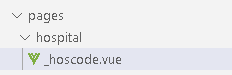

# 一、医院详情

## 1、医院详情接口

需要获取医院信息（医院基本信息、预约信息）和科室信息

### （1）添加service接口与实现

在HospitalService添加

```java
/**
     * 医院预约挂号详情
     */
Map<String, Object> item(String hoscode);

//实现方法
@Override
public Map<String, Object> item(String hoscode) {
    Map<String, Object> result = new HashMap<>();
    //医院详情
    Hospital hospital = this.packHospital(this.getByHoscode(hoscode));
    result.put("hospital", hospital);
    //预约规则
    result.put("bookingRule", hospital.getBookingRule());
    //不需要重复返回
    hospital.setBookingRule(null);
    return result;
}  
```

### （2）HospitalApiController添加方法

```java
@Autowired
private DepartmentService departmentService;

@ApiOperation(value = "获取科室列表")
@GetMapping("department/{hoscode}")
public R index(
    @ApiParam(name = "hoscode", value = "医院code", required = true)
    @PathVariable String hoscode) {

    List<DepartmentVo> list = departmentService.findDeptTree(hoscode);
    return R.ok().data("list",list);
}

@ApiOperation(value = "医院预约挂号详情")
@GetMapping("{hoscode}")
public R item(
    @ApiParam(name = "hoscode", value = "医院code", required = true)
    @PathVariable String hoscode) {

    Map<String, Object> map = hospitalService.item(hoscode);
    return R.ok().data(map);
}
```

## 2、医院详情前端

### 2.1 封装api方法

在hospital.js定义方法

```javascript
show(hoscode) {
    return request({
        url: `${api_name}/${hoscode}`,
        method: 'get'
    })
},
findDepartment(hoscode) {
    return request({
        url: `${api_name}/department/${hoscode}`,
        method: 'get'
    })
}
```

### 2.2 动态路由

#### （1）创建方式

如果我们需要根据id查询一条记录，就需要使用动态路由。NUXT的动态路由是以下划线开头的vue文件，参数名为下划线后边的文件名



#### （2）创建/pages/hospital/\_hoscode.vue组件

```html
<template>
<!-- header -->
    <div class="nav-container page-component">
        <!--左侧导航 #start -->
        <div class="nav left-nav">
            <div class="nav-item selected">
                <span class="v-link selected dark" 
                    :onclick="'javascript:window.location=\'/hospital/'+hospital.hoscode+'\''">预约挂号 </span>
            </div>
                <div class="nav-item ">
                    <span class="v-link clickable dark" :onclick="'javascript:window.location=\'/hospital/detail/'+hospital.hoscode+'\''"> 医院详情 </span>
                </div>
                <div class="nav-item">
                    <span class="v-link clickable dark" :onclick="'javascript:window.location=\'/hospital/notice/'+hospital.hoscode+'\''"> 预约须知 </span>
                </div>
                <div class="nav-item "><span
                    class="v-link clickable dark"> 停诊信息 </span>
                </div>
                <div class="nav-item "><span
                    class="v-link clickable dark"> 查询/取消 </span>
                </div>
        </div>
        <!-- 左侧导航 #end -->
        <!-- 右侧内容 #start -->
        <div class="page-container">
            <div class="hospital-home">
                <div class="common-header">
                    <div class="title-wrapper"><span
                        class="hospital-title">{{ hospital.hosname }}</span>
                        <div class="icon-wrapper">
                            <span class="iconfont"></span>{{ hospital.param.hostypeString }}
                        </div>
                    </div>
                </div>
                <div class="info-wrapper">
                    
                <div class="content-wrapper">
                <div> 挂号规则</div>
                    <div class="line">
                        <div><span class="label">预约周期：</span><span>{{ bookingRule.cycle }}天</span></div>
                        <div class="space"><span class="label">放号时间：</span><span>{{ bookingRule.releaseTime }}</span></div>
                        <div class="space"><span class="label">停挂时间：</span><span>{{ bookingRule.stopTime }}</span></div>
                    </div>
                    <div class="line"><span class="label">退号时间：</span>
                        <span v-if="bookingRule.quitDay == -1">就诊前一工作日{{ bookingRule.quitTime }}前取消</span>
                        <span v-if="bookingRule.quitDay == 0">就诊前当天{{ bookingRule.quitTime }}前取消</span>
                    </div>
                    <div style="margin-top:20px"> 医院预约规则</div>
                    <div class="rule-wrapper">
                        <ol>
                        <li v-for="item in bookingRule.rule" :key="item">{{ item }}</li>
                        </ol>
                    </div>
                </div>
                </div>
                <div class="title select-title"> 选择科室</div>
                <div class="select-dept-wrapper">
                    <div class="department-wrapper">
                    <div class="hospital-department">
                        <div class="dept-list-wrapper el-scrollbar" style="height: 100%;">
                            <div class="dept-list el-scrollbar__wrap" style="margin-bottom: -17px; margin-right: -17px;">
                                <div class="el-scrollbar__view">
                                    <div class="sub-item" v-for="(item,index) in departmentVoList" :key="item.id" :class="index == activeIndex ? 'selected' : ''" @click="move(index,item.depcode)"> {{ item.depname }}</div>
                                </div>
                            </div>
                            <div class="el-scrollbar__bar is-horizontal">
                                <div class="el-scrollbar__thumb" style="transform: translateX(0%);"></div>
                            </div>
                            <div class="el-scrollbar__bar is-vertical">
                                <div class="el-scrollbar__thumb" style="transform: translateY(0%); height: 91.4761%;"></div>
                            </div>
                        </div>
                    </div>
                    </div>
                    <div class="sub-dept-container">
                        <div v-for="(item,index) in departmentVoList" :key="item.id" :class="index == 0 ? 'selected' : ''" class="sub-dept-wrapper" :id="item.depcode">
                            <div class="sub-title">
                                <div class="block selected"></div>{{ item.depname }}
                            </div>
                            <div class="sub-item-wrapper">
                                <div v-for="it in item.children" :key="it.id" class="sub-item" @click="schedule(it.depcode)"><span class="v-link clickable">{{ it.depname }} </span></div>
                            </div>
                        </div>
                    </div>
                </div>
            </div>
        </div>
    <!-- 右侧内容 #end -->
    </div>
    <!-- footer -->
</template>

<script>
import '~/assets/css/hospital_personal.css'
import '~/assets/css/hospital.css'

import hospitalApi from '@/api/yygh/hospital'

export default {
  data() {
    return {
      hoscode: null,
      activeIndex: 0,

      hospital: {
        param: {}
      },
      bookingRule : {},
      departmentVoList : []
    }
  },
  created() {
    this.hoscode = this.$route.params.hoscode
    this.init()
  },
  methods: {
    init() {
      hospitalApi.show(this.hoscode).then(response => {
        this.hospital = response.data.hospital
        this.bookingRule = response.data.bookingRule
      })

      hospitalApi.findDepartment(this.hoscode).then(response => {
        this.departmentVoList = response.data.list
      })
    },
    schedule(depcode) {
      window.location.href = '/hospital/schedule?hoscode=' + this.hoscode + "&depcode="+ depcode
    }
  }
}
</script>
```

### 2.3 医院详情

创建/pages/hospital/detail/\_hoscode.vue组件

```html
<template>
  <!-- header -->
  <div class="nav-container page-component">
    <!--左侧导航 #start -->
    <div class="nav left-nav">
      <div class="nav-item ">
        <span class="v-link clickable dark" :onclick="'javascript:window.location=\'/hospital/'+hospital.hoscode+'\''">预约挂号 </span>
      </div>
      <div class="nav-item selected">
        <span class="v-link selected dark" :onclick="'javascript:window.location=\'/hospital/detail/'+hospital.hoscode+'\''"> 医院详情 </span>
      </div>
      <div class="nav-item">
        <span class="v-link clickable dark" :onclick="'javascript:window.location=\'/hospital/notice/'+hospital.hoscode+'\''"> 预约须知 </span>
      </div>
      <div class="nav-item "><span
        class="v-link clickable dark"> 停诊信息 </span>
      </div>
      <div class="nav-item "><span
        class="v-link clickable dark"> 查询/取消 </span>
      </div>
    </div>
    <!-- 左侧导航 #end -->

    <!-- 右侧内容 #start -->
    <div class="page-container">
      <div class="hospital-detail">
        <div class="common-header">
          <div class="title-wrapper"><span class="hospital-title">{{ hospital.hosname }}</span>
            <div class="icon-wrapper"><span class="iconfont"></span> {{ hospital.param.hostypeString }}</div>
          </div>
        </div>
        <div class="info-wrapper">
          <div class="content-wrapper">
            <div></div>
            <div></div>
            <div></div>
            <div>
              <div class="icon-text-wrapper"><span class="iconfont prefix-icon"></span>
                <span class="text"><p>{{ hospital.route }}</p>
              </span><span class="iconfont right-icon"></span></div>
            </div>
          </div>
        </div>
        <div class="title mt40"> 医院介绍</div>
        <div class="detail-content mt40"><p>{{ hospital.intro }}</p></div>
      </div>
    </div>
    <!-- 右侧内容 #end -->
  </div>
  <!-- footer -->
</template>

<script>
import '~/assets/css/hospital_personal.css'
import '~/assets/css/hospital.css'

import hospitalApi from '@/api/yygh/hospital'
export default {
  data() {
    return {
      hoscode: null,
      hospital: {
        param: {}
      }
    }
  },

  created() {
    this.hoscode = this.$route.params.hoscode

    this.init()
  },

  methods: {
    init() {
      hospitalApi.show(this.hoscode).then(response => {
        this.hospital = response.data.hospital
      })

    }
  }
}
</script>
<style>
  .hospital-detail .info-wrapper {
    width: 100%;
    padding-left: 0;
    padding-top: 0;
    margin-top: 0;
    flex-direction: inherit;
  }

  .hospital-detail .info-wrapper .text {
    font-size: 14px;

  }

  .hospital-detail .content-wrapper p {
    text-indent: 0;
  }
</style>
```

### 2.4 预约规则

创建/pages/hospital/notice/\_hoscode.vue组件

```html
<template>
  <!-- header -->
  <div class="nav-container page-component">
    <!--左侧导航 #start -->
    <div class="nav left-nav">
      <div class="nav-item ">
        <span class="v-link clickable dark" :onclick="'javascript:window.location=\'/hospital/'+hospital.hoscode+'\''">预约挂号 </span>
      </div>
      <div class="nav-item ">
        <span class="v-link clickable dark" :onclick="'javascript:window.location=\'/hospital/detail/'+hospital.hoscode+'\''"> 医院详情 </span>
      </div>
      <div class="nav-item selected">
        <span class="v-link selected dark" :onclick="'javascript:window.location=\'/hospital/notice/'+hospital.hoscode+'\''"> 预约须知 </span>
      </div>
      <div class="nav-item "><span
        class="v-link clickable dark"> 停诊信息 </span>
      </div>
      <div class="nav-item "><span
        class="v-link clickable dark"> 查询/取消 </span>
      </div>
    </div>
    <!-- 左侧导航 #end -->

    <!-- 右侧内容 #start -->
    <div class="page-container">
      <div class="hospital-notice">
        <div class="content"><h2>{{ hospital.hosname }}预约挂号须知</h2>
          <p>为方便您早日就医康复，请您认真阅读预约挂号须知：</p>
          <h4 id="一、预约实名制：">一、预约实名制：</h4>
          <p>统一平台电话预约和网上预约挂号均采取实名制注册预约，请您如实提供就诊人员的真实姓名、有效证件号（身份证、护照）、性别、手机号码、社保卡号等基本信息。</p>
          <h4 id="二、预约挂号：">二、预约挂号：</h4>
          <p>按照北京市卫健委统一平台要求，预约挂号规则如下：</p>
          <ul>
            <li>在同一自然日，同一医院，同一科室，同一就诊单元，同一就诊人，可以预约最多1个号源；</li>
            <li>在同一自然周，同一就诊人，可以预约最多8个号源；</li>
            <li>在同一自然月，同一就诊人，可以预约最多12个号源；</li>
            <li>在同一自然季度，同一就诊人，可以预约最多24个号源。</li>
          </ul>
          <h4 id="三、取消预约：">三、取消预约：</h4>
          <p>已完成预约的号源，如需办理退号，至少在就诊前一工作日14:00前通过网站、微信公众号、114电话等平台预约渠道进行取消预约。</p>
          <h4 id="四、爽约处理：">四、爽约处理：</h4>
          <p>如预约成功后患者未能按时就诊且不办理取消预约号视为爽约，同一患者在自然年内爽约规则如下：</p>
          <ul>
            <li>累计爽约3次，自3次爽约日起，90天内不允许通过114平台进行预约挂号；</li>
            <li>累计爽约6次，自6次爽约日起，180天内不允许通过114平台进行预约挂号。</li>
          </ul>
        </div>

      </div>
    </div>
    <!-- 右侧内容 #end -->
  </div>
  <!-- footer -->
</template>

<script>
import '~/assets/css/hospital_personal.css'
import '~/assets/css/hospital.css'

import hospitalApi from '@/api/yygh/hospital'
export default {
  data() {
    return {
      hoscode: null,
      hospital: {
        param: {}
      }
    }
  },

  created() {
    this.hoscode = this.$route.params.hoscode

    this.init()
  },

  methods: {
    init() {
      hospitalApi.show(this.hoscode).then(response => {
        this.hospital = response.data.hospital
      })
    }
  }
}
</script>
<style>
  .hospital-detail .info-wrapper {
    width: 100%;
    padding-left: 0;
    padding-top: 0;
    margin-top: 0;
    flex-direction: inherit;
  }

  .hospital-detail .info-wrapper .text {
    font-size: 14px;

  }

  .hospital-detail .content-wrapper p {
    text-indent: 0;
  }
</style>
```
