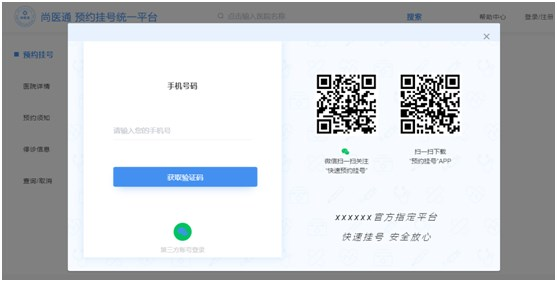
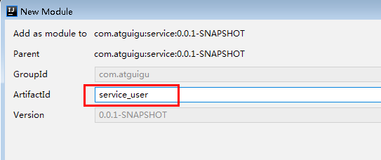
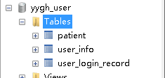

# 一、登录需求分析


## 1、登录采取弹出层的形式

## 2、登录方式：

（1）手机号码+手机验证码

（2）微信扫描

## 3、无注册界面，第一次登录根据手机号判断系统是否存在，如果不存在则自动注册

## 4、微信扫描登录成功必须绑定手机号码，即：第一次扫描成功后绑定手机号，以后登录扫描直接登录成功

## 5、网关统一判断登录状态，如何需要登录，页面弹出登录层

# 二、搭建service-user模块

## 1、在service下创建service\_user模块



## 2、添加application.properties

```javascript
# 服务端口
server.port=8203
# 服务名
spring.application.name=service-user

# 环境设置：dev、test、prod
spring.profiles.active=dev

# mysql数据库连接
spring.datasource.driver-class-name=com.mysql.jdbc.Driver
spring.datasource.url=jdbc:mysql://localhost:3306/yygh_user?characterEncoding=utf-8&useSSL=false
spring.datasource.username=root
spring.datasource.password=root

#返回json的全局时间格式
spring.jackson.date-format=yyyy-MM-dd HH:mm:ss
spring.jackson.time-zone=GMT+8

# nacos服务地址
spring.cloud.nacos.discovery.server-addr=127.0.0.1:8848

#配置mapper xml文件的路径
mybatis-plus.mapper-locations=classpath:com/atguigu/yygh/user/mapper/xml/*.xml
```
## 3、创建数据库和表



## 4、创建启动类

```java
@SpringBootApplication
@ComponentScan(basePackages = "com.atguigu")
@EnableDiscoveryClient
@EnableFeignClients(basePackages = "com.atguigu")
@MapperScan("com.atguigu.yygh.user.mapper")
public class ServiceUserApplication {
    public static void main(String[] args) {
        SpringApplication.run(ServiceUserApplication.class, args);
    }
}
```
## 5、配置GateWay网关

```javascript
#设置路由id
spring.cloud.gateway.routes[3].id=service-user
#设置路由的uri
spring.cloud.gateway.routes[3].uri=lb://service-user
#设置路由断言,代理servicerId为auth-service的/auth/路径
spring.cloud.gateway.routes[3].predicates= Path=/*/userinfo/**
```
# 三、登录接口实现 

## 1、添加service接口与实现

### 1.1 创建UserInfoService定义方法

```java
public interface UserInfoService extends IService<UserInfo> {
    //会员登录
    Map<String, Object> login(LoginVo loginVo);
}
```
### 1.2 创建UserInfoServiceImpl实现方法

```javascript
@Service
public class UserInfoServiceImpl extends
        ServiceImpl<UserInfoMapper, UserInfo> implements UserInfoService {
    @Override
    public Map<String, Object> login(LoginVo loginVo) {
        String phone = loginVo.getPhone();
        String code = loginVo.getCode();
        //校验参数
        if(StringUtils.isEmpty(phone) ||
                StringUtils.isEmpty(code)) {
            throw new YyghException(20001,"数据为空");
        }

        //TODO 校验校验验证码

        //手机号已被使用
        QueryWrapper<UserInfo> queryWrapper = new QueryWrapper<>();
        queryWrapper.eq("phone", phone);
        //获取会员
        UserInfo userInfo = baseMapper.selectOne(queryWrapper);
        if(null == userInfo) {
            userInfo = new UserInfo();
            userInfo.setName("");
            userInfo.setPhone(phone);
            userInfo.setStatus(1);
            this.save(userInfo);
        }
        //校验是否被禁用
        if(userInfo.getStatus() == 0) {
            throw new YyghException(20001,"用户已经禁用");
        }

        //返回页面显示名称
        Map<String, Object> map = new HashMap<>();
        String name = userInfo.getName();
        if(StringUtils.isEmpty(name)) {
            name = userInfo.getNickName();
        }
        if(StringUtils.isEmpty(name)) {
            name = userInfo.getPhone();
        }
        map.put("name", name);
        map.put("token", "");
        return map;
    }
}
```
## 2、添加Mapper接口

```javascript
public interface UserInfoMapper extends BaseMapper<UserInfo> {
}
```
## 3、添加Controller方法

### 3.1 创建UserInfoApiController添加方法

```java
@RestController
@RequestMapping("/api/userinfo")
public class UserInfoApiController {

    @Autowired
    private UserInfoService userInfoService;

    @ApiOperation(value = "会员登录")
    @PostMapping("login")
    public R login(@RequestBody LoginVo loginVo) {
        Map<String, Object> info = userInfoService.login(loginVo);
        return R.ok().data(info);
    }
}
```