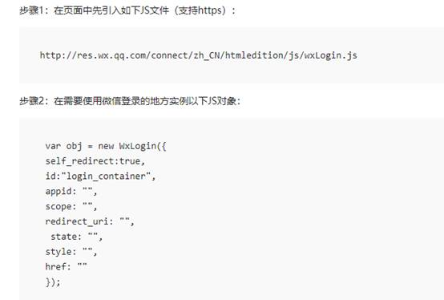

# 一、准备工作
[https://open.weixin.qq.com](https://open.weixin.qq.com)

1、注册  

## 2、邮箱激活
## 3、完善开发者资料
## 4、开发者资质认证
准备营业执照，1-2个工作日审批、300元

## 5、创建网站应用
提交审核，7个工作日审批

## 6、熟悉微信登录流程
参考文档：[https://open.weixin.qq.com/cgi-bin/showdocument?action=dir\_list&t=resource/res\_list&verify=1&id=open1419316505&token=e547653f995d8f402704d5cb2945177dc8aa4e7e&lang=zh\_CN](https://open.weixin.qq.com/cgi-bin/showdocument?action=dir_list&t=resource/res_list&verify=1&id=open1419316505&token=e547653f995d8f402704d5cb2945177dc8aa4e7e&lang=zh_CN)

**获取access\_token时序图**


# 二、后端开发service\_user
说明：微信登录二维码我们是以弹出层的形式打开，不是以页面形式，所以做法是不一样的，参考如下链接，上面有相关弹出层的方式

[https://developers.weixin.qq.com/doc/oplatform/Website\_App/WeChat\_Login/Wechat\_Login.html](https://developers.weixin.qq.com/doc/oplatform/Website_App/WeChat_Login/Wechat_Login.html)

如图：



因此我们的操作步骤为：

第一步我们通过接口把对应参数返回页面；

第二步在头部页面启动打开微信登录二维码；

第三步处理登录回调接口；

第四步回调返回页面通知微信登录层回调成功

第五步如果是第一次扫描登录，则绑定手机号码，登录成功

接下来我们根据步骤，一步一步实现


## 1、添加配置
application.properties添加相关配置信息

```bash
# 微信开放平台 appid
wx.open.app_id=你的appid
# 微信开放平台 appsecret
wx.open.app_secret=你的appsecret
# 微信开放平台 重定向url
wx.open.redirect_url=http://你的服务器名称/api/ucenter/wx/callback
```
引入依赖  

```xml
<dependencies>
    <dependency>
        <groupId>org.apache.httpcomponents</groupId>
        <artifactId>httpclient</artifactId>
    </dependency>
</dependencies>
```
## 2、创建常量类  

---
创建util包，创建ConstantPropertiesUtil.java常量类

```java
@Component
//@PropertySource("classpath:application.properties")
public class ConstantPropertiesUtil implements InitializingBean {

    @Value("${wx.open.app_id}")
    private String appId;

    @Value("${wx.open.app_secret}")
    private String appSecret;

    @Value("${wx.open.redirect_url}")
    private String redirectUrl;

    public static String WX_OPEN_APP_ID;
    public static String WX_OPEN_APP_SECRET;
    public static String WX_OPEN_REDIRECT_URL;

    @Override
    public void afterPropertiesSet() throws Exception {
        WX_OPEN_APP_ID = appId;
        WX_OPEN_APP_SECRET = appSecret;
        WX_OPEN_REDIRECT_URL = redirectUrl;
    }
}
```
## 3、创建controller
service\_user微服务中创建api包

api包中创建WxApiController，返回微信参数

```java
@Controller
@RequestMapping("/api/ucenter/wx")
public class WeixinApiController {

    @Autowired
    private UserInfoService userInfoService;
    @Autowired
    private RedisTemplate redisTemplate;

    /**
     * 获取微信登录参数
     */
    @GetMapping("getLoginParam")
    @ResponseBody
    public R genQrConnect(HttpSession session) throws UnsupportedEncodingException {
        String redirectUri = URLEncoder.encode(ConstantPropertiesUtil.WX_OPEN_REDIRECT_URL, "UTF-8");
        Map<String, Object> map = new HashMap<>();
        map.put("appid", ConstantPropertiesUtil.WX_OPEN_APP_ID);
        map.put("redirectUri", redirectUri);
        map.put("scope", "snsapi_login");
        map.put("state", System.currentTimeMillis()+"");//System.currentTimeMillis()+""
        return R.ok().data(map);
    }
}
```
授权url参数说明

|参数|是否必须|说明|
| ----- | ----- | ----- |
|appid|是|应用唯一标识|
|redirect\_uri|是|请使用urlEncode对链接进行处理|
|response\_type|是|填code|
|scope|是|应用授权作用域，拥有多个作用域用逗号（,）分隔，网页应用目前仅填写snsapi\_login即|
|state|否|用于保持请求和回调的状态，授权请求后原样带回给第三方。该参数可用于防止csrf攻击（跨站请求伪造攻击），建议第三方带上该参数，可设置为简单的随机数加session进行校验|

# 三、前端显示登录二维码
## 1、封装api请求  

创建api/yygh/wx.js

```javascript
import request from '@/utils/request'

const api_name = `/api/ucenter/wx`

export default {
  getLoginParam() {
    return request({
      url: `${api_name}/getLoginParam`,
      method: `get`
    })
  }
}
```
## 2、修改组件
修改layouts/myheader.vue文件，添加微信二维码登录逻辑

```javascript
// 1、引入api
import weixinApi from '@/api/yygh/wx'

//2、引入微信js
mounted() {
    // 注册全局登录事件对象
    window.loginEvent = new Vue();
    // 监听登录事件
    loginEvent.$on('loginDialogEvent', function () {
        document.getElementById("loginDialog").click();
    })
    // 触发事件，显示登录层：loginEvent.$emit('loginDialogEvent')
    //初始化微信js
    const script = document.createElement('script')
    script.type = 'text/javascript'
    script.src = 'https://res.wx.qq.com/connect/zh_CN/htmledition/js/wxLogin.js'
    document.body.appendChild(script)

    // 微信登录回调处理
    let self = this;
    window["loginCallback"] = (name,token, openid) => {
        self.loginCallback(name, token, openid);
    }
},

//3、实例化微信JS对象
//添加微信登录方法
loginCallback(name, token, openid) {
    // 打开手机登录层，绑定手机号，改逻辑与手机登录一致
    if(openid != '') {
       this.userInfo.openid = openid
       this.showLogin()
    } else {
       this.setCookies(name, token)
    }
},

weixinLogin() {
  this.dialogAtrr.showLoginType = 'weixin'

  weixinApi.getLoginParam().then(response => {
    var obj = new WxLogin({
      self_redirect:true,
      id: 'weixinLogin', // 需要显示的容器id
      appid: response.data.appid, // 公众号appid wx*******
      scope: response.data.scope, // 网页默认即可
      redirect_uri: response.data.redirectUri, // 授权成功后回调的url
      state: response.data.state, // 可设置为简单的随机数加session用来校验
      style: 'black', // 提供"black"、"white"可选。二维码的样式
      href: '' // 外部css文件url，需要https
    })
  })
},
//说明：微信登录方法已绑定weixinLogin()，查看页面
```