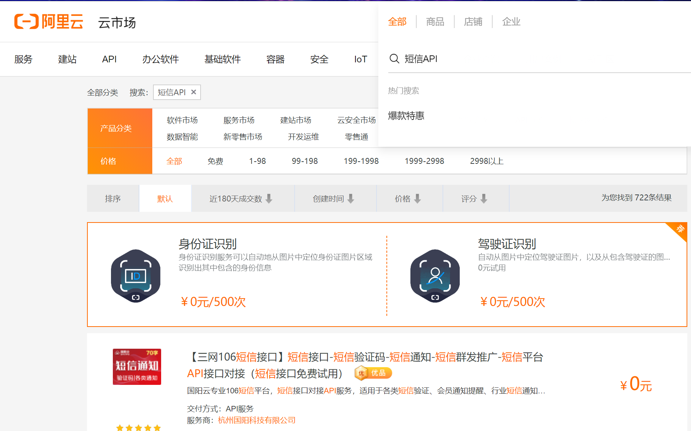
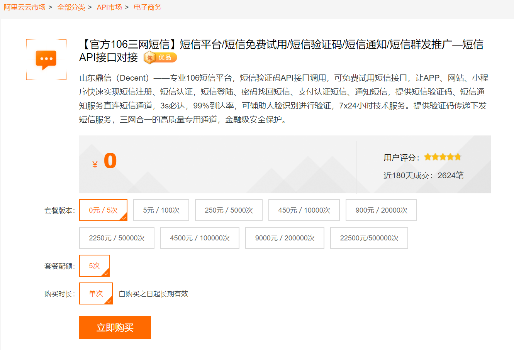
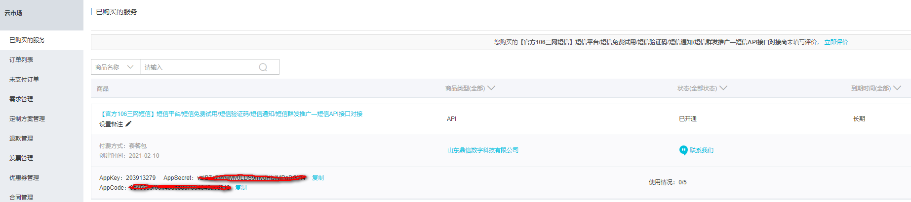

# 一、开通短信服务
## 1、开通
在阿里云云市场搜索''短信API''




使用官方推荐的短信平台：鼎信，第一次可以免费领取5条短信





在云市场中可以查看已购买的短信服务





## 2、测试
参考文档，测试代码如下：注意修改参数，并按照注释提示下载HttpUtils工具类和添加响应依赖到项目中

```java
public static void main(String[] args) {
        String host = "http://dingxin.market.alicloudapi.com";
        String path = "/dx/sendSms";
        String method = "POST";
        String appcode = "你自己的AppCode";
        Map<String, String> headers = new HashMap<String, String>();
        //最后在header中的格式(中间是英文空格)为Authorization:APPCODE 83359fd73fe94948385f570e3c139105
        headers.put("Authorization", "APPCODE " + appcode);
        Map<String, String> querys = new HashMap<String, String>();
        querys.put("mobile", "159xxxx9999");
        querys.put("param", "code:1234");
        querys.put("tpl_id", "TP1711063");
        Map<String, String> bodys = new HashMap<String, String>();
        try {
            /**
            * 重要提示如下:
            * HttpUtils请从
            * https://github.com/aliyun/api-gateway-demo-sign-java/blob/master/src/main/java/com/aliyun/api/gateway/demo/util/HttpUtils.java
            * 下载
            *
            * 相应的依赖请参照
            * https://github.com/aliyun/api-gateway-demo-sign-java/blob/master/pom.xml
            */
            HttpResponse response = HttpUtils.doPost(host, path, method, headers, querys, bodys);
            System.out.println(response.toString());
            //获取response的body
            //System.out.println(EntityUtils.toString(response.getEntity()));
        } catch (Exception e) {
            e.printStackTrace();
        }
    }
```