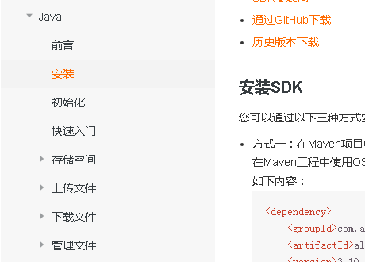

# 一、对象存储OSS  
用户认证需要上传证件图片、首页轮播也需要上传图片，因此我们要做文件服务，阿里云oss是一个很好的分布式文件服务系统，所以我们只需要集成阿里云oss即可

## 1、开通“对象存储OSS”服务
（1）申请阿里云账号

（2）实名认证

（3）开通“对象存储OSS”服务

（4）进入管理控制台

## 2、创建Bucket
选择：标准存储、公共读、不开通

## 3、上传默认头像
创建文件夹avatar，上传默认的用户头像  

## 4、创建RAM用户

# 二、使用SDK
