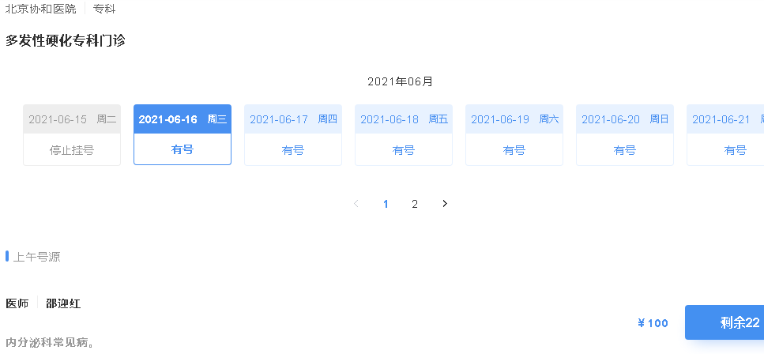

# 一、预约挂号详情
## 1、需求


**接口分析**

（1）根据预约周期，展示可预约日期数据，按分页展示

（2）选择日期展示当天可预约列表（该接口后台已经实现过）

**页面展示分析**

（1）分页展示可预约日期，根据有号、无号、约满等状态展示不同颜色，以示区分

（2）可预约最后一个日期为即将放号日期，根据放号时间页面展示倒计时

## 2、预约挂号详情接口  

### （1）在ScheduleService添加方法
```java
/**
     * 获取排班可预约日期数据
     * @param page
     * @param limit
     * @param hoscode
     * @param depcode
     */
Map<String, Object> getBookingScheduleRule(Integer page, Integer limit, String hoscode, String depcode);
```
###  （2）在ScheduleServiceImpl实现方法
```java
//获取排班可预约日期数据
@Override
public Map<String, Object> getBookingScheduleRule(Integer page, Integer limit, String hoscode, String depcode) {
    Map<String, Object> result = new HashMap<>();

    //获取预约规则
    Hospital hospital = hospitalService.getByHoscode(hoscode);
    if(null == hospital) {
        throw new YyghException();
    }
    BookingRule bookingRule = hospital.getBookingRule();

    //获取可预约日期分页数据
    IPage iPage = this.getListDate(page, limit, bookingRule);
    //当前页可预约日期
    List<Date> dateList = iPage.getRecords();
    //获取可预约日期科室剩余预约数
    Criteria criteria = Criteria.where("hoscode").is(hoscode).and("depcode").is(depcode).and("workDate").in(dateList);
    Aggregation agg = Aggregation.newAggregation(
        Aggregation.match(criteria),
        Aggregation.group("workDate")//分组字段
        .first("workDate").as("workDate")
        .count().as("docCount")
        .sum("availableNumber").as("availableNumber")
        .sum("reservedNumber").as("reservedNumber")
    );
    AggregationResults<BookingScheduleRuleVo> aggregationResults = mongoTemplate.aggregate(agg, Schedule.class, BookingScheduleRuleVo.class);
    List<BookingScheduleRuleVo> scheduleVoList = aggregationResults.getMappedResults();
    //获取科室剩余预约数

    //合并数据 将统计数据ScheduleVo根据“安排日期”合并到BookingRuleVo
    Map<Date, BookingScheduleRuleVo> scheduleVoMap = new HashMap<>();
    if(!CollectionUtils.isEmpty(scheduleVoList)) {
        scheduleVoMap = scheduleVoList.stream().collect(Collectors.toMap(BookingScheduleRuleVo::getWorkDate, BookingScheduleRuleVo -> BookingScheduleRuleVo));
    }
    //获取可预约排班规则
    List<BookingScheduleRuleVo> bookingScheduleRuleVoList = new ArrayList<>();
    for(int i=0, len=dateList.size(); i<len; i++) {
        Date date = dateList.get(i);

        BookingScheduleRuleVo bookingScheduleRuleVo = scheduleVoMap.get(date);
        if(null == bookingScheduleRuleVo) { // 说明当天没有排班医生
            bookingScheduleRuleVo = new BookingScheduleRuleVo();
            //就诊医生人数
            bookingScheduleRuleVo.setDocCount(0);
            //科室剩余预约数  -1表示无号
            bookingScheduleRuleVo.setAvailableNumber(-1);
        }
        bookingScheduleRuleVo.setWorkDate(date);
        bookingScheduleRuleVo.setWorkDateMd(date);
        //计算当前预约日期为周几
        String dayOfWeek = this.getDayOfWeek(new DateTime(date));
        bookingScheduleRuleVo.setDayOfWeek(dayOfWeek);

        //最后一页最后一条记录为即将预约   状态 0：正常 1：即将放号 -1：当天已停止挂号
        if(i == len-1 && page == iPage.getPages()) {
            bookingScheduleRuleVo.setStatus(1);
        } else {
            bookingScheduleRuleVo.setStatus(0);
        }
        //当天预约如果过了停号时间， 不能预约
        if(i == 0 && page == 1) {
            DateTime stopTime = this.getDateTime(new Date(), bookingRule.getStopTime());
            if(stopTime.isBeforeNow()) {
                //停止预约
                bookingScheduleRuleVo.setStatus(-1);
            }
        }
        bookingScheduleRuleVoList.add(bookingScheduleRuleVo);
    }

    //可预约日期规则数据
    result.put("bookingScheduleList", bookingScheduleRuleVoList);
    result.put("total", iPage.getTotal());
    //其他基础数据
    Map<String, String> baseMap = new HashMap<>();
    //医院名称
    baseMap.put("hosname", hospitalService.getByHoscode(hoscode).getHosname());
    //科室
    Department department =departmentService.getDepartment(hoscode, depcode);
    //大科室名称
    baseMap.put("bigname", department.getBigname());
    //科室名称
    baseMap.put("depname", department.getDepname());
    //月
    baseMap.put("workDateString", new DateTime().toString("yyyy年MM月"));
    //放号时间
    baseMap.put("releaseTime", bookingRule.getReleaseTime());
    //停号时间
    baseMap.put("stopTime", bookingRule.getStopTime());
    result.put("baseMap", baseMap);
    return result;

}
```
###  （3）添加获取可预约日期分页数据方法
```java
   /**
     * 获取可预约日期分页数据
     */
    private IPage<Date> getListDate(int page, int limit, BookingRule bookingRule) {
        //当天放号时间
        DateTime releaseTime = this.getDateTime(new Date(), bookingRule.getReleaseTime());
        //预约周期
        int cycle = bookingRule.getCycle();
        //如果当天放号时间已过，则预约周期后一天为即将放号时间，周期加1
        if(releaseTime.isBeforeNow()) cycle += 1;
        //可预约所有日期，最后一天显示即将放号倒计时
        List<Date> dateList = new ArrayList<>();
        for (int i = 0; i < cycle; i++) {
            //计算当前预约日期
            DateTime curDateTime = new DateTime().plusDays(i);
            String dateString = curDateTime.toString("yyyy-MM-dd");
            dateList.add(new DateTime(dateString).toDate());
        }
        //日期分页，由于预约周期不一样，页面一排最多显示7天数据，多了就要分页显示
        List<Date> pageDateList = new ArrayList<>();
        int start = (page-1)*limit;
        int end = (page-1)*limit+limit;
        if(end >dateList.size()) end = dateList.size();
        for (int i = start; i < end; i++) {
            pageDateList.add(dateList.get(i));
        }

        IPage<Date> iPage = new com.baomidou.mybatisplus.extension.plugins.pagination.Page(page, 7, dateList.size());
        iPage.setRecords(pageDateList);
        return iPage;
    }
```
### （4）将Date日期（yyyy-MM-dd HH:mm）转换为DateTime
```java
/**
     * 将Date日期（yyyy-MM-dd HH:mm）转换为DateTime
     */
    private DateTime getDateTime(Date date, String timeString) {
        String dateTimeString = new DateTime(date).toString("yyyy-MM-dd") + " "+ timeString;
        DateTime dateTime = DateTimeFormat.forPattern("yyyy-MM-dd HH:mm").parseDateTime(dateTimeString);
        return dateTime;
    }
```
### （5）在DepartmentService类添加方法和实现
```java
/**
 * 根据医院编号 和 科室编号获取科室数据
*/
Department getDepartment(String hoscode, String depcode);

//实现方法：根据医院编号 和 科室编号获取科室数据
@Override
public Department getDepartment(String hoscode, String depcode) {
    return departmentRepository.getDepartmentByHoscodeAndDepcode(hoscode, depcode);
}
```
### （6）在HospitalApiController添加方法
```java
@Autowired
private ScheduleService scheduleService;

@ApiOperation(value = "获取可预约排班数据")
@GetMapping("auth/getBookingScheduleRule/{page}/{limit}/{hoscode}/{depcode}")
public R getBookingSchedule(
    @PathVariable Integer page,
    @PathVariable Integer limit,
    @PathVariable String hoscode,
    @PathVariable String depcode) {

    Map<String, Object> map = scheduleService.getBookingScheduleRule(page, limit, hoscode, depcode);
    return R.ok().data(map);
}

@ApiOperation(value = "获取排班数据")
@GetMapping("auth/findScheduleList/{hoscode}/{depcode}/{workDate}")
public R findScheduleList(
    @PathVariable String hoscode,
    @PathVariable String depcode,
    @PathVariable String workDate) {
    List<Schedule> scheduleList = scheduleService.getDetailSchedule(hoscode, depcode, workDate);
    return R.ok().data("scheduleList",scheduleList);
}
```
## 3、预约挂号详情前端
### （1）在/api/yygh/hospital.js添加方法
```javascript
getBookingScheduleRule(page, limit, hoscode, depcode) {
    return request({
        url: `${api_name}/auth/getBookingScheduleRule/${page}/${limit}/${hoscode}/${depcode}`,
        method: 'get'
    })
},

findScheduleList(hoscode, depcode, workDate) {
    return request({
        url: `${api_name}/auth/findScheduleList/${hoscode}/${depcode}/${workDate}`,
        method: 'get'
        })
},
```
### （2）页面显示
**创建/pages/hospital/schedule.vue组件**  

```html
<template>
  <!-- header -->
  <div class="nav-container page-component">
    <!--左侧导航 #start -->
    <div class="nav left-nav">
      <div class="nav-item selected">
        <span class="v-link selected dark" :onclick="'javascript:window.location=\'/hosp/'+hoscode+'\''">预约挂号 </span>
      </div>
      <div class="nav-item ">
        <span class="v-link clickable dark" :onclick="'javascript:window.location=\'/hosp/detail/'+hoscode+'\''"> 医院详情 </span>
      </div>
      <div class="nav-item">
        <span class="v-link clickable dark" :onclick="'javascript:window.location=\'/hosp/notice/'+hoscode+'\''"> 预约须知 </span>
      </div>
      <div class="nav-item "><span
        class="v-link clickable dark"> 停诊信息 </span>
      </div>
      <div class="nav-item "><span
        class="v-link clickable dark"> 查询/取消 </span>
      </div>
    </div>
    <!-- 左侧导航 #end -->
    <!-- 右侧内容 #start -->
    <div class="page-container">
      <div class="hospital-source-list">
        <div class="header-wrapper" style="justify-content:normal">
          <span class="v-link clickable" @click="show()">{{ baseMap.hosname}}</span>
          <div class="split"></div>
          <div>{{ baseMap.bigname }}</div>
        </div>
        <div class="title mt20"> {{ baseMap.depname }}</div>
        <!-- 号源列表 #start -->
        <div class="mt60">
          <div class="title-wrapper">{{ baseMap.workDateString }}</div>
          <div class="calendar-list-wrapper">
            <!-- item.depNumber == -1 ? 'gray space' : item.depNumber == 0 ? 'gray' : 'small small-space'-->
            <!-- selected , index == activeIndex ? 'selected' : ''-->
            <div :class="'calendar-item '+item.curClass" style="width: 124px;"
                 v-for="(item, index) in bookingScheduleList" :key="item.id"
                 @click="selectDate(item, index)">
              <div class="date-wrapper"><span>{{ item.workDate }}</span><span class="week">{{ item.dayOfWeek }}</span></div>
              <div class="status-wrapper" v-if="item.status == 0">{{ item.availableNumber == -1 ? '无号' : item.availableNumber == 0 ? '约满' : '有号' }}</div>
              <div class="status-wrapper" v-if="item.status == 1">即将放号</div>
              <div class="status-wrapper" v-if="item.status == -1">停止挂号</div>
            </div>
          </div>
          <!-- 分页 -->
          <el-pagination
             class="pagination"
             layout="prev, pager, next"
             :current-page="page"
             :total="total"
             :page-size="limit"
             @current-change="getPage">
          </el-pagination>
        </div>
        <!-- 即将放号 #start-->
        <div class="countdown-wrapper mt60" v-if="!tabShow">
          <div class="countdonw-title"> {{ time }}<span class="v-link selected">{{ baseMap.releaseTime }} </span>放号</div>
          <div class="countdown-text"> 倒 计 时
            <div>
              <span class="number">{{ timeString }}</span>
            </div>
          </div>
        </div>
        <!-- 即将放号 #end-->
        <!-- 号源列表 #end -->
        <!-- 上午号源 #start -->
        <div class="mt60" v-if="tabShow">
          <div class="">
            <div class="list-title">
              <div class="block"></div>
              上午号源
            </div>
            <div v-for="item in scheduleList" :key="item.id" >
              <div class="list-item" v-if="item.workTime == 0">
                <div class="item-wrapper">
                  <div class="title-wrapper">
                    <div class="title">{{ item.title }}</div>
                    <div class="split"></div>
                    <div class="name"> {{ item.docname }}</div>
                  </div>
                  <div class="special-wrapper">{{ item.skill }}</div>
                </div>
                <div class="right-wrapper">
                  <div class="fee"> ￥{{ item.amount }}
                  </div>
                  <div class="button-wrapper">
                    <div class="v-button" @click="booking(item.id, item.availableNumber)" :style="item.availableNumber == 0 || pageFirstStatus == -1 ? 'background-color: #7f828b;' : ''">
                      <span>剩余<span class="number">{{ item.availableNumber }}</span></span></div>
                  </div>
                </div>
              </div>
            </div>
          </div>
        </div>
        <!-- 上午号源 #end -->
        <!-- 下午号源 #start -->
        <div class="mt60" v-if="tabShow">
          <div class="">
            <div class="list-title">
              <div class="block"></div>
              下午号源
            </div>
            <div v-for="item in scheduleList" :key="item.id">
              <div class="list-item" v-if="item.workTime == 1">
                <div class="item-wrapper">
                  <div class="title-wrapper">
                    <div class="title">{{ item.title }}</div>
                    <div class="split"></div>
                    <div class="name"> {{ item.docname }}</div>
                  </div>
                  <div class="special-wrapper">{{ item.skill }}</div>
                </div>
                <div class="right-wrapper">
                  <div class="fee"> ￥{{ item.amount }}
                  </div>
                  <div class="button-wrapper">
                    <div class="v-button" @click="booking(item.id, item.availableNumber)" :style="item.availableNumber == 0 || pageFirstStatus == -1 ? 'background-color: #7f828b;' : ''">
                      <span>剩余<span class="number">{{ item.availableNumber }}</span></span></div>
                  </div>
                </div>
              </div>
            </div>
          </div>
        </div>
        <!-- 下午号源 #end -->
      </div>
    </div>
    <!-- 右侧内容 #end -->
  </div>
  <!-- footer -->
</template>
<script>
import '~/assets/css/hospital_personal.css'
import '~/assets/css/hospital.css'

import hospitalApi from '@/api/yygh/hospital'
export default {
  data() {
    return {
      hoscode: null,
      depcode: null,
      workDate: null,
      bookingScheduleList: [],
      scheduleList : [],
      baseMap : {},
      nextWorkDate: null, // 下一页第一个日期
      preWorkDate: null, // 上一页第一个日期
      tabShow: true, //挂号列表与即将挂号切换
      activeIndex: 0,

      page: 1, // 当前页
      limit: 7, // 每页个数
      total: 1, // 总页码

      timeString: null,
      time: '今天',
      timer: null,

      pageFirstStatus: 0 // 第一页第一条数据状态
    }
  },

  created() {
    this.hoscode = this.$route.query.hoscode
    this.depcode = this.$route.query.depcode
    this.workDate = this.getCurDate()
    this.getBookingScheduleRule()
  },

  methods: {
    getPage(page = 1) {
      this.page = page
      this.workDate = null
      this.activeIndex = 0

      this.getBookingScheduleRule()
    },

    getBookingScheduleRule() {
      hospitalApi.getBookingScheduleRule(this.page, this.limit, this.hoscode, this.depcode).then(response => {
        this.bookingScheduleList = response.data.bookingScheduleList
        this.total = response.data.total
        this.baseMap = response.data.baseMap

        this.dealClass()

        // 分页后workDate=null，默认选中第一个
        if (this.workDate == null) {
          this.workDate = this.bookingScheduleList[0].workDate
        }
        //判断当天是否停止预约 status == -1 停止预约
        if(this.workDate == this.getCurDate()) {
          this.pageFirstStatus = this.bookingScheduleList[0].status
        } else {
          this.pageFirstStatus = 0
        }
        this.findScheduleList()
      })
    },

    findScheduleList() {
      hospitalApi.findScheduleList(this.hoscode, this.depcode, this.workDate).then(response => {
        this.scheduleList = response.data.scheduleList
      })
    },

    selectDate(item, index) {
      this.workDate = item.workDate
      this.activeIndex = index

      //清理定时
      if(this.timer != null) clearInterval(this.timer)

      // 是否即将放号
      if(item.status == 1) {
        this.tabShow = false
        // 放号时间
        let releaseTime = new Date(this.getCurDate() + ' ' + this.baseMap.releaseTime).getTime()
        let nowTime = new Date().getTime();
        this.countDown(releaseTime, nowTime)

        this.dealClass();
      } else {
        this.tabShow = true

        this.getBookingScheduleRule()
      }
    },

    dealClass() {
      //处理样式
      for (let i = 0; i < this.bookingScheduleList.length; i++) {
        // depNumber -1:无号 0：约满 >0：有号
        let curClass = this.bookingScheduleList[i].availableNumber == -1 ? 'gray space' : this.bookingScheduleList[i].availableNumber == 0 ? 'gray' : 'small small-space'
        curClass += i == this.activeIndex ? ' selected' : ''
        this.bookingScheduleList[i].curClass = curClass
      }
    },

    getCurDate() {
      let datetime = new Date()
      let year = datetime.getFullYear()
      let month = datetime.getMonth() + 1 < 10 ? '0' + (datetime.getMonth() + 1) : datetime.getMonth() + 1
      let date = datetime.getDate() < 10 ? '0' + datetime.getDate() : datetime.getDate()
      return year + '-' + month + '-' + date
    },

    countDown(releaseTime, nowTime) {
      //计算倒计时时长
      let secondes = 0;
      if(releaseTime > nowTime) {
        this.time = '今天'
        //当前时间到放号时间的时长
        secondes = Math.floor((releaseTime - nowTime) / 1000);
      } else {
        this.time = '明天'
        //计算明天放号时间
        let releaseDate = new Date(releaseTime)
        releaseTime = new Date(releaseDate.setDate(releaseDate.getDate() + 1)).getTime()
        //当前时间到明天放号时间的时长
        secondes = Math.floor((releaseTime - nowTime) / 1000);
      }

      //定时任务
      this.timer = setInterval(() => {
        secondes = secondes - 1
        if(secondes <= 0) {
          clearInterval(timer);
          this.init()
        }
        this.timeString = this.convertTimeString(secondes)
      }, 1000);
      // 通过$once来监听定时器，在beforeDestroy钩子可以被清除。
      this.$once('hook:beforeDestroy', () => {
        clearInterval(timer);
      })
    },

    convertTimeString(allseconds) {
      if(allseconds <= 0) return '00:00:00'
      // 计算天数
      let days = Math.floor(allseconds / (60 * 60 * 24));
      // 小时
      let hours = Math.floor((allseconds - (days * 60 * 60 * 24)) / (60 * 60));
      // 分钟
      let minutes = Math.floor((allseconds - (days * 60 * 60 * 24) - (hours * 60 * 60)) / 60);
      // 秒
      let seconds = allseconds - (days * 60 * 60 * 24) - (hours * 60 * 60) - (minutes * 60);

      //拼接时间
      let timString = "";
      if (days > 0) {
        timString = days + "天:";
      }
      return timString += hours + " 时 " + minutes + " 分 " + seconds + " 秒 ";
    },

    show() {
      window.location.href = '/hospital/' + this.hoscode
    },

    booking(scheduleId, availableNumber) {
      if(availableNumber == 0 || this.pageFirstStatus == -1) {
        this.$message.error('不能预约')
      } else {
        window.location.href = '/hospital/booking?scheduleId=' + scheduleId
      }
    }
  }
}
</script>
```