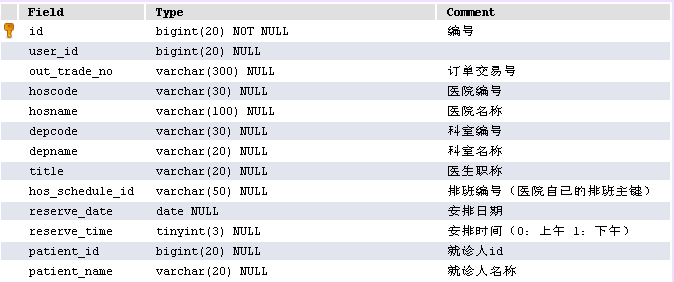
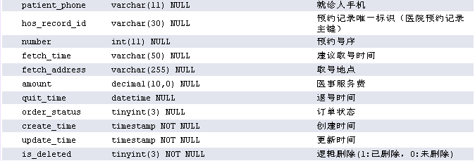
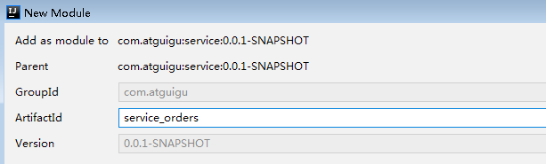
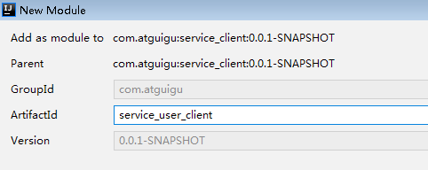

# 一、预约下单
## 1、需求
### （1）订单表结构






### （2）生成订单分析 

生成订单需要的参数：就诊人id与 排班id

第一、生成订单需要获取就诊人信息

第二、获取排班下单信息与规则信息

第三、下单后，然后通过接口去医院预约下单

第四、下单成功更新排班信息与发送短信


## 2、搭建订单模块
### （1）搭建service\_orders模块



### （2）引入依赖

```xml
<dependencies>
    <dependency>
        <groupId>com.atguigu</groupId>
        <artifactId>service_cmn_client</artifactId>
        <version>0.0.1-SNAPSHOT</version>
    </dependency>
</dependencies>
```
### （3）添加配置文件  

```javascript
# 服务端口
server.port=8207
# 服务名
spring.application.name=service-orders
# 环境设置：dev、test、prod
spring.profiles.active=dev

# mysql数据库连接
spring.datasource.driver-class-name=com.mysql.jdbc.Driver
spring.datasource.url=jdbc:mysql://localhost:3306/yygh_order?characterEncoding=utf-8&useSSL=false
spring.datasource.username=root
spring.datasource.password=root

#返回json的全局时间格式
spring.jackson.date-format=yyyy-MM-dd HH:mm:ss
spring.jackson.time-zone=GMT+8

spring.data.mongodb.uri=mongodb://192.168.44.165:27017/test

# nacos服务地址
spring.cloud.nacos.discovery.server-addr=127.0.0.1:8848

#rabbitmq地址
#spring.rabbitmq.host=192.168.44.165
#spring.rabbitmq.port=5672
#spring.rabbitmq.username=guest
#spring.rabbitmq.password=guest

spring.redis.host=192.168.189.129
spring.redis.port=6379
spring.redis.database= 0
spring.redis.timeout=1800000

spring.redis.lettuce.pool.max-active=20
spring.redis.lettuce.pool.max-wait=-1
#最大阻塞等待时间(负数表示没限制)
spring.redis.lettuce.pool.max-idle=5
spring.redis.lettuce.pool.min-idle=0
```
###  （4）创建启动类
```java
@SpringBootApplication
@MapperScan("com.atguigu.yygh.order.mapper")
@ComponentScan(basePackages = {"com.atguigu"})
@EnableDiscoveryClient
@EnableFeignClients(basePackages = {"com.atguigu"})
public class ServiceOrderApplication {
    public static void main(String[] args) {
        SpringApplication.run(ServiceOrderApplication.class, args);
    }
}
```
### （5）配置网关

```javascript
#设置路由id
spring.cloud.gateway.routes[7].id=service-orders
#设置路由的uri
spring.cloud.gateway.routes[7].uri=lb://service-orders
#设置路由断言,代理servicerId为auth-service的/auth/路径
spring.cloud.gateway.routes[7].predicates= Path=/*/order/**
```
### （6）创建订单的Mapper、Service和Controller
```java
//创建mapper
public interface OrderInfoMapper extends BaseMapper<OrderInfo> {
}

//创建service
public interface OrderService extends IService<OrderInfo> {
    //保存订单
    Long saveOrder(String scheduleId, Long patientId);
}

//创建service实现类
@Service
public class OrderServiceImpl extends ServiceImpl<OrderInfoMapper, OrderInfo> implements OrderService {
    //生成订单
    @Override
    public Long saveOrder(String scheduleId, Long patientId) {
        return null;
    }
}

//创建controller方法
@Api(tags = "订单接口")
@RestController
@RequestMapping("/api/order/orderInfo")
public class OrderApiController {

    @Autowired
    private OrderInfoService orderInfoService;

    @ApiOperation(value = "创建订单")
    @PostMapping("auth/submitOrder/{scheduleId}/{patientId}")
    public R submitOrder(
            @ApiParam(name = "scheduleId", value = "排班id", required = true)
            @PathVariable String scheduleId,
            @ApiParam(name = "patientId", value = "就诊人id", required = true)
            @PathVariable Long patientId) {

        Long orderId = orderService.saveOrder(scheduleId, patientId);
        return R.ok().data("orderId",orderId);
    }
}
```
## 3、封装Feign调用获取就诊人接口
### （1）在PatientController类添加方法

操作模块service\_user  

```java
@ApiOperation(value = "获取就诊人")
@GetMapping("inner/get/{id}")
public Patient getPatientOrder(
    @ApiParam(name = "id", value = "就诊人id", required = true)
    @PathVariable("id") Long id) {
    return patientService.getById(id);
}
```
### （2）搭建service\_user\_client模块


### （3）添加Feign接口类


```java
@FeignClient(value = "service-user")
@Repository
public interface PatientFeignClient {
    //获取就诊人
    @GetMapping("/api/userinfo/patient/inner/get/{id}")
    Patient getPatient(@PathVariable("id") Long id);
}
```
## 4、封装Feign调用获取排班下单信息接口
### （1）在ScheduleService添加接口和实现

操作模块service\_hosp

```java
//根据排班id获取预约下单数据
ScheduleOrderVo getScheduleOrderVo(String scheduleId);

//根据排班id获取预约下单数据实现
@Override
public ScheduleOrderVo getScheduleOrderVo(String scheduleId) {
    ScheduleOrderVo scheduleOrderVo = new ScheduleOrderVo();
    //排班信息
    Schedule schedule = this.getById(scheduleId);
    if(null == schedule) {
        throw new YyghException();
    }

    //获取预约规则信息
    Hospital hospital = hospitalService.getByHoscode(schedule.getHoscode());
    if(null == hospital) {
        throw new YyghException();
    }
    BookingRule bookingRule = hospital.getBookingRule();
    if(null == bookingRule) {
        throw new YyghException();
    }

    scheduleOrderVo.setHoscode(schedule.getHoscode());
    scheduleOrderVo.setHosname(hospital.getHosname());
    scheduleOrderVo.setDepcode(schedule.getDepcode());
    scheduleOrderVo.setDepname(departmentService.getDepartment(schedule.getHoscode(), schedule.getDepcode()).getDepname());
    scheduleOrderVo.setHosScheduleId(schedule.getHosScheduleId());
    scheduleOrderVo.setAvailableNumber(schedule.getAvailableNumber());
    scheduleOrderVo.setTitle(schedule.getTitle());
    scheduleOrderVo.setReserveDate(schedule.getWorkDate());
    scheduleOrderVo.setReserveTime(schedule.getWorkTime());
    scheduleOrderVo.setAmount(schedule.getAmount());

    //退号截止天数（如：就诊前一天为-1，当天为0）
    int quitDay = bookingRule.getQuitDay();
    DateTime quitTime = this.getDateTime(new DateTime(schedule.getWorkDate()).plusDays(quitDay).toDate(), bookingRule.getQuitTime());
    scheduleOrderVo.setQuitTime(quitTime.toDate());

    //预约开始时间
    DateTime startTime = this.getDateTime(new Date(), bookingRule.getReleaseTime());
    scheduleOrderVo.setStartTime(startTime.toDate());

    //预约截止时间
    DateTime endTime = this.getDateTime(new DateTime().plusDays(bookingRule.getCycle()).toDate(), bookingRule.getStopTime());
    scheduleOrderVo.setEndTime(endTime.toDate());

    //当天停止挂号时间
    DateTime stopTime = this.getDateTime(new Date(), bookingRule.getStopTime());
    scheduleOrderVo.setStopTime(stopTime.toDate());
    return scheduleOrderVo;
}
```
### （2）在ScheduleController添加方法
```java
@ApiOperation(value = "根据排班id获取预约下单数据")
@GetMapping("inner/getScheduleOrderVo/{scheduleId}")
public ScheduleOrderVo getScheduleOrderVo(
    @ApiParam(name = "scheduleId", value = "排班id", required = true)
    @PathVariable("scheduleId") String scheduleId) {
    return scheduleService.getScheduleOrderVo(scheduleId);
}
```
### （3）搭建service\_hosp\_client
###  （4）添加Feign接口类
```java
@FeignClient(value = "service-hosp")
@Repository
public interface HospitalFeignClient {
    /**
     * 根据排班id获取预约下单数据
     */
    @GetMapping("/admin/hosp/schedule/inner/getScheduleOrderVo/{scheduleId}")
    ScheduleOrderVo getScheduleOrderVo(@PathVariable("scheduleId") String scheduleId);

}
```