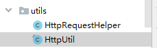

# 一、预约下单

## 1、实现生成订单接口

### （1）service\_orders引入依赖

```xml
<dependencies>
    <dependency>
        <groupId>com.atguigu</groupId>
        <artifactId>service_cmn_client</artifactId>
        <version>0.0.1-SNAPSHOT</version>
    </dependency>

    <dependency>
        <groupId>com.atguigu</groupId>
        <artifactId>service_hosp_client</artifactId>
        <version>0.0.1-SNAPSHOT</version>
    </dependency>

    <dependency>
        <groupId>com.atguigu</groupId>
        <artifactId>service_user_client</artifactId>
        <version>0.0.1-SNAPSHOT</version>
    </dependency>
</dependencies>
```

### （2）封装工具类



### （3）实现生成订单

```java
@Autowired
private PatientFeignClient patientFeignClient;

@Autowired
private HospitalFeignClient hospitalFeignClient;

//创建订单
@Override
public Long saveOrder(String scheduleId, Long patientId) {
    //1 根据scheduleId获取排班数据
    ScheduleOrderVo scheduleOrderVo = hospitalFeignClient.getScheduleOrderVo(scheduleId);

    //2 根据patientId获取就诊人信息
    Patient patient = patientFeignClient.getPatient(patientId);

    //3 平台里面 ==> 调用医院订单确认接口，
    // 3.1 如果医院返回失败，挂号失败
    //使用map集合封装需要传过医院数据
    Map<String, Object> paramMap = new HashMap<>();
    paramMap.put("hoscode",scheduleOrderVo.getHoscode());
    paramMap.put("depcode",scheduleOrderVo.getDepcode());
    paramMap.put("hosScheduleId",scheduleOrderVo.getHosScheduleId());
    paramMap.put("reserveDate",new DateTime(scheduleOrderVo.getReserveDate()).toString("yyyy-MM-dd"));
    paramMap.put("reserveTime", scheduleOrderVo.getReserveTime());
    paramMap.put("amount",scheduleOrderVo.getAmount()); //挂号费用
    paramMap.put("name", patient.getName());
    paramMap.put("certificatesType",patient.getCertificatesType());
    paramMap.put("certificatesNo", patient.getCertificatesNo());
    paramMap.put("sex",patient.getSex());
    paramMap.put("birthdate", patient.getBirthdate());
    paramMap.put("phone",patient.getPhone());
    paramMap.put("isMarry", patient.getIsMarry());
    paramMap.put("provinceCode",patient.getProvinceCode());
    paramMap.put("cityCode", patient.getCityCode());
    paramMap.put("districtCode",patient.getDistrictCode());
    paramMap.put("address",patient.getAddress());
    //联系人
    paramMap.put("contactsName",patient.getContactsName());
    paramMap.put("contactsCertificatesType", patient.getContactsCertificatesType());
    paramMap.put("contactsCertificatesNo",patient.getContactsCertificatesNo());
    paramMap.put("contactsPhone",patient.getContactsPhone());
    paramMap.put("timestamp", HttpRequestHelper.getTimestamp());
    //String sign = HttpRequestHelper.getSign(paramMap, signInfoVo.getSignKey());
    paramMap.put("sign", "");

    //使用httpclient发送请求，请求医院接口
    JSONObject result =
        HttpRequestHelper.sendRequest(paramMap, "http://localhost:9998/order/submitOrder");
    //根据医院接口返回状态码判断  200 成功
    if(result.getInteger("code") == 200) { //挂号成功
        // 3.2 如果返回成功，得到返回其他数据
        JSONObject jsonObject = result.getJSONObject("data");
        //预约记录唯一标识（医院预约记录主键）
        String hosRecordId = jsonObject.getString("hosRecordId");
        //预约序号
        Integer number = jsonObject.getInteger("number");;
        //取号时间
        String fetchTime = jsonObject.getString("fetchTime");;
        //取号地址
        String fetchAddress = jsonObject.getString("fetchAddress");

        //4 如果医院接口返回成功，添加上面三部分数据到数据库
        OrderInfo orderInfo = new OrderInfo();
        //设置添加数据--排班数据
        BeanUtils.copyProperties(scheduleOrderVo, orderInfo);
        //设置添加数据--就诊人数据
        //订单号
        String outTradeNo = System.currentTimeMillis() + ""+ new Random().nextInt(100);
        orderInfo.setOutTradeNo(outTradeNo);
        orderInfo.setScheduleId(scheduleId);
        orderInfo.setUserId(patient.getUserId());
        orderInfo.setPatientId(patientId);
        orderInfo.setPatientName(patient.getName());
        orderInfo.setPatientPhone(patient.getPhone());
        orderInfo.setOrderStatus(OrderStatusEnum.UNPAID.getStatus());

        //设置添加数据--医院接口返回数据
        orderInfo.setHosRecordId(hosRecordId);
        orderInfo.setNumber(number);
        orderInfo.setFetchTime(fetchTime);
        orderInfo.setFetchAddress(fetchAddress);

        //调用方法添加
        baseMapper.insert(orderInfo);

        //TODO 5 根据医院返回数据，更新排班数量
        //排班可预约数
        Integer reservedNumber = jsonObject.getInteger("reservedNumber");
        //排班剩余预约数
        Integer availableNumber = jsonObject.getInteger("availableNumber");

        //TODO 6 给就诊人发送短信

        //7 返回订单号
        return orderInfo.getId();
    } else { //挂号失败
        throw new YyghException(20001,"挂号失败");
    }
}
```
