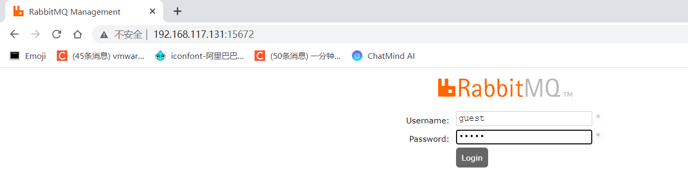
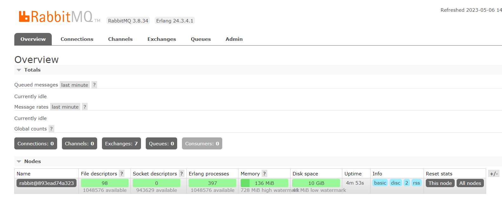
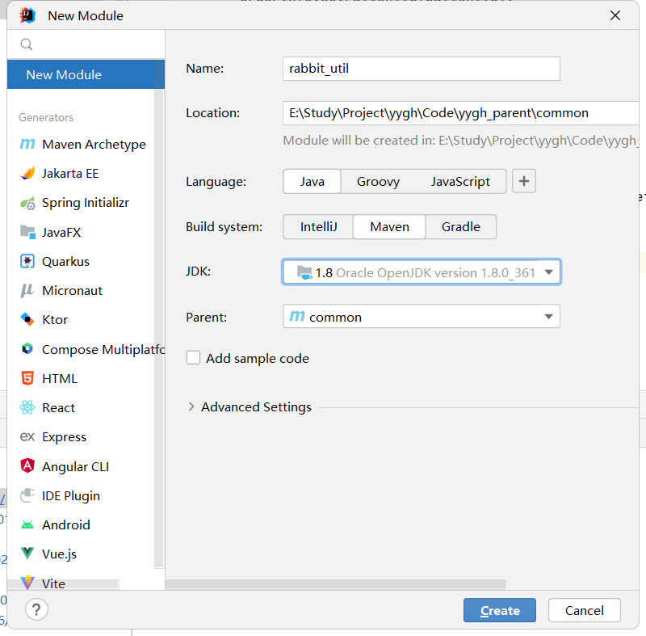

# 一、预约下单

## 1、生成订单前端整合

### （1）封装api方法

创建api/yygh/orderinfo.js

```javascript
import request from '@/utils/request'

const api_name = `/api/order/orderInfo`

export default {
 submitOrder(scheduleId, patientId) {
  return request({
    url: `${api_name}/auth/submitOrder/${scheduleId}/${patientId}`,
    method: 'post'
  })
 }
}
```

### （2）在booking.vue组件完善下单方法

```javascript
import orderInfoApi from '@/api/yygh/orderinfo'

submitOrder() {
    if(this.patient.id == null) {
        this.$message.error('请选择就诊人')
        return
    }
    // 防止重复提交
    if(this.submitBnt == '正在提交...') {
        this.$message.error('重复提交')
        return
    }

    this.submitBnt = '正在提交...'
    orderInfoApi.submitOrder(this.scheduleId, this.patient.id).then(response => {
        let orderId = response.data.orderId
        window.location.href = '/order/show?orderId=' + orderId
    }).catch(e => {
        this.submitBnt = '确认挂号'
    })
},
```

## 2、生成订单后处理逻辑-更新订单信息

预约成功后我们要 **更新订单信息，更新预约数** 和 **短信提醒预约成功**，为了提高下单的并发性，这部分逻辑我们就交给mq为我们完成，预约成功发送消息即可

### （1）修改OrderServiceImpl方法

```java
//生成预约挂号订单
@Override
public Long saveOrders(String scheduleId, Long patientId) {

    ...............

    //发送请求,调用医院模拟系统接口，完成下单
    //使用工具类方法
    JSONObject result= 
       HttpRequestHelper.sendRequest(paramMap,"http://localhost:9998/order/submitOrder");
    //根据医院模拟系统返回数据，进行处理，如果返回状态码200，下单成功，否则下单失败
    if(result.getInteger("code")==200) {//下单成功
        System.out.println("下单成功");
        JSONObject jsonObject = result.getJSONObject("data");
        //预约记录唯一标识（医院预约记录主键）
        String hosRecordId = jsonObject.getString("hosRecordId");
        //预约序号
        Integer number = jsonObject.getInteger("number");;
        //取号时间
        String fetchTime = jsonObject.getString("fetchTime");;
        //取号地址
        String fetchAddress = jsonObject.getString("fetchAddress");;
        //更新订单
        orderInfo.setHosRecordId(hosRecordId);
        orderInfo.setNumber(number);
        orderInfo.setFetchTime(fetchTime);
        orderInfo.setFetchAddress(fetchAddress);
        baseMapper.updateById(orderInfo);
        //排班可预约数
        Integer reservedNumber = jsonObject.getInteger("reservedNumber");
        //排班剩余预约数
        Integer availableNumber = jsonObject.getInteger("availableNumber");
        //发送mq信息更新号源和短信通知

    } else {//下单失败
        System.out.println("下单失败");
        throw new YyghException(20001,"下单失败");
    }
    //返回订单号
    return orderInfo.getId();
}
```

## 3、生成订单后处理逻辑rabbit-util模块封装

### （1）rabbitMQ简介

**以商品订单场景为例，**

如果商品服务和订单服务是两个不同的微服务，在下单的过程中订单服务需要调用商品服务进行扣库存操作。按照传统的方式，下单过程要等到调用完毕之后才能返回下单成功，如果网络产生波动等原因使得商品服务扣库存延迟或者失败，会带来较差的用户体验，如果在高并发的场景下，这样的处理显然是不合适的，那怎么进行优化呢？这就需要消息队列登场了。

消息队列提供一个异步通信机制，消息的发送者不必一直等待到消息被成功处理才返回，而是立即返回。消息中间件负责处理网络通信，如果网络连接不可用，消息被暂存于队列当中，当网络畅通的时候在将消息转发给相应的应用程序或者服务，当然前提是这些服务订阅了该队列。如果在商品服务和订单服务之间使用消息中间件，既可以提高并发量，又降低服务之间的耦合度。

RabbitMQ就是这样一款消息队列。RabbitMQ是一个开源的消息代理的队列服务器，用来通过普通协议在完全不同的应用之间共享数据。

**典型应用场景：**

异步处理。把消息放入消息中间件中，等到需要的时候再去处理。

流量削峰。例如秒杀活动，在短时间内访问量急剧增加，使用消息队列，当消息队列满了就拒绝响应，跳转到错误页面，这样就可以使得系统不会因为超负载而崩溃

### （2）安装rabbitMQ

```shell
#拉取镜像
docker pull rabbitmq:3.8-management

#创建容器启动
docker run -d --restart=always -p 5672:5672 -p 15672:15672 --name rabbitmq rabbitmq:3.8-management
```

### （3）服务rabbitMQ后台

**管理后台**：[http://IP:15672](http://IP:15672)





### （4）在common搭建rabbit\_util模块




### （4）在rabbit\_util引入依赖

```xml
<dependencies>
    <!--rabbitmq消息队列-->
    <dependency>
        <groupId>org.springframework.cloud</groupId>
        <artifactId>spring-cloud-starter-bus-amqp</artifactId>
    </dependency>
    <dependency>
        <groupId>com.alibaba</groupId>
        <artifactId>fastjson</artifactId>
    </dependency>
</dependencies>
```

### （5）添加service方法

```java
@Service
public class RabbitService {
    @Autowired
    private RabbitTemplate rabbitTemplate;
    /**
     *  发送消息
     * @param exchange 交换机
     * @param routingKey 路由键
     * @param message 消息
     */
    public boolean sendMessage(String exchange, String routingKey, Object message) {
        rabbitTemplate.convertAndSend(exchange, routingKey, message);
        return true;
    }
}
```

### （6）配置mq消息转换器

```java
@Configuration
public class MQConfig {
    @Bean
    public MessageConverter messageConverter(){
        return new Jackson2JsonMessageConverter();
    }
}
```

说明：默认是字符串转换器

### （7）添加常量类

```java
public class MqConst {
    /**
     * 预约下单
     */
    public static final String EXCHANGE_DIRECT_ORDER = "exchange.direct.order";
    public static final String ROUTING_ORDER = "order";
    //队列
    public static final String QUEUE_ORDER  = "queue.order";

    /**
     * 短信
     */
    public static final String EXCHANGE_DIRECT_MSM = "exchange.direct.msm";
    public static final String ROUTING_MSM_ITEM = "msm.item";
    //队列
    public static final String QUEUE_MSM_ITEM  = "queue.msm.item";
}
```
