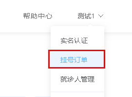

# 一、订单列表功能



## 1、订单列表接口

### （1）创建service接口和实现

OrderInfoService接口和实现类

```java
/**
     * 分页列表
     */
IPage<OrderInfo> selectPage(Page<OrderInfo> pageParam, OrderQueryVo orderQueryVo);

//实现列表
//（条件查询带分页）
@Override
public IPage<OrderInfo> selectPage(Page<OrderInfo> pageParam, OrderQueryVo orderQueryVo) {
    //orderQueryVo获取条件值
    String name = orderQueryVo.getKeyword(); //医院名称
    Long patientId = orderQueryVo.getPatientId(); //就诊人名称
    String orderStatus = orderQueryVo.getOrderStatus(); //订单状态
    String reserveDate = orderQueryVo.getReserveDate();//安排时间
    String createTimeBegin = orderQueryVo.getCreateTimeBegin();
    String createTimeEnd = orderQueryVo.getCreateTimeEnd();
    //对条件值进行非空判断
    QueryWrapper<OrderInfo> wrapper = new QueryWrapper<>();
    if(!StringUtils.isEmpty(name)) {
        wrapper.like("hosname",name);
    }
    if(!StringUtils.isEmpty(patientId)) {
        wrapper.eq("patient_id",patientId);
    }
    if(!StringUtils.isEmpty(orderStatus)) {
        wrapper.eq("order_status",orderStatus);
    }
    if(!StringUtils.isEmpty(reserveDate)) {
        wrapper.ge("reserve_date",reserveDate);
    }
    if(!StringUtils.isEmpty(createTimeBegin)) {
        wrapper.ge("create_time",createTimeBegin);
    }
    if(!StringUtils.isEmpty(createTimeEnd)) {
        wrapper.le("create_time",createTimeEnd);
    }
    //调用mapper的方法
    IPage<OrderInfo> pages = baseMapper.selectPage(pageParam, wrapper);
    //编号变成对应值封装
    pages.getRecords().stream().forEach(item -> {
        this.packOrderInfo(item);
    });
    return pages;
}

private OrderInfo packOrderInfo(OrderInfo orderInfo) {
    orderInfo.getParam().put("orderStatusString", OrderStatusEnum.getStatusNameByStatus(orderInfo.getOrderStatus()));
    return orderInfo;
}
```

### （2）创建controller

在OrderApiController类添加方法

```java
//订单列表（条件查询带分页）
@GetMapping("auth/{page}/{limit}")
public R list(@PathVariable Long page,
              @PathVariable Long limit,
              OrderQueryVo orderQueryVo, HttpServletRequest request) {
    //设置当前用户id
    orderQueryVo.setUserId(AuthContextHolder.getUserId(request));
    Page<OrderInfo> pageParam = new Page<>(page,limit);
    IPage<OrderInfo> pageModel =
        orderService.selectPage(pageParam,orderQueryVo);
    return R.ok().data("pageModel",pageModel);
}

@ApiOperation(value = "获取订单状态")
@GetMapping("auth/getStatusList")
public R getStatusList() {
    return R.ok().data("statusList", OrderStatusEnum.getStatusList());
}
```

## 2、订单列表前端

### （1）封装api请求

在api/orderinfo.js定义方法

```javascript
//订单列表
getPageList(page, limit, searchObj) {
    return request({
        url: `${api_name}/auth/${page}/${limit}`,
        method: `get`,
        params: searchObj
    })
},

//订单状态
getStatusList() {
   return request({
        url: `${api_name}/auth/getStatusList`,
        method: 'get'
   })
},
```

### （2）页面显示

创建/pages/order/index.vue组件

---

```html
<template>
  <!-- header -->
  <div class="nav-container page-component">
    <!--左侧导航 #start -->
    <div class="nav left-nav">
      <div class="nav-item ">
        <span class="v-link clickable dark" onclick="javascript:window.location='/user'">实名认证 </span>
      </div>
      <div class="nav-item selected">
        <span class="v-link selected dark" onclick="javascript:window.location='/order'"> 挂号订单 </span>
      </div>
      <div class="nav-item ">
        <span class="v-link clickable dark" onclick="javascript:window.location='/patient'"> 就诊人管理 </span>
      </div>
      <div class="nav-item ">
        <span class="v-link clickable dark"> 修改账号信息 </span>
      </div>
      <div class="nav-item ">
        <span class="v-link clickable dark"> 意见反馈 </span>
      </div>
    </div>
    <!-- 左侧导航 #end -->
    <!-- 右侧内容 #start -->
    <div class="page-container">
      <div class="personal-order">
        <div class="title"> 挂号订单</div>
        <el-form :inline="true">
          <el-form-item label="就诊人：">
            <el-select v-model="searchObj.patientId" placeholder="请选择就诊人" class="v-select patient-select">
              <el-option
                v-for="item in patientList"
                :key="item.id"
                :label="item.name + '【' + item.certificatesNo + '】'"
                :value="item.id">
              </el-option>
            </el-select>
          </el-form-item>
          <el-form-item label="订单状态：" style="margin-left: 80px">
            <el-select v-model="searchObj.orderStatus" placeholder="全部" class="v-select patient-select" style="width: 200px;">
              <el-option
                v-for="item in statusList"
                :key="item.status"
                :label="item.comment"
                :value="item.status">
              </el-option>
            </el-select>
          </el-form-item>
          <el-form-item>
            <el-button type="text" class="search-button v-link highlight clickable selected" @click="fetchData()">
              查询
            </el-button>
          </el-form-item>
        </el-form>
        <div class="table-wrapper table">
          <el-table
            :data="list"
            stripe
            style="width: 100%">
            <el-table-column
              label="就诊时间"
              width="120">
              <template slot-scope="scope">
                {{ scope.row.reserveDate }} {{ scope.row.reserveTime === 0 ? '上午' : '下午' }}
              </template>
            </el-table-column>
            <el-table-column
              prop="hosname"
              label="医院"
              width="100">
            </el-table-column>
            <el-table-column
              prop="depname"
              label="科室">
            </el-table-column>
            <el-table-column
              prop="title"
              label="医生">
            </el-table-column>
            <el-table-column
              prop="amount"
              label="医事服务费">
            </el-table-column>
            <el-table-column
              prop="patientName"
              label="就诊人">
            </el-table-column>
            <el-table-column
              prop="param.orderStatusString"
              label="订单状态">
            </el-table-column>
            <el-table-column label="操作">
              <template slot-scope="scope">
                <el-button type="text" class="v-link highlight clickable selected" @click="show(scope.row.id)">详情</el-button>
              </template>
            </el-table-column>
          </el-table>
        </div>
        <!-- 分页 -->
        <el-pagination
          class="pagination"
          layout="prev, pager, next"
          :current-page="page"
          :total="total"
          :page-size="limit"
          @current-change="fetchData">
        </el-pagination>
      </div>
    </div>
    <!-- 右侧内容 #end -->
  </div>
  <!-- footer -->
</template>
<script>
import '~/assets/css/hospital_personal.css'
import '~/assets/css/hospital.css'
import orderInfoApi from '@/api/orderinfo'
import patientApi from '@/api/patient'
export default {
  data() {
    return {
      list: [], // banner列表
      total: 0, // 数据库中的总记录数
      page: 1, // 默认页码
      limit: 10, // 每页记录数
      searchObj: {}, // 查询表单对象
      patientList: [],
      statusList: []
    }
  },
  created() {
    this.orderId = this.$route.query.orderId
    this.fetchData()
    this.findPatientList()
    this.getStatusList()
  },
  methods: {
    fetchData(page = 1) {
      this.page = page
      orderInfoApi.getPageList(this.page, this.limit, this.searchObj).then(response => {
        console.log(response.data);
        this.list = response.data.pageModel.records
        this.total = response.data.pageModel.total
      })
    },
    findPatientList() {
      patientApi.findList().then(response => {
        this.patientList = response.data.list
      })
    },
    getStatusList() {
      orderInfoApi.getStatusList().then(response => {
        this.statusList = response.data.statusList
      })
    },
    changeSize(size) {
      console.log(size)
      this.limit = size
      this.fetchData(1)
    },
    show(id) {
      window.location.href = '/order/show?orderId=' + id
    }
  }
}
</script>
```

# 二、订单详情功能

## 1、订单详情接口

### （1）OrderInfoService添加方法

```java
/**
     * 获取订单详情
     */
OrderInfo getOrderInfo(Long id);

//实现方法
@Override
public OrderInfo getOrderInfo(Long id) {
    OrderInfo orderInfo = baseMapper.selectById(id);
    return this.packOrderInfo(orderInfo);
}
```

### （2）OrderApiCont添加方法

在OrderInfoController类添加方法

```java
//根据订单id查询订单详情
@GetMapping("auth/getOrders/{orderId}")
public R getOrders(@PathVariable Long orderId) {
    OrderInfo orderInfo = orderInfoService.getOrderInfo(orderId);
    return R.ok().data("orderInfo",orderInfo);
}
```

## 2、订单详情前端

### （1）封装api方法

在orderinfo.js添加方法定义

```javascript
//订单详情
getOrders(orderId) {
    return request({
        url: `${api_name}/auth/getOrders/${orderId}`,
        method: `get`
    })
},
```

### （2）添加页面

创建/pages/order/show.vue组件

```html
<template>
  <!-- header -->
  <div class="nav-container page-component">
    <!--左侧导航 #start -->
    <div class="nav left-nav">
      <div class="nav-item ">
        <span class="v-link clickable dark" onclick="javascript:window.location='/user'">实名认证 </span>
      </div>
      <div class="nav-item selected">
        <span class="v-link selected dark" onclick="javascript:window.location='/order'"> 挂号订单 </span>
      </div>
      <div class="nav-item ">
        <span class="v-link clickable dark" onclick="javascript:window.location='/patient'"> 就诊人管理 </span>
      </div>
      <div class="nav-item ">
        <span class="v-link clickable dark"> 修改账号信息 </span>
      </div>
      <div class="nav-item ">
        <span class="v-link clickable dark"> 意见反馈 </span>
      </div>
    </div>
    <!-- 左侧导航 #end -->
    <!-- 右侧内容 #start -->
    <div class="page-container">
      <div class="order-detail">
        <div class="title"> 挂号详情</div>
        <div class="status-bar">
          <div class="left-wrapper">
            <div class="status-wrapper BOOKING_SUCCESS">
              <span class="iconfont"></span> {{ orderInfo.param.orderStatusString }}
            </div>
          </div>
          <div class="right-wrapper">
            
            <div class="content-wrapper">
              <div> 微信<span class="iconfont"></span>关注“北京114预约挂号”</div>
              <div class="watch-wrapper"> 快速挂号，轻松就医</div>
            </div>
          </div>
        </div>
        <div class="info-wrapper">
          <div class="title-wrapper">
            <div class="block"></div>
            <div>挂号信息</div>
          </div>
          <div class="info-form">
            <el-form ref="form" :model="form">
              <el-form-item label="就诊人信息：">
                <div class="content"><span>{{ orderInfo.patientName }}</span></div>
              </el-form-item>
              <el-form-item label="就诊日期：">
                <div class="content"><span>{{ orderInfo.reserveDate }} {{ orderInfo.reserveTime == 0 ? '上午' : '下午' }}</span></div>
              </el-form-item>
              <el-form-item label="就诊医院：">
                <div class="content"><span>{{ orderInfo.hosname }} </span></div>
              </el-form-item>
              <el-form-item label="就诊科室：">
                <div class="content"><span>{{ orderInfo.depname }} </span></div>
              </el-form-item>
              <el-form-item label="医生职称：">
                <div class="content"><span>{{ orderInfo.title }} </span></div>
              </el-form-item>
              <el-form-item label="医事服务费：">
                <div class="content">
                  <div class="fee">{{ orderInfo.amount }}元
                  </div>
                </div>
              </el-form-item>
              <el-form-item label="挂号单号：">
                <div class="content"><span>{{ orderInfo.outTradeNo }} </span></div>
              </el-form-item>
              <el-form-item label="挂号时间：">
                <div class="content"><span>{{ orderInfo.createTime }}</span></div>
              </el-form-item>
            </el-form>
          </div>
        </div>
        <div class="rule-wrapper mt40">
          <div class="rule-title"> 注意事项</div>
          <div>1、请确认就诊人信息是否准确，若填写错误将无法取号就诊，损失由本人承担；<br>
            <span style="color:red">2、【取号】就诊当天需在{{ orderInfo.fetchTime }}在医院取号，未取号视为爽约，该号不退不换；</span><br>
            3、【退号】在{{ orderInfo.quitTime }}前可在线退号 ，逾期将不可办理退号退费；<br>
            4、北京114预约挂号支持自费患者使用身份证预约，同时支持北京市医保患者使用北京社保卡在平台预约挂号。请于就诊当日，携带预约挂号所使用的有效身份证件到院取号；<br>
            5、请注意北京市医保患者在住院期间不能使用社保卡在门诊取号。
          </div>
        </div>
        <div class="bottom-wrapper mt60" v-if="orderInfo.orderStatus == 0 || orderInfo.orderStatus == 1">
          <div class="button-wrapper">
            <div class="v-button white" @click="cancelOrder()">取消预约</div>
          </div>
          <div class="button-wrapper ml20" v-if="orderInfo.orderStatus == 0">
            <div class="v-button" @click="pay()">支付</div>
          </div>
        </div>
      </div>
    </div>
    <!-- 右侧内容 #end -->
    <!-- 微信支付弹出框 -->
    <el-dialog :visible.sync="dialogPayVisible" style="text-align: left" :append-to-body="true" width="500px" @close="closeDialog">
      <div class="container">
        <div class="operate-view" style="height: 350px;">
          <div class="wrapper wechat">
            <div>
              

              <div style="text-align: center;line-height: 25px;margin-bottom: 40px;">
                请使用微信扫一扫<br/>
                扫描二维码支付
              </div>
            </div>
          </div>
        </div>
      </div>
    </el-dialog>
  </div>
  <!-- footer -->
</template>
<script>
import '~/assets/css/hospital_personal.css'
import '~/assets/css/hospital.css'
import orderInfoApi from '@/api/yygh/orderinfo'
export default {
  data() {
    return {
      orderId: null,
      orderInfo: {
        param: {}
      },
      dialogPayVisible: false,
      payObj: {},
      timer: null  // 定时器名称
    }
  },
  created() {
    this.orderId = this.$route.query.orderId
    this.init()
  },
  methods: {
    init() {
      orderInfoApi.getOrders(this.orderId).then(response => {
        console.log(response.data);
        this.orderInfo = response.data.orderInfo
      })
    }
  }
}
</script>
<style>
  .info-wrapper {
    padding-left: 0;
    padding-top: 0;
  }
  .content-wrapper {
    color: #333;
    font-size: 14px;
    padding-bottom: 0;
  }
  .bottom-wrapper {
    width: 100%;
  }
  .button-wrapper {
    margin: 0;
  }
  .el-form-item {
    margin-bottom: 5px;
  }
  .bottom-wrapper .button-wrapper {
    margin-top: 0;
  }
</style>
```
