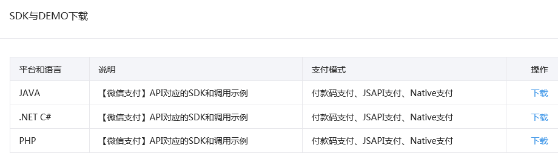
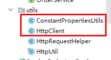

# 一、微信支付介绍

## 1、微信扫码支付申请

微信扫码支付是商户系统按微信支付协议生成支付二维码，用户再用微信“扫一扫”完成支付的模式。该模式适用于PC网站支付、实体店单品或订单支付、媒体广告支付等场景。

申请步骤：（了解）

**第一步：注册公众号（类型须为：服务号）**

请根据营业执照类型选择以下主体注册：[个体工商户](http://kf.qq.com/faq/120911VrYVrA151009JB3i2Q.html)| [企业/公司](http://kf.qq.com/faq/120911VrYVrA151013MfYvYV.html)| [政府](http://kf.qq.com/faq/161220eaAJjE161220IJn6zU.html)| [媒体](http://kf.qq.com/faq/161220IFBJFv161220YnqAbQ.html)| [其他类型](http://kf.qq.com/faq/120911VrYVrA151013nYFZ7Z.html)。

**第二步：认证公众号**

公众号认证后才可申请微信支付，认证费：300元/年。

**第三步：提交资料申请微信支付**

登录公众平台，点击左侧菜单【微信支付】，开始填写资料等待审核，审核时间为1-5个工作日内。

**第四步：开户成功，登录商户平台进行验证**

资料审核通过后，请登录联系人邮箱查收商户号和密码，并登录商户平台填写财付通备付金打的小额资金数额，完成账户验证。

**第五步：在线签署协议**

本协议为线上电子协议，签署后方可进行交易及资金结算，签署完立即生效。

## 2、开发文档

**微信支付接口调用的整体思路：**

按API要求组装参数，以XML方式发送（POST）给微信支付接口（URL）,微信支付接口也是以XML方式给予响应。程序根据返回的结果（其中包括支付URL）生成二维码或判断订单状态。

在线微信支付开发文档：

[https://pay.weixin.qq.com/wiki/doc/api/index.html](https://pay.weixin.qq.com/wiki/doc/api/index.html)

（1） appid：微信公众账号或开放平台APP的唯一标识

（2）mch\_id：商户号  (配置文件中的partner)

（3）partnerkey：商户密钥

（4）sign:数字签名, 根据微信官方提供的密钥和一套算法生成的一个加密信息, 就是为了保证交易的安全性

## 3、微信支付SDK



**我们主要会用到微信支付SDK的以下功能：**

**（1）获取随机字符串**
``WXPayUtil.generateNonceStr()``

**（2）MAP转换为XML字符串（自动添加签名）**

``WXPayUtil.generateSignedXml(param, partnerkey)``

**（3）XML字符串转换为MAP**

``WXPayUtil.xmlToMap(result)``

# 二、微信支付开发

## 1、微信支付接口-生成微信支付二维码

**场景：用户扫描商户展示在各种场景的二维码进行支付**

**使用案例：**

线下：家乐福超市、7-11便利店、上品折扣线下店等

线上：大众点评网站、携程网站、唯品会、美丽说网站等

**开发模式：**

**模式一：** 商户在后台给你生成二维码，用户打开扫一扫

**模式二：** 商户后台系统调用微信支付统一下单API生成预付交易，将接口返回的链接生成二维码，用户扫码后输入密码完成支付交易。注意：**该模式的预付单有效期为2小时，**过期后无法支付。

**微信支付：生成xml发送请求**

**操作模块：service\_orders**

### （1）service\_orders引入依赖

```xml
<dependency>
    <groupId>com.github.wxpay</groupId>
    <artifactId>wxpay-sdk</artifactId>
    <version>0.0.3</version>
</dependency>
```

### （2）添加配置

```bash
spring.redis.host=192.168.44.165
spring.redis.port=6379
spring.redis.database= 0
spring.redis.timeout=1800000
spring.redis.lettuce.pool.max-active=20
spring.redis.lettuce.pool.max-wait=-1
#最大阻塞等待时间(负数表示没限制)
spring.redis.lettuce.pool.max-idle=5
spring.redis.lettuce.pool.min-idle=0

#关联的公众号appid
weixin.pay.appid=wx74862e0dfcf69954
#商户号
weixin.pay.partner=1558950191
#商户key
weixin.pay.partnerkey=T6m9iK73b0kn9g5v426MKfHQH7X8rKwb
```

### （3）复制工具类



### （4）添加添加交易记录方法

**添加PaymentMapper接口**

```java
public interface PaymentMapper extends BaseMapper<PaymentInfo> {
}
```

**添加PaymentService接口**

```java
public interface PaymentService extends IService<PaymentInfo> {
    /**
     * 保存交易记录
     * @param order
     * @param paymentType 支付类型（1：微信 2：支付宝）
     */
    void savePaymentInfo(OrderInfo order, Integer paymentType);
}
```

**添加PaymentServiceImpl实现类**

```java
@Service
public class PaymentServiceImpl extends
        ServiceImpl<PaymentMapper, PaymentInfo> implements PaymentService {
    /**
     * 保存交易记录
     * @param orderInfo
     * @param paymentType 支付类型（1：微信 2：支付宝）
     */
    @Override
    public void savePaymentInfo(OrderInfo orderInfo, Integer paymentType) {
        QueryWrapper<PaymentInfo> queryWrapper = new QueryWrapper<>();
        queryWrapper.eq("order_id", orderInfo.getId());
        queryWrapper.eq("payment_type", paymentType);
        Integer count = baseMapper.selectCount(queryWrapper);
        if(count >0) return;
        // 保存交易记录
        PaymentInfo paymentInfo = new PaymentInfo();
        paymentInfo.setCreateTime(new Date());
        paymentInfo.setOrderId(orderInfo.getId());
        paymentInfo.setPaymentType(paymentType);
        paymentInfo.setOutTradeNo(orderInfo.getOutTradeNo());
        paymentInfo.setPaymentStatus(PaymentStatusEnum.UNPAID.getStatus());
        String subject = new DateTime(orderInfo.getReserveDate()).toString("yyyy-MM-dd")+"|"+orderInfo.getHosname()+"|"+orderInfo.getDepname()+"|"+orderInfo.getTitle();
        paymentInfo.setSubject(subject);
        paymentInfo.setTotalAmount(orderInfo.getAmount());
        baseMapper.insert(paymentInfo);
    }
}
```

### （5）添加支付service接口与实现

**添加WeixinService接口**

```java
public interface WeixinService {
    /**
     * 根据订单号下单，生成支付链接
     */
    Map createNative(Long orderId);
}
```

**添加WeixinServiceImpl实现类**

```java
@Service
public class WeixinServiceImpl implements WeixinService {

    @Autowired
    private OrderInfoService orderService;
    @Autowired
    private PaymentInfoService paymentService;
    @Autowired
    private RedisTemplate redisTemplate;
    /**
     * 根据订单号下单，生成支付链接
     */
    @Override
    public Map createNative(Long orderId) {
        try {
            Map payMap = (Map) redisTemplate.opsForValue().get(orderId.toString());
            if(null != payMap) return payMap;
            //根据id获取订单信息
            OrderInfo order = orderService.getById(orderId);
            // 保存交易记录
            paymentService.savePaymentInfo(order, PaymentTypeEnum.WEIXIN.getStatus());
            //1、设置参数
            Map paramMap = new HashMap();
            paramMap.put("appid", ConstantPropertiesUtils.APPID);
            paramMap.put("mch_id", ConstantPropertiesUtils.PARTNER);
            paramMap.put("nonce_str", WXPayUtil.generateNonceStr());
            Date reserveDate = order.getReserveDate();
            String reserveDateString = new DateTime(reserveDate).toString("yyyy/MM/dd");
            String body = reserveDateString + "就诊"+ order.getDepname();
            paramMap.put("body", body);
            paramMap.put("out_trade_no", order.getOutTradeNo());
            //paramMap.put("total_fee", order.getAmount().multiply(new BigDecimal("100")).longValue()+"");
            paramMap.put("total_fee", "1");//为了测试
            paramMap.put("spbill_create_ip", "127.0.0.1");
            paramMap.put("notify_url", "http://guli.shop/api/order/weixinPay/weixinNotify");
            paramMap.put("trade_type", "NATIVE");
            //2、HTTPClient来根据URL访问第三方接口并且传递参数
            HttpClient client = new HttpClient("https://api.mch.weixin.qq.com/pay/unifiedorder");
            //client设置参数
            client.setXmlParam(WXPayUtil.generateSignedXml(paramMap, ConstantPropertiesUtils.PARTNERKEY));
            client.setHttps(true);
            client.post();
            //3、返回第三方的数据
            String xml = client.getContent();
            Map<String, String> resultMap = WXPayUtil.xmlToMap(xml);
            //4、封装返回结果集
            Map map = new HashMap<>();
            map.put("orderId", orderId);
            map.put("totalFee", order.getAmount());
            map.put("resultCode", resultMap.get("result_code"));
            map.put("codeUrl", resultMap.get("code_url"));
            if(null != resultMap.get("result_code")) {
                //微信支付二维码2小时过期，可采取2小时未支付取消订单
                redisTemplate.opsForValue().set(orderId.toString(), map, 1000, TimeUnit.MINUTES);
            }
            return map;
        } catch (Exception e) {
            e.printStackTrace();
            return new HashMap<>();
        }
    }
}
```

### （6）添加Controller方法

**添加WeixinController类** 

```java
@RestController
@RequestMapping("/api/order/weixin")
public class WeixinController {
    @Autowired
    private WeixinService weixinPayService;
    /**
     * 下单 生成二维码
     */
    @GetMapping("/createNative/{orderId}")
    public R createNative(
            @ApiParam(name = "orderId", value = "订单id", required = true)
            @PathVariable("orderId") Long orderId) {
        Map map = weixinPayService.createNative(orderId);
        return R.ok().data(map);
    }
}
```

## 2、微信支付前端整合

### （1）在wx.js定义方法

```javascript
createNative(orderId) {
    return request({
        url: `/api/order/weixin/createNative/${orderId}`,
        method: 'get'
    })
}
```

### （2）安装npm install vue-qriously

### （3）修改order/show.vue组件

```html
<template>
  <!-- header -->
  <div class="nav-container page-component">
    <!--左侧导航 #start -->
    <div class="nav left-nav">
      <div class="nav-item ">
        <span class="v-link clickable dark" onclick="javascript:window.location='/user'">实名认证 </span>
      </div>
      <div class="nav-item selected">
        <span class="v-link selected dark" onclick="javascript:window.location='/order'"> 挂号订单 </span>
      </div>
      <div class="nav-item ">
        <span class="v-link clickable dark" onclick="javascript:window.location='/patient'"> 就诊人管理 </span>
      </div>
      <div class="nav-item ">
        <span class="v-link clickable dark"> 修改账号信息 </span>
      </div>
      <div class="nav-item ">
        <span class="v-link clickable dark"> 意见反馈 </span>
      </div>
    </div>
    <!-- 左侧导航 #end -->
    <!-- 右侧内容 #start -->
    <div class="page-container">
      <div class="order-detail">
        <div class="title"> 挂号详情</div>
        <div class="status-bar">
          <div class="left-wrapper">
            <div class="status-wrapper BOOKING_SUCCESS">
              <span class="iconfont"></span> {{ orderInfo.param.orderStatusString }}
            </div>
          </div>
          <div class="right-wrapper">
            
            <div class="content-wrapper">
              <div> 微信<span class="iconfont"></span>关注“预约挂号”</div>
              <div class="watch-wrapper"> 快速挂号，轻松就医</div>
            </div>
          </div>
        </div>
        <div class="info-wrapper">
          <div class="title-wrapper">
            <div class="block"></div>
            <div>挂号信息</div>
          </div>
          <div class="info-form">
            <el-form ref="form" :model="form">
              <el-form-item label="就诊人信息：">
                <div class="content"><span>{{ orderInfo.patientName }}</span></div>
              </el-form-item>
              <el-form-item label="就诊日期：">
                <div class="content"><span>{{ orderInfo.reserveDate }} {{ orderInfo.reserveTime == 0 ? '上午' : '下午' }}</span></div>
              </el-form-item>
              <el-form-item label="就诊医院：">
                <div class="content"><span>{{ orderInfo.hosname }} </span></div>
              </el-form-item>
              <el-form-item label="就诊科室：">
                <div class="content"><span>{{ orderInfo.depname }} </span></div>
              </el-form-item>
              <el-form-item label="医生职称：">
                <div class="content"><span>{{ orderInfo.title }} </span></div>
              </el-form-item>
              <el-form-item label="医事服务费：">
                <div class="content">
                  <div class="fee">{{ orderInfo.amount }}元
                  </div>
                </div>
              </el-form-item>
              <el-form-item label="挂号单号：">
                <div class="content"><span>{{ orderInfo.outTradeNo }} </span></div>
              </el-form-item>
              <el-form-item label="挂号时间：">
                <div class="content"><span>{{ orderInfo.createTime }}</span></div>
              </el-form-item>
            </el-form>
          </div>
        </div>
        <div class="rule-wrapper mt40">
          <div class="rule-title"> 注意事项</div>
          <div>1、请确认就诊人信息是否准确，若填写错误将无法取号就诊，损失由本人承担；<br>
            <span style="color:red">2、【取号】就诊当天需在{{ orderInfo.fetchTime }}在医院取号，未取号视为爽约，该号不退不换；</span><br>
            3、【退号】在{{ orderInfo.quitTime }}前可在线退号 ，逾期将不可办理退号退费；<br>
            4、预约挂号支持自费患者使用身份证预约，同时支持北京市医保患者使用北京社保卡在平台预约挂号。请于就诊当日，携带预约挂号所使用的有效身份证件到院取号；<br>
            5、请注意北京市医保患者在住院期间不能使用社保卡在门诊取号。
          </div>
        </div>
        <div class="bottom-wrapper mt60" v-if="orderInfo.orderStatus == 0 || orderInfo.orderStatus == 1">
          <div class="button-wrapper">
            <div class="v-button white" @click="cancelOrder()">取消预约</div>
          </div>
          <div class="button-wrapper ml20" v-if="orderInfo.orderStatus == 0">
            <div class="v-button" @click="pay()">支付</div>
          </div>
        </div>
      </div>
    </div><!-- 右侧内容 #end -->
    <!-- 微信支付弹出框 -->
    <el-dialog :visible.sync="dialogPayVisible" style="text-align: left" :append-to-body="true" width="500px" @close="closeDialog">
      <div class="container">
        <div class="operate-view" style="height: 350px;">
          <div class="wrapper wechat">
            <div>
              <qriously :value="payObj.codeUrl" :size="220"/>
              <div style="text-align: center;line-height: 25px;margin-bottom: 40px;">
                请使用微信扫一扫<br/>
                扫描二维码支付
              </div>
            </div>
          </div>
        </div>
      </div>
    </el-dialog>
  </div><!-- footer -->
</template>
<script>
import '~/assets/css/hospital_personal.css'
import '~/assets/css/hospital.css'
import orderInfoApi from '@/api/orderinfo'
import weixinApi from '@/api/wx'
export default {
  data() {
    return {
      orderId: null,
      orderInfo: {
        param: {}
      },
      dialogPayVisible: false,
      payObj: {},
      timer: null  // 定时器名称
    }
  },
  created() {
    this.orderId = this.$route.query.orderId
    this.init()
  },
  methods: {
    init() {
      orderInfoApi.getOrders(this.orderId).then(response => {
        this.orderInfo = response.data.orderInfo
      })
    },
    pay() {
      this.dialogPayVisible = true
      weixinApi.createNative(this.orderId).then(response => {
        this.payObj = response.data
        if(this.payObj.codeUrl == '') {
          this.dialogPayVisible = false
          this.$message.error("支付错误")
        } 
      })
    }
  }
}
</script>
<style>
  .info-wrapper {
    padding-left: 0;
    padding-top: 0;
  }
  .content-wrapper {
    color: #333;
    font-size: 14px;
    padding-bottom: 0;
  }
  .bottom-wrapper {
    width: 100%;
  }
  .button-wrapper {
    margin: 0;
  }
  .el-form-item {
    margin-bottom: 5px;
  }
  .bottom-wrapper .button-wrapper {
    margin-top: 0;
  }
</style>
```
