# 一、下单并发处理
## 1、需求说明

热门医院的号可能很紧张，尤其是放号的那一刻，可能有很多用户抢号，那么如何保证服务正常运行呢，因此我们需要对热门医院做流量控制，阿里Sentinel流量控制工具就能很好的解决我们的问题，它能根据热点值，动态控制流量。

## 2、Sentinel介绍

随着微服务的流行，服务和服务之间的稳定性变得越来越重要。Sentinel 以流量为切入点，从流量控制、熔断降级、系统负载保护等多个维度保护服务的稳定性。

Sentinel 的历史：

\- 2012 年，Sentinel 诞生，主要功能为入口流量控制。

\- 2013-2017 年，Sentinel 在阿里巴巴集团内部迅速发展，成为基础技术模块，覆盖了所有的核心场景。Sentinel 也因此积累了大量的流量归整场景以及生产实践。

\- 2018 年，Sentinel 开源，并持续演进。

\- 2019 年，Sentinel 朝着多语言扩展的方向不断探索，推出 C++ 原生版本，同时针对 Service Mesh 场景也推出了 Envoy 集群流量控制支持，以解决 Service Mesh 架构下多语言限流的问题。

\- 2020 年，推出 Sentinel Go 版本，继续朝着云原生方向演进。

Sentinel 分为两个部分:

\- 核心库（Java 客户端）不依赖任何框架/库，能够运行于所有 Java 运行时环境，同时对 Dubbo / Spring Cloud 等框架也有较好的支持。

\- 控制台（Dashboard）基于 Spring Boot 开发，打包后可以直接运行，不需要额外的 Tomcat 等应用容器。


## 3、搭建sentinel控制台

您可以从 release 页面 下载最新版本的控制台 jar 包。

**https://github.com/alibaba/Sentinel/releases**

下载的jar包，copy到一个没有空格或者中文的路径下，打开dos窗口切换到jar包所在目录。

执行：**java -Dserver.port=8088 -jar sentinel-dashboard-1.8.1.jar**

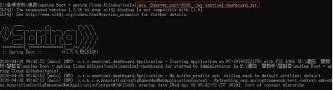

在浏览器中访问sentinel控制台，默认端口号是8080。进入登录页面，管理页面用户名和密码：sentinel/sentinel

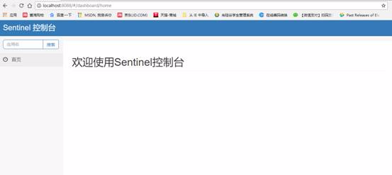

此时页面为空，因为还没有监控任何服务。另外，sentinel是懒加载的，如果服务没有被访问，看不到该服务信息。


## 4、sentinel入门

### 4.1 service模块引入依赖

**在项目配置文件**

```Plain Text
# 指定dashboard地址
spring.cloud.sentinel.transport.dashboard=127.0.0.1:8088
# 启动该服务，会在应用程序的相应服务器上启动HTTP Server，并且该服务器将与Sentinel dashboard进行交互
spring.cloud.sentinel.transport.port=8719
```

### 4.2 在service\_orders模块创建测试controller

**启动项目，在浏览器访问 controller，http://localhost:8207/test，可以在sentinel控制台看到服务信息**

```java
@RestController
@RequestMapping("/test")
public class TestController {

    @GetMapping
    public String test1() {
        return "hello";
    }
}
```
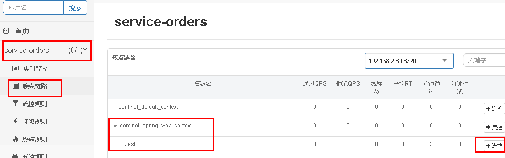


### 4.3 QPS流量控制  

**QPS** `Queries Per Second` 是每秒查询率 ,是一台服务器每秒能够相应的查询次数，是对一个特定的查询服务器在规定时间内所处理流量多少的衡量标准, 即每秒的响应请求数，也即是最大吞吐能力。  

当 QPS 超过某个阈值时，采取措施流量控制。流量控制的效果包括以下几种：直接拒绝、Warm Up、匀速排队。

（1）直接拒绝（`RuleConstant.CONTROL_BEHAVIOR_DEFAULT`）方式是默认的流量控制方式，当QPS超过任意规则的阈值后，新的请求就会被立即拒绝，拒绝方式为抛出`FlowException`。这种方式适用于对系统处理能力确切已知的情况下，比如通过压测确定了系统的准确水位时。

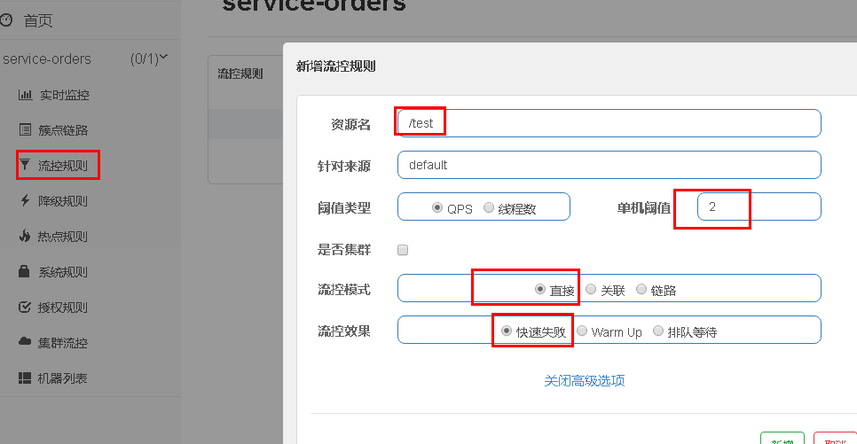

在浏览器访问：http://localhost:8207/test，并不断刷新，出现如下信息：

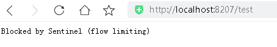

（2）Warm Up（预热）

Warm Up（`RuleConstant.CONTROL_BEHAVIOR_WARM_UP`）方式，即预热/冷启动方式。当系统长期处于低水位的情况下，当流量突然增加时，直接把系统拉升到高水位可能瞬间把系统压垮。通过"冷启动"，让通过的流量缓慢增加，在一定时间内逐渐增加到阈值上限，给冷系统一个预热的时间，避免冷系统被压垮。

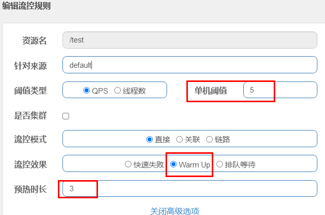

在浏览器访问：http://localhost:8207/test，并不断刷新测试：

可以发现前几秒会发生熔断，几秒钟之后就完全没有问题了

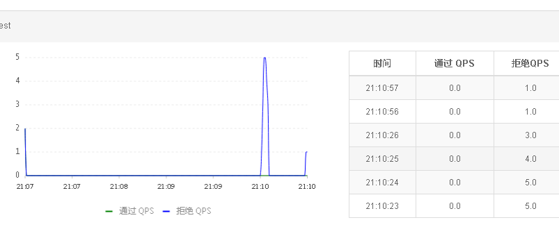


（3）匀速排队（`RuleConstant.CONTROL_BEHAVIOR_RATE_LIMITER`）方式会严格控制请求通过的间隔时间，也即是让请求以均匀的速度通过。

测试配置如下：1s处理一个请求，排队等待，等待时间10s。

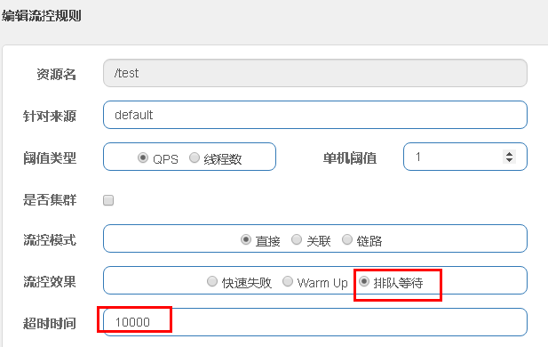

（4）使用jmeter工具测试

1、下载Jmeter：https://jmeter.apache.org/download\_jmeter.cgi
2、解压apache-jmeter-5.4.zip文件至目录下（不要有空格和中文）；

3、我的电脑----》属性----》高级----》环境变量----》在系统变量中----》点击新建JMETER\_HOME，

   变量名输入：JMETER\_HOME

   变量值输入：D:\\ProgramFiles(86)\\apache-jmeter-5.4

4、编辑CLASSPATH变量，加上%JMETER\_HOME%\\lib\\ext\\ApacheJMeter\_core.jar;%JMETER\_HOME%\\lib\\jorphan.jar;%JMETER\_HOME%\\lib\\logkit-2.0.jar;然后确定

5、点击Jmeter中bin目录下面的jmeter.bat文件即可打开Jmeter了。(Linux运行Jmeter.sh)

注意：打开的时候会有两个窗口，Jmeter的命令窗口和Jmeter的图形操作界面，不可以关闭命令窗口；

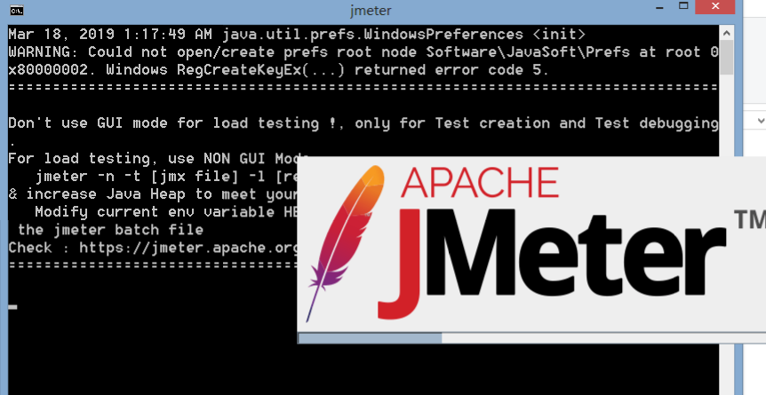

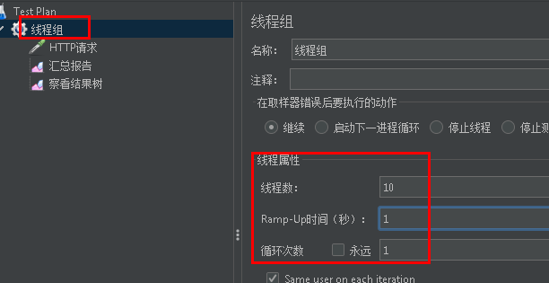

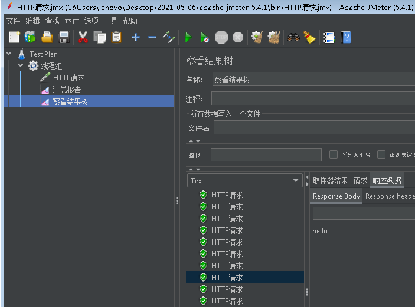


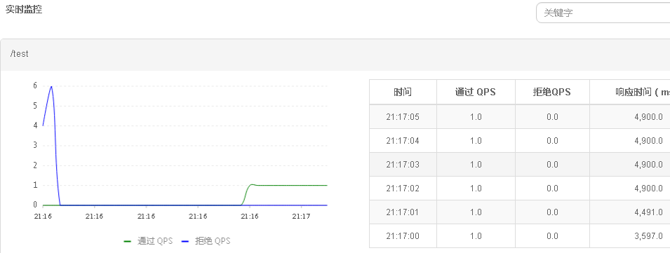


**5、下单接口添加sentinel规则**

**根据热点值，动态控制流量**  

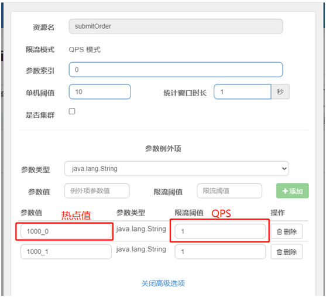

## **（1）OrderInfoController添加方法**
```java
//构造方法
public OrderInfoController(){
    initRule();
}

/**
     * 导入热点值限流规则
     * 也可在Sentinel dashboard界面配置（仅测试）
     */
public void initRule() {
    ParamFlowRule pRule = new ParamFlowRule("submitOrder")//资源名称，与SentinelResource值保持一致
        //限流第一个参数
        .setParamIdx(0)
        //单机阈值
        .setCount(5);

    // 针对 热点参数值单独设置限流 QPS 阈值，而不是全局的阈值.
    //如：1000（北京协和医院）,可以通过数据库表一次性导入，目前为测试
    ParamFlowItem item1 = new ParamFlowItem().setObject("1000")//热点值
        .setClassType(String.class.getName())//热点值类型
        .setCount(1);//热点值 QPS 阈值
    List<ParamFlowItem> list = new ArrayList<>();
    list.add(item1);
    pRule.setParamFlowItemList(list);
    ParamFlowRuleManager.loadRules(Collections.singletonList(pRule));
}
```
## （2）修改下单接口
```java
@ApiOperation(value = "创建订单")
@PostMapping("auth/submitOrder/{hoscode}/{scheduleId}/{patientId}")
@SentinelResource(value = "submitOrder",blockHandler = "submitOrderBlockHandler")
public R submitOrder(
    @ApiParam(name = "hoscode", value = "医院编号，限流使用", required = true)
    @PathVariable String hoscode,
    @ApiParam(name = "scheduleId", value = "排班id", required = true)
    @PathVariable String scheduleId,
    @ApiParam(name = "patientId", value = "就诊人id", required = true)
    @PathVariable Long patientId) {
    //调用service方法
    //返回订单号
    Long orderId = 1L; //orderService.saveOrders(scheduleId,patientId);
    return R.ok().data("orderId",orderId);
}

/**
     * 热点值超过 QPS 阈值，返回结果
     * @param hoscode
     * @param scheduleId
     * @param patientId
     * @param e
     * @return
     */
public R submitOrderBlockHandler(String hoscode, String scheduleId, Long patientId, BlockException e){
    return R.error().message("系统业务繁忙，请稍后下单");
}
```
**（3）并发测试**  

---
使用并发测试工具：apache-jmeter测试校验数据，测试时可将具体下单业务注释，只访问controller方法即可。如图：

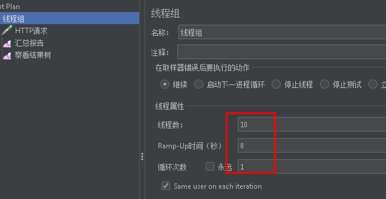


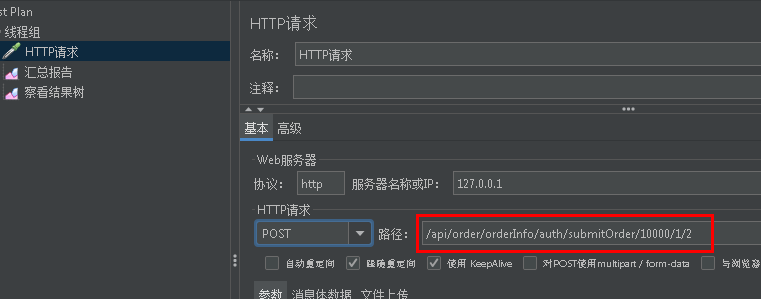


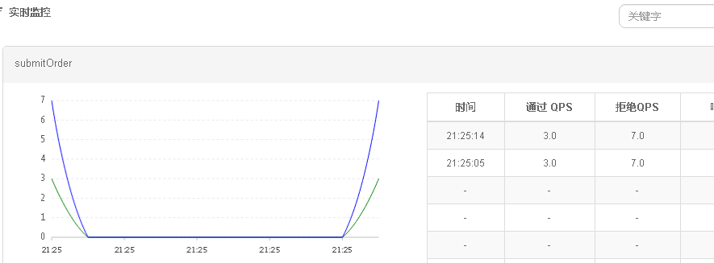


**6、流控规则**持久化\*\*\*\*

无论是通过硬编码方式来更新规则，还是通过接入 Sentinel Dashboard 后，在页面上操作更新规则，都无法避免一个问题，那就是服务重新后，规则就丢失了，因为默认情况下规则是保存在内存中的。

我们在 Dashboard 上为客户端配置好了规则，并推送给了客户端。这时由于一些因素客户端出现异常，服务不可用了，当客户端恢复正常再次连接上 Dashboard 后，这时所有的规则都丢失了，我们还需要重新配置一遍规则，这肯定不是我们想要的。

**6.1 持久化配置分以下3步**  

**1、引入依赖**

```xml
<dependency>
    <groupId>com.alibaba.csp</groupId>
    <artifactId>sentinel-datasource-nacos</artifactId>
    <version>1.7.0</version>
</dependency>
```
2、添加配置  

---
```yaml
# 这里datasource后的consumer是数据源名称，可以随便写，推荐使用服务名
spring.cloud.sentinel.datasource.consumer.nacos.server-addr=127.0.0.1:8848

spring.cloud.sentinel.datasource.consumer.nacos.dataId=${spring.application.name}-sentinel-rules

spring.cloud.sentinel.datasource.consumer.nacos.groupId=SENTINEL_GROUP

spring.cloud.sentinel.datasource.consumer.nacos.data-type=json

# 规则类型
#authority（授权规则）、degrade（降级规则）、flow（流控规则）、
#param（热点规则）、system（系统规则）五种规则持久化到Nacos中
spring.cloud.sentinel.datasource.consumer.nacos.rule_type=flow
```
3、在nacos创建流控规则  

---
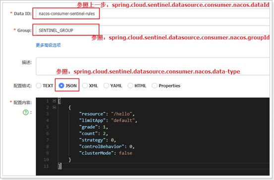

**配置内容**

```java
[
    {
        "resource": "/hi",
        "limitApp": "default",
        "grade": 1,
        "count": 2,
        "strategy": 0,
        "controlBehavior": 0,
        "clusterMode": false
    }
]
```
resource：资源名称

limitApp：限流应用，就是用默认就可以

grade：阈值类型，0表示线程数，1表示qps

count：单机阈值

strategy：流控模式，0-直接，1-关联， 2-链路

controlBehavior：流控效果。0-快速失败，1-warm up 2-排队等待

clusterMode：是否集群

**重启项目，并多次访问：http://localhost:8207/test**

**查看sentinel客户端：就有了限流配置了**

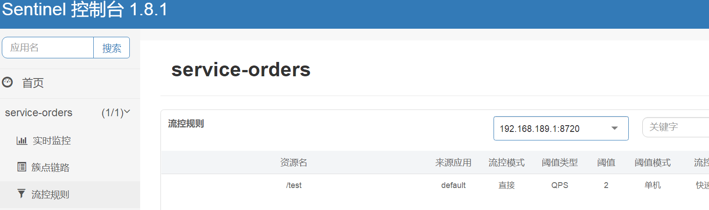

**现在你可以尝试测试一下限流配置了**