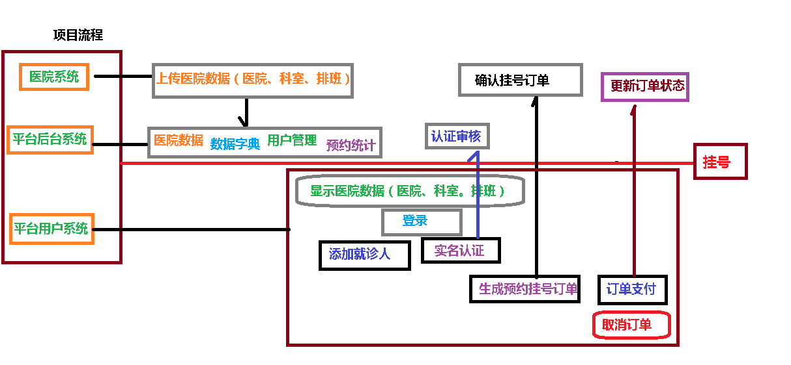

# 一、项目总结
## 1、项目流程

## 2、项目功能总结（后台管理系统）

1、医院设置管理
* 医院设置列表、添加、锁定、删除
* 医院列表、详情、排班、下线

2、数据管理
* 数据字典树形显示、导入、导出

3、用户管理
* 用户列表、查看、锁定
* 认证用户审批

4、订单管理
* 订单列表、详情

5、统计管理
* 预约统计

6、平台对外上传医院信息接口

## 3、项目功能总结（前台用户系统）
1、首页数据显示
（1）医院列表
2、医院详情显示
（1）医院科室显示
3、用户登录功能
（1）手机号登录（短信验证码发送）
（2）微信扫描登录
4、用户实名认证
5、就诊人管理
（1）列表、添加、详情、删除
6、预约挂号功能
（1）排班和挂号详情信息
（2）确认挂号信息
（3）生成预约挂号订单
（4）挂号订单支付（微信）
（5）取消预约订单
7、就医提醒功能

## 4、项目技术点总结（后端技术）
1、SpringBoot
2、SpringCloud
（1）Nacos注册中心和配置中心
（2）Feign
（3）GateWay
（4）Sentinel
（5）跨域
3、Redis
（1）使用Redis作为缓存
（2）验证码有效时间、支付二维码有效时间
4、MongoDB
（1）使用MongoDB存储 医院相关数据
5、EasyExcel
（1）操作excel表格，进行读和写操作
6、MyBatisPlus
7、RabbitMQ
（1）订单相关操作，发送mq消息
8、Docker
（1）下载镜像 docker pull
（2）创建容器 docker run
（3）制作docker镜像
9、阿里云OSS
10、短信服务
11、微信登录/支付
（1）httpclient
12、定时任务
（1）cron表达式
13、git
14、mysql

## 5、项目技术点总结（前端技术）
1、vue
（1）指令
（2）生命周期
2、Element-ui
3、nuxt
4、npm
5、ECharts
6、模块化
（1）es6模块化在nodejs不能直接运行，使用babel把es6代码转换es5
7、nodejs